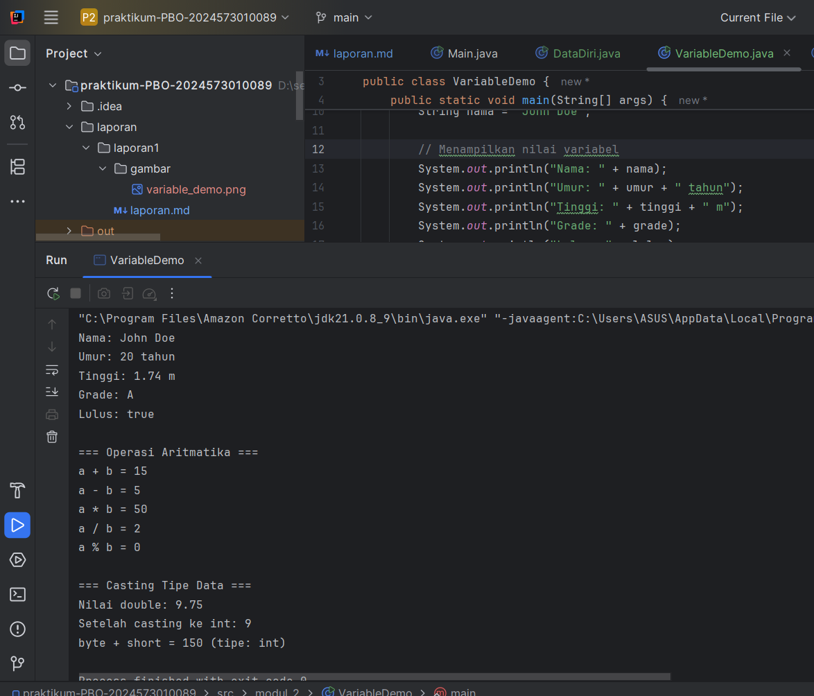
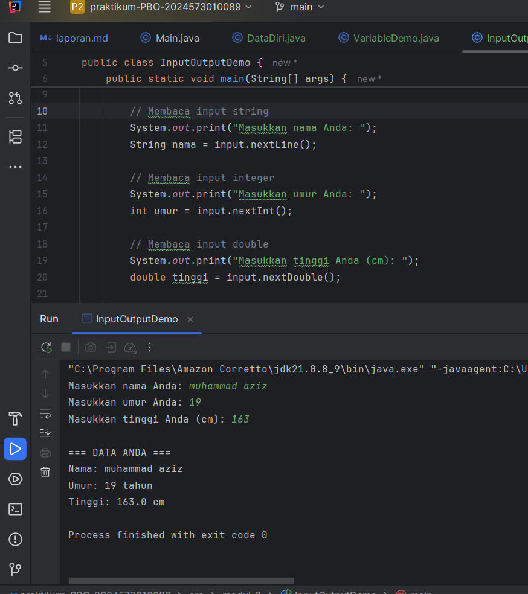
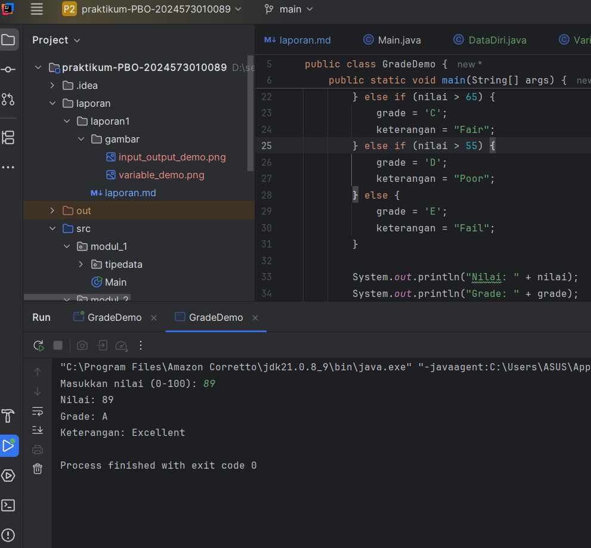
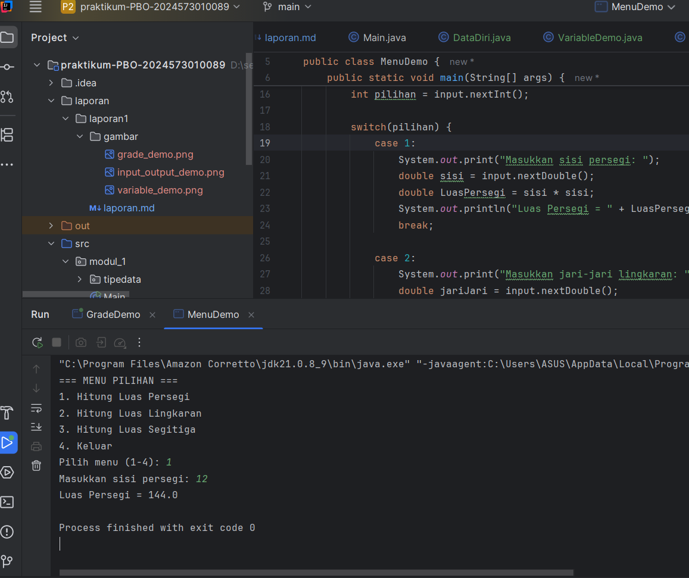
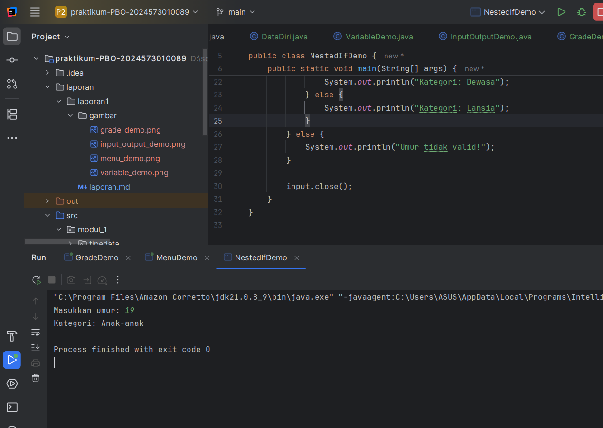
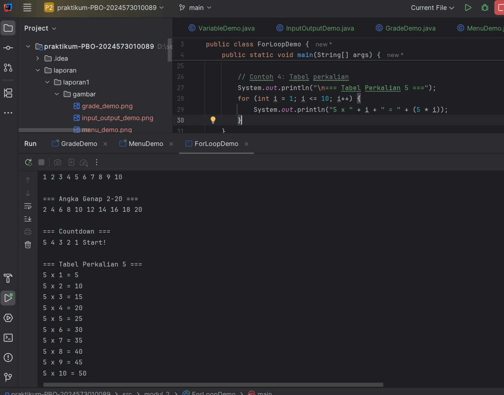
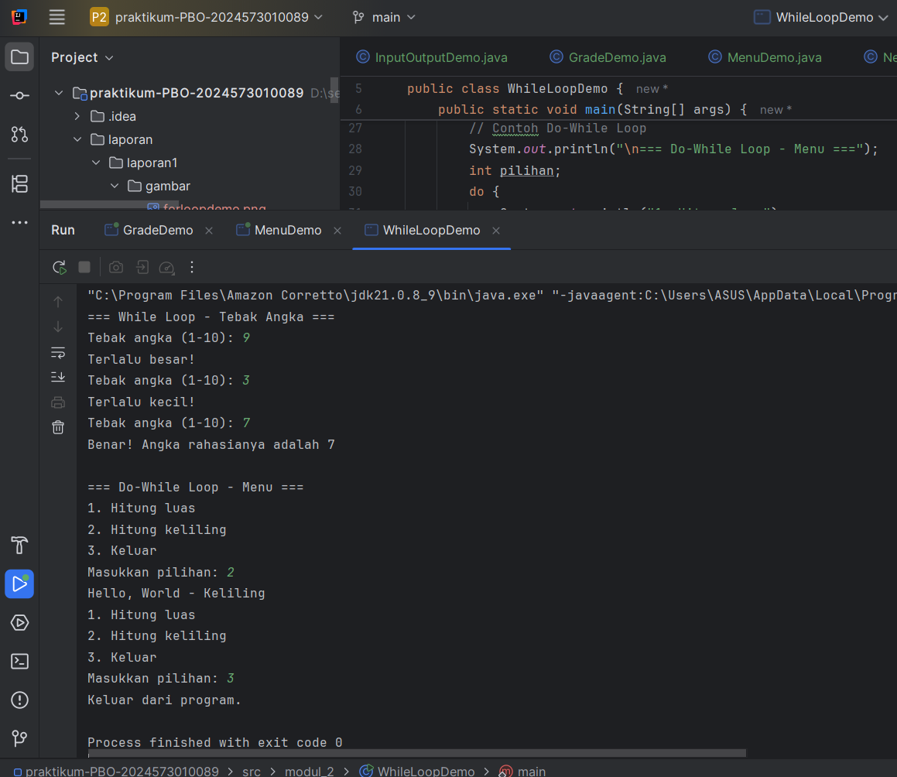
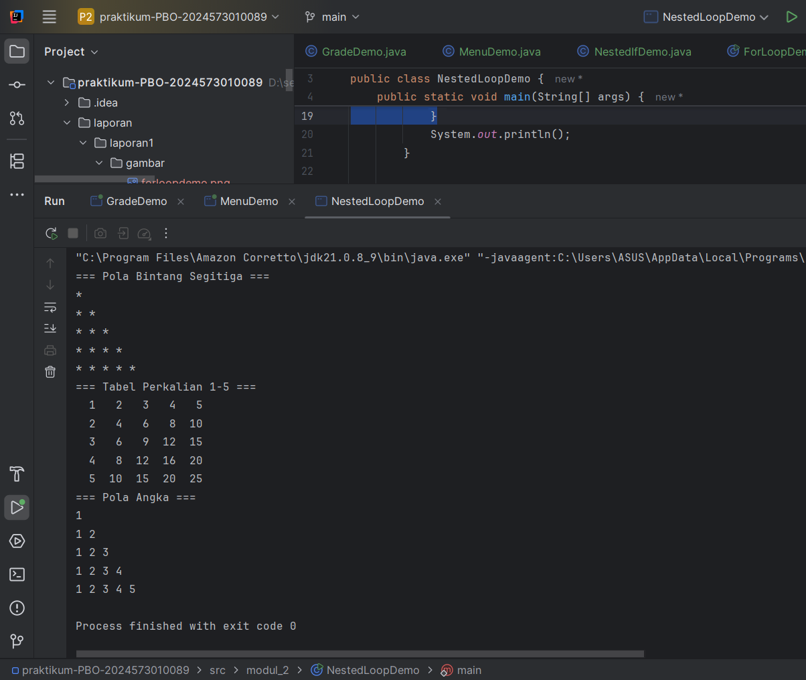

# Laporan Modul 2: Dasar Pemrograman Java

**Mata Kuliah:** Praktikum Pemrograman Berorientasi Objek  
**Nama:** Muhammad Aziz  
**NIM:** 2024573010089  
**Kelas:** TI 2E

---

## 1. Abstrak
Laporan ini merangkum hasil praktikum Modul 2 mengenai dasar-dasar pemrograman Java. Praktikum ini mencakup konsep-konsep fundamental seperti variabel dan tipe data, operasi input-output menggunakan kelas `Scanner`, serta struktur kontrol program berupa percabangan (`if-else`, `switch`) dan perulangan (`for`, `while`, `do-while`).

Tujuan dari laporan ini adalah untuk mendokumentasikan implementasi kode, menganalisis cara kerja setiap program, dan memahami penerapan konsep dasar Java dalam menyelesaikan masalah sederhana.

---

## 2. Praktikum

### 2.1 Praktikum 1 - Variabel dan Tipe Data

#### Dasar Teori
Java memiliki dua kategori utama tipe data: **primitif** dan **referensi**.
- **Tipe data primitif**: menyimpan nilai tunggal sederhana, seperti `int`, `double`, `char`, `boolean`.
- **Tipe data referensi**: seperti `String`, yang merujuk pada sebuah objek di memori.

Aturan penamaan variabel: tidak diawali angka, case-sensitive, dan tidak menggunakan keyword bawaan Java.

#### Langkah Praktikum
1. Membuat file baru dengan nama `VariableDemo.java` di dalam package `modul_2`.
2. Menuliskan kode untuk mendeklarasikan variabel, melakukan operasi aritmatika, serta casting tipe data.

```java
// Kode lengkap VariableDemo.java
package modul_2;

public class VariableDemo {
public static void main(String[] args) {
// Deklarasi dan inisialisasi variabel
int umur = 20;
double tinggi = 1.74;
char grade = 'A';
boolean lulus = true;
String nama = "John Doe";

        // Menampilkan nilai variabel
        System.out.println("Nama: " + nama);
        System.out.println("Umur: " + umur + " tahun");
        System.out.println("Tinggi: " + tinggi + " m");
        System.out.println("Grade: " + grade);
        System.out.println("Lulus: " + lulus);

        int a = 10;
        int b = 5;

        System.out.println("\n=== Operasi Aritmatika ===");
        System.out.println("a + b = " + (a + b));
        System.out.println("a - b = " + (a - b));
        System.out.println("a * b = " + (a * b));
        System.out.println("a / b = " + (a / b));
        System.out.println("a % b = " + (a % b));

        System.out.println("\n=== Casting Tipe Data ===");
        double nilaiDouble = 9.75;
        int nilaiInt = (int) nilaiDouble;
        System.out.println("Nilai double: " + nilaiDouble);
        System.out.println("Setelah casting ke int: " + nilaiInt);

        // Automatic promotion
        byte byteVar = 50;
        short shortVar = 100;
        int hasil = byteVar + shortVar;
        System.out.println("byte + short = " + hasil + " (tipe: int)");
    }
}
```

#### Screenshoot Hasil

<!-- Simpan screenshot program VariableDemo.java di folder img dengan nama variable_demo.png -->

#### Analisa dan Pembahasan
Program ini menunjukkan cara deklarasi variabel, operasi aritmatika dasar, explicit casting (`double → int`), dan automatic promotion (`byte + short → int`).

---

### 2.2 Praktikum 2 - Input, Output, dan Scanner

#### Dasar Teori
- **Output**: `System.out.println()` digunakan untuk menampilkan teks ke konsol.
- **Input**: kelas `Scanner` dari `java.util` digunakan untuk membaca input pengguna (`nextLine()`, `nextInt()`, `nextDouble()`).

#### Langkah Praktikum
1. Membuat file baru `InputOutputDemo.java`.
2. Program meminta input nama, umur, tinggi, lalu menampilkannya kembali.

Kode lengkap InputOutputDemo.java
```java

package modul_2;

import java.util.Scanner;

public class InputOutputDemo {
public static void main(String[] args) {
// Membuat objek Scanner
Scanner input = new Scanner(System.in);

        // Membaca input string
        System.out.print("Masukkan nama Anda: ");
        String nama = input.nextLine();

        // Membaca input integer
        System.out.print("Masukkan umur Anda: ");
        int umur = input.nextInt();

        // Membaca input double
        System.out.print("Masukkan tinggi Anda (cm): ");
        double tinggi = input.nextDouble();

        // Menampilkan output
        System.out.println("\n=== DATA ANDA ===");
        System.out.println("Nama: " + nama);
        System.out.println("Umur: " + umur + " tahun");
        System.out.println("Tinggi: " + tinggi + " cm");

        // Menutup Scanner
        input.close();
    }
}

```

#### Screenshoot Hasil

<!-- Simpan screenshot program InputOutputDemo.java di folder img dengan nama input_output_demo.png -->

#### Analisa dan Pembahasan
Program berhasil membaca input pengguna dan menampilkannya kembali. Metode `close()` digunakan untuk menutup `Scanner`.

---

### 2.3 Praktikum 3 - Struktur Kontrol: Percabangan

#### Implementasi
1. **GradeDemo.java** → konversi nilai angka ke huruf.
2. **MenuDemo.java** → menu interaktif dengan `switch`.
3. **NestedIfDemo.java** → menentukan kategori usia + izin mengemudi.

Kode GradeDemo.java

````java

package modul_2;

import java.util.Scanner;

public class GradeDemo {
    public static void main(String[] args) {
        Scanner input = new Scanner(System.in);

        System.out.print("Masukkan nilai (0-100): ");
        int nilai = input.nextInt();

        char grade;
        String keterangan;

        // Menggunakan if-else if-else
        if (nilai > 85) {
            grade = 'A';
            keterangan = "Excellent";
        } else if (nilai > 75) {
            grade = 'B';
            keterangan = "Good";
        } else if (nilai > 65) {
            grade = 'C';
            keterangan = "Fair";
        } else if (nilai > 55) {
            grade = 'D';
            keterangan = "Poor";
        } else {
            grade = 'E';
            keterangan = "Fail";
        }

        System.out.println("Nilai: " + nilai);
        System.out.println("Grade: " + grade);
        System.out.println("Keterangan: " + keterangan);

        input.close();
    }
}
````
Kode menudemo.java
````Java
package modul_2;

import java.util.Scanner;

public class MenuDemo {
    public static void main(String[] args) {
        Scanner input = new Scanner(System.in);

        System.out.println("=== MENU PILIHAN ===");
        System.out.println("1. Hitung Luas Persegi");
        System.out.println("2. Hitung Luas Lingkaran");
        System.out.println("3. Hitung Luas Segitiga");
        System.out.println("4. Keluar");

        System.out.print("Pilih menu (1-4): ");
        int pilihan = input.nextInt();

        switch(pilihan) {
            case 1:
                System.out.print("Masukkan sisi persegi: ");
                double sisi = input.nextDouble();
                double LuasPersegi = sisi * sisi;
                System.out.println("Luas Persegi = " + LuasPersegi);
                break;

            case 2:
                System.out.print("Masukkan jari-jari lingkaran: ");
                double jariJari = input.nextDouble();
                double LuasLingkaran = Math.PI * jariJari * jariJari;
                System.out.println("Luas Lingkaran = " + LuasLingkaran);
                break;

            case 3:
                System.out.print("Masukkan alas segitiga: ");
                double alas = input.nextDouble();
                System.out.print("Masukkan tinggi segitiga: ");
                double tinggi = input.nextDouble();
                double LuasSegitiga = 0.5 * alas * tinggi;
                System.out.println("Luas Segitiga = " + LuasSegitiga);
                break;

            case 4:
                System.out.println("Terima kasih!");
                break;

            default:
                System.out.println("Pilihan tidak valid.");
        }

        input.close();
    }
}

````
Kode nestedifdemo.java
````Java
package modul_2;

import java.util.Scanner;

public class NestedIfDemo {
    public static void main(String[] args) {
        Scanner input = new Scanner(System.in);

        System.out.print("Masukkan umur: ");
        int umur = input.nextInt();

        if (umur >= 0) {
            if (umur <= 5) {
                System.out.println("Kategori: Bayi");
            } else if (umur <= 11) {
                System.out.println("Kategori: Anak-anak");
            } else if (umur <= 17) {
                System.out.println("Kategori: Remaja");
            } else if (umur <= 30) {
                System.out.println("Kategori: Anak-anak");
            } else if (umur <= 60) {
                System.out.println("Kategori: Dewasa");
            } else {
                System.out.println("Kategori: Lansia");
            }
        } else {
            System.out.println("Umur tidak valid!");
        }

        input.close();
    }
}

````

#### Screenshoot Hasil
  
  


<!-- Simpan screenshot program GradeDemo.java, MenuDemo.java, NestedIfDemo.java di folder img -->

#### Analisa dan Pembahasan
- `if-else`: memetakan nilai angka ke grade.
- `switch`: kode lebih terstruktur untuk menu pilihan.
- `nested if`: logika bertingkat untuk kondisi kompleks.

---

### 2.4 Praktikum 4 - Struktur Kontrol: Perulangan

#### Implementasi
1. **ForLoopDemo.java** → deret angka, countdown, tabel perkalian.
2. **WhileLoopDemo.java** → game tebak angka + menu interaktif.
3. **NestedLoopDemo.java** → pola bintang, tabel perkalian, pola angka.

Kode lengkap ForLoopDemo.java
````java
package modul_2;

public class ForLoopDemo {
    public static void main(String[] args) {
        // Contoh 1: Menampilkan angka 1-10
        System.out.println("\n=== Angka 1-10 ===");
        for (int i = 1; i <= 10; i++) {
            System.out.print(i + " ");
        }
        System.out.println();

        // Contoh 2: Menampilkan angka genap
        System.out.println("\n=== Angka Genap 2-20 ===");
        for (int i = 2; i <= 20; i += 2) {
            System.out.print(i + " ");
        }
        System.out.println();

        // Contoh 3: Countdown
        System.out.println("\n=== Countdown ===");
        for (int i = 5; i >= 1; i--) {
            System.out.print(i + " ");
        }
        System.out.println("Start!");

        // Contoh 4: Tabel perkalian
        System.out.println("\n=== Tabel Perkalian 5 ===");
        for (int i = 1; i <= 10; i++) {
            System.out.println("5 x " + i + " = " + (5 * i));
        }
    }
}
````
Kode lengkap WhileLoopDemo.java
````java
package modul_2;

import java.util.Scanner;

public class WhileLoopDemo {
    public static void main(String[] args) {
        Scanner input = new Scanner(System.in);

        // Contoh While Loop
        System.out.println("=== While Loop - Tebak Angka ===");
        int angkaRahasia = 7;
        int tebakan = 0;

        while (tebakan != angkaRahasia) {
            System.out.print("Tebak angka (1-10): ");
            tebakan = input.nextInt();

            if (tebakan < angkaRahasia) {
                System.out.println("Terlalu kecil!");
            } else if (tebakan > angkaRahasia) {
                System.out.println("Terlalu besar!");
            } else {
                System.out.println("Benar! Angka rahasianya adalah " + angkaRahasia);
            }
        }

        // Contoh Do-While Loop
        System.out.println("\n=== Do-While Loop - Menu ===");
        int pilihan;
        do {
            System.out.println("1. Hitung luas");
            System.out.println("2. Hitung keliling");
            System.out.println("3. Keluar");
            System.out.print("Masukkan pilihan: ");
            pilihan = input.nextInt();

            switch (pilihan) {
                case 1:
                    System.out.println("Hello, World - Luas");
                    break;
                case 2:
                    System.out.println("Hello, World - Keliling");
                    break;
                case 3:
                    System.out.println("Keluar dari program.");
                    break;
                default:
                    System.out.println("Pilihan tidak valid!");
            }
        } while (pilihan != 3);

        input.close();
    }
}

````
Kode lengkap NestedLoopDemo.java
````java
package modul_2;

public class NestedLoopDemo {
    public static void main(String[] args) {
        // Contoh 1: Pola Bintang
        System.out.println("=== Pola Bintang Segitiga ===");
        for (int i = 1; i <= 5; i++) {
            for (int j = 1; j <= i; j++) {
                System.out.print("* ");
            }
            System.out.println();
        }

        // Contoh 2: Tabel Perkalian
        System.out.println("=== Tabel Perkalian 1-5 ===");
        for (int i = 1; i <= 5; i++) {
            for (int j = 1; j <= 5; j++) {
                System.out.printf("%3d ", (i * j));
            }
            System.out.println();
        }

        // Contoh 3: Pola Angka
        System.out.println("=== Pola Angka ===");
        for (int i = 1; i <= 5; i++) {
            for (int j = 1; j <= i; j++) {
                System.out.print(j + " ");
            }
            System.out.println();
        }
    }
}
````


#### Screenshoot Hasil
  
  


<!-- Simpan screenshot program ForLoopDemo.java, WhileLoopDemo.java, NestedLoopDemo.java di folder img -->

#### Analisa dan Pembahasan
- **for**: fleksibel (increment, decrement, step khusus).
- **while vs do-while**: perbedaan utama pada minimal eksekusi 1x.
- **nested loop**: membuat pola 2D dan tabel.

---

## 3. Kesimpulan
Melalui praktikum Modul 2, saya telah memahami:
- Cara mendeklarasikan variabel dan tipe data.
- Menggunakan `Scanner` untuk input dan `System.out.println()` untuk output.
- Mengontrol alur program dengan percabangan (`if`, `switch`) dan perulangan (`for`, `while`, `do-while`).
- Praktikum ini memberikan pengalaman praktis dalam menerapkan teori dasar Java untuk membuat program sederhana dan interaktif.

Kesalahan kecil (seperti lupa `close()` atau logika loop) menjadi pelajaran penting dalam proses ini.

---

## 4. Referensi
1. Deitel, P. J., & Deitel, H. M. (2017). *Java: How to Program (11th Edition)*. Pearson.
3. Oracle. (2025). *Java Platform, Standard Edition Documentation*. https://docs.oracle.com/javase/  
