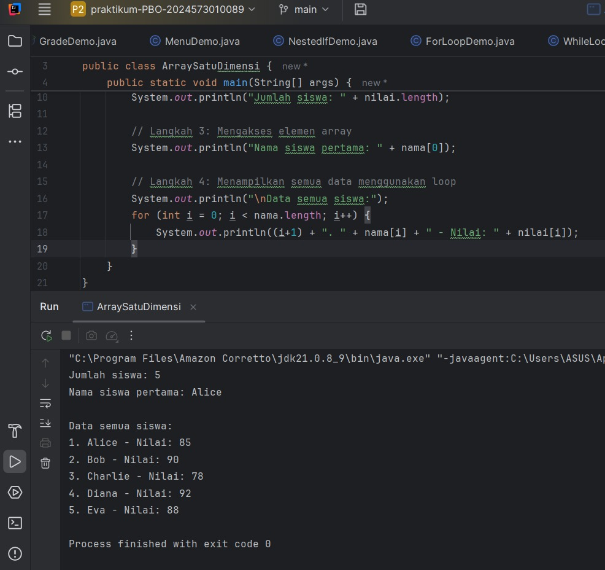
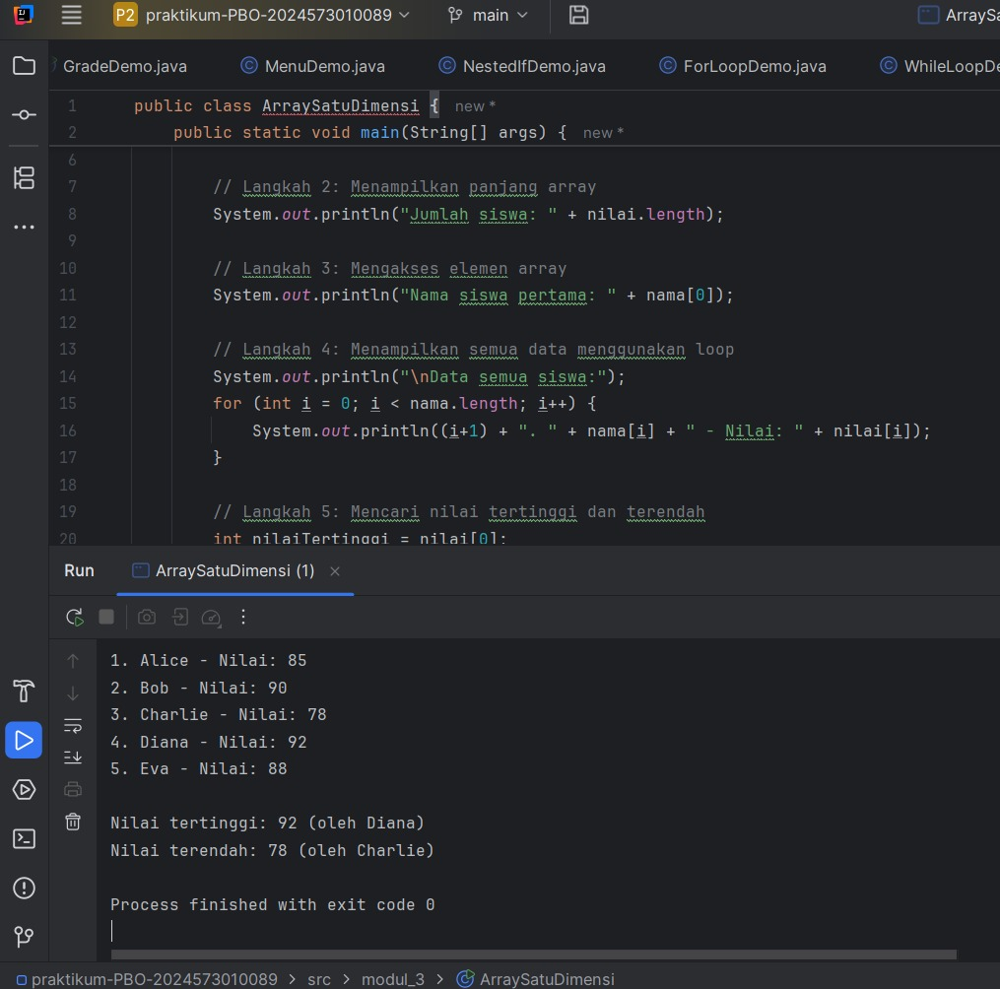
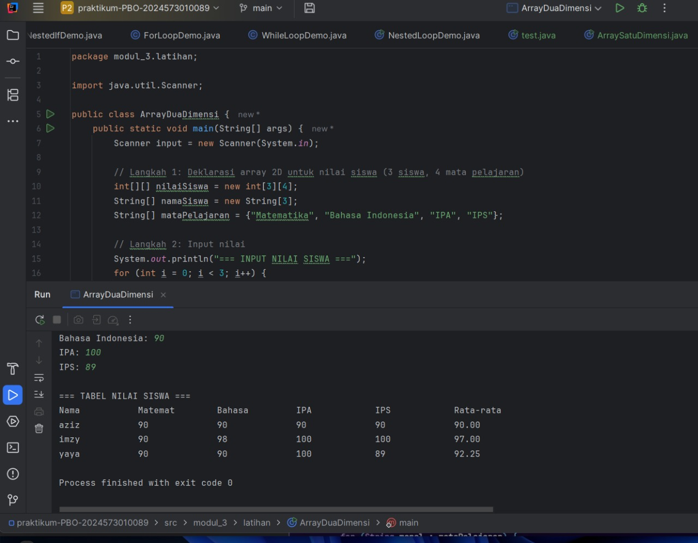
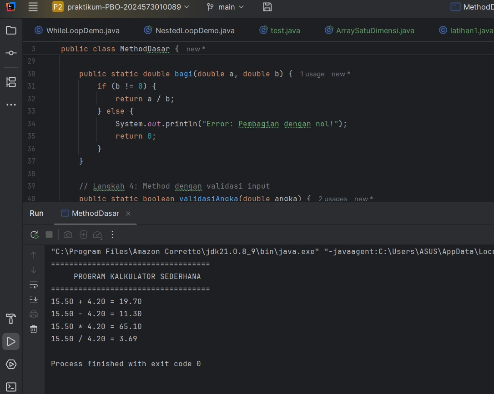
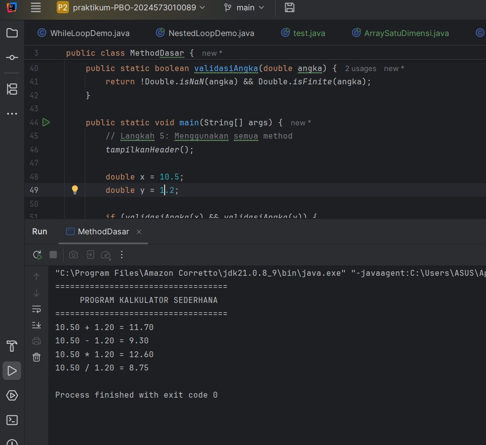
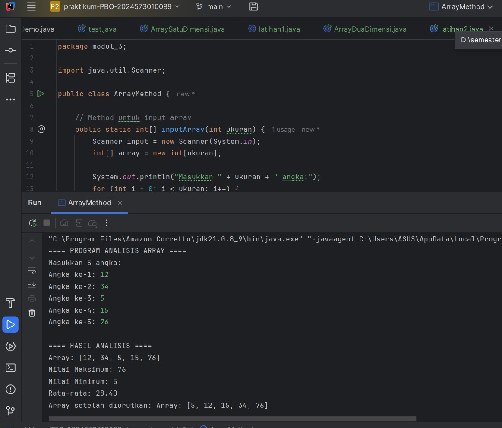
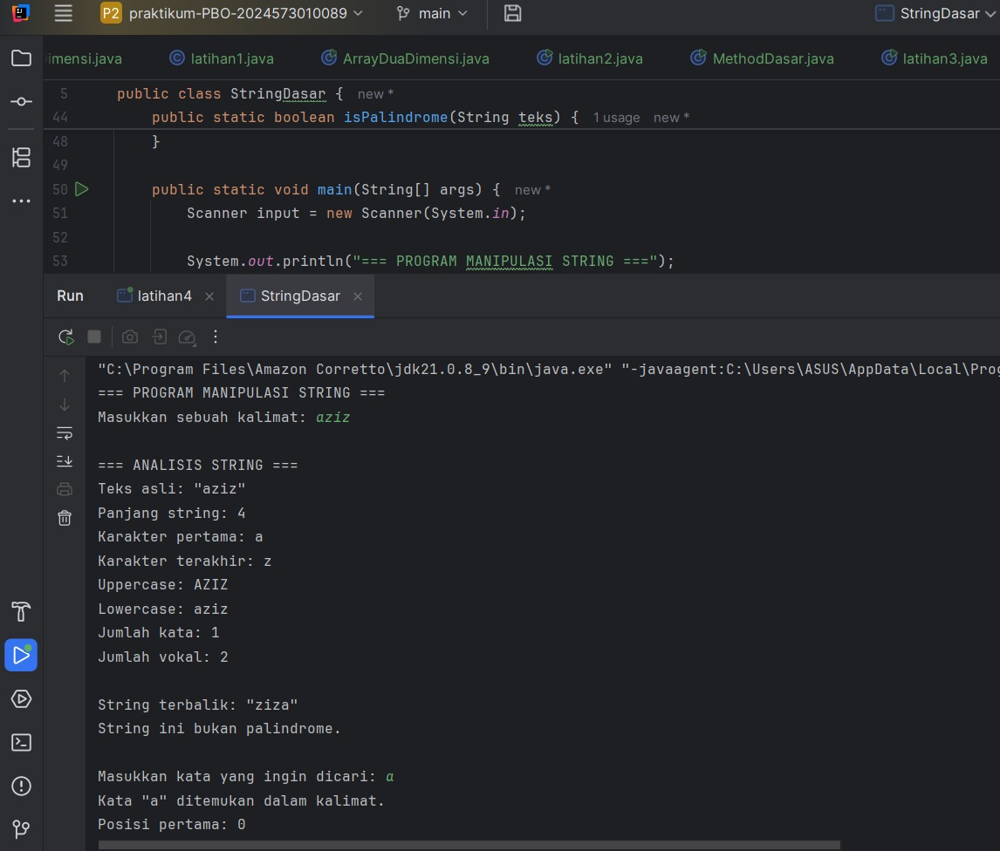
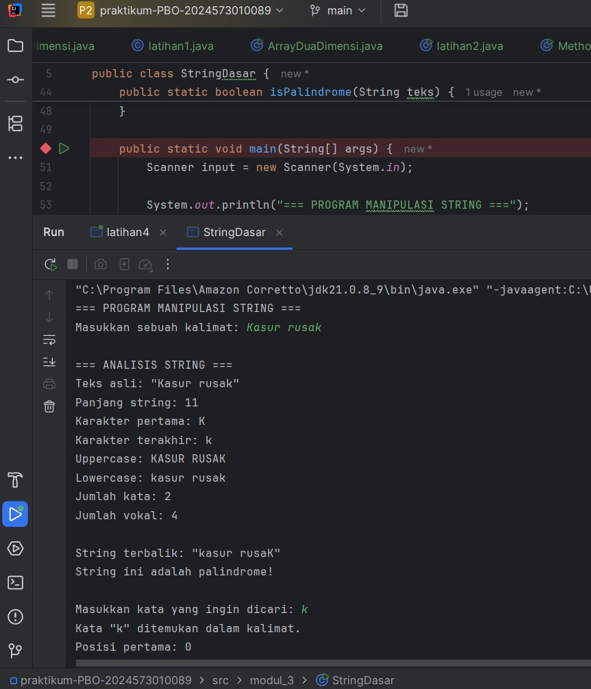
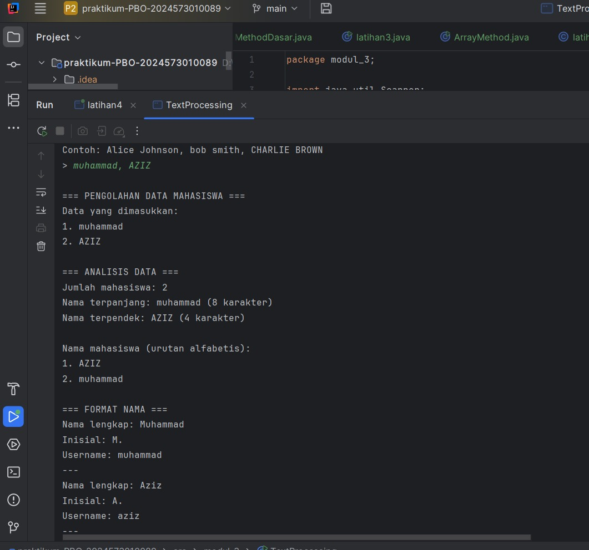

# Laporan Modul 3: Array, Method, dan String pada Java

**Mata Kuliah:** Praktikum Pemrograman Berorientasi Objek  
**Nama:** Muhammad Aziz  
**NIM:** 2024573010089  
**Kelas:** TI 2E

---

## 1. Abstrak

Laporan ini membahas hasil praktikum Modul 3 yang berfokus pada konsep **array**, **method**, dan **string manipulation** dalam bahasa pemrograman Java.  
Tujuannya adalah memahami bagaimana data disimpan, diproses, dan dimanipulasi menggunakan struktur data dasar serta fungsi‐fungsi buatan sendiri.  
Melalui praktikum ini, mahasiswa belajar membuat program dengan array satu dan dua dimensi, memanfaatkan method untuk modularisasi, serta menerapkan berbagai operasi string seperti pencarian, pembalikan, dan validasi.

---

## 2. Praktikum

### 2.1 Praktikum 1.1 – Penggunaan Array Dasar

#### Dasar Teori
Array digunakan untuk menyimpan beberapa nilai dalam satu variabel dengan tipe data yang sama.

#### Langkah Praktikum

- menyimpan nilai ujian 10 siswa,
- menghitung rata-rata,
- mencari nilai tertinggi dan terendah.

#### Kode Program ArraySatuDimensi sebelum di modifikasi
```java
package modul_3;

public class ArraySatuDimensi {
    public static void main(String[] args) {
        // Langkah 1: Deklarasi dan inisialisasi array
        int[] nilai = {85, 90, 78, 92, 88};
        String[] nama = {"Alice", "Bob", "Charlie", "Diana", "Eva"};

        // Langkah 2: Menampilkan panjang array
        System.out.println("Jumlah siswa: " + nilai.length);

        // Langkah 3: Mengakses elemen array
        System.out.println("Nama siswa pertama: " + nama[0]);

        // Langkah 4: Menampilkan semua data menggunakan loop
        System.out.println("\nData semua siswa:");
        for (int i = 0; i < nama.length; i++) {
            System.out.println((i+1) + ". " + nama[i] + " - Nilai: " + nilai[i]);
        }
    }
}

```
#### Screenshot Hasil arraysatudimensi sebelum di modifikasi


#### Kode Program ArraySatuDimensi sesudah di modifikasi
```java
package modul_3;

public class ArraySatuDimensi {
    public static void main(String[] args) {
        // Langkah 1: Deklarasi dan inisialisasi array
        int[] nilai = {85, 90, 78, 92, 88};
        String[] nama = {"Alice", "Bob", "Charlie", "Diana", "Eva"};

        // Langkah 2: Menampilkan panjang array
        System.out.println("Jumlah siswa: " + nilai.length);

        // Langkah 3: Mengakses elemen array
        System.out.println("Nama siswa pertama: " + nama[0]);

        // Langkah 4: Menampilkan semua data menggunakan loop
        System.out.println("\nData semua siswa:");
        for (int i = 0; i < nama.length; i++) {
            System.out.println((i+1) + ". " + nama[i] + " - Nilai: " + nilai[i]);
        }

        // Langkah 5: Mencari nilai tertinggi dan terendah
        int nilaiTertinggi = nilai[0];
        int nilaiTerendah = nilai[0];
        String siswaTertinggi = nama[0];
        String siswaTerendah = nama[0];

        for (int i = 1; i < nilai.length; i++) {
            if (nilai[i] > nilaiTertinggi) {
                nilaiTertinggi = nilai[i];
                siswaTertinggi = nama[i];
            }
            if (nilai[i] < nilaiTerendah) {
                nilaiTerendah = nilai[i];
                siswaTerendah = nama[i];
            }
        }

        // Langkah 6: Menampilkan hasil pencarian
        System.out.println("\nNilai tertinggi: " + nilaiTertinggi + " (oleh " + siswaTertinggi + ")");
        System.out.println("Nilai terendah: " + nilaiTerendah + " (oleh " + siswaTerendah + ")");
    }
}
```
#### Screenshot Hasil arraysatudimensi setelah di modifikasi



#### **Analisa dan Pembahasan: Array Satu Dimensi**

#### **1. Program ArraySatuDimensi (Sebelum dan Sesudah Dimodifikasi)**

#### **Analisa Program**
Program ini menggunakan **array satu dimensi** untuk menyimpan data nilai dan nama siswa.  
Langkah-langkah utamanya:
1. Mendeklarasikan dua array: `nilai` dan `nama`.
2. Menampilkan jumlah siswa menggunakan `array.length`.
3. Mengakses elemen pertama dari array `nama`.
4. Menampilkan seluruh data siswa menggunakan perulangan `for`.

Pada versi **setelah dimodifikasi**, ditambahkan:
- Fitur pencarian **nilai tertinggi dan terendah**.
- Menampilkan **nama siswa** yang memiliki nilai tersebut.
- Penambahan variabel seperti `nilaiTertinggi`, `nilaiTerendah`, `siswaTertinggi`, dan `siswaTerendah`.

#### **Pembahasan**
Perubahan yang dilakukan membuat program lebih lengkap karena tidak hanya menampilkan data, tetapi juga menganalisisnya.  
Program ini menunjukkan cara menggunakan **loop dan kondisi** untuk mencari nilai maksimum dan minimum dalam array.

Konsep yang dipelajari:
- Deklarasi dan inisialisasi array.
- Penggunaan indeks array untuk mengakses data.
- Pencarian data tertinggi dan terendah menggunakan perulangan.

---


### 2.2 Praktikum 1.2 – Array 2D dan Perhitungan Per Mata Pelajaran

#### Dasar Teori
Array dua dimensi menyimpan data dalam bentuk tabel (baris × kolom).

#### Langkah Praktikum

- menampilkan nilai 10 siswa × 5 mata pelajaran,
- menampilkan mata pelajaran dengan nilai tertinggi tiap siswa,
- menghitung rata-rata tiap mata pelajaran.

#### Kode Program ArrayDuaDimensi
```java
package modul_3;

import java.util.Scanner;

public class ArrayDuaDimensi {
    public static void main(String[] args) {
        Scanner input = new Scanner(System.in);

        // Langkah 1: Deklarasi array 2D untuk nilai siswa (3 siswa, 4 mata pelajaran)
        int[][] nilaiSiswa = new int[3][4];
        String[] namaSiswa = new String[3];
        String[] mataPelajaran = {"Matematika", "Bahasa Indonesia", "IPA", "IPS"};

        // Langkah 2: Input nilai
        System.out.println("=== INPUT NILAI SISWA ===");
        for (int i = 0; i < 3; i++) {
            System.out.print("Nama siswa ke-" + (i+1) + ": ");
            namaSiswa[i] = input.next();
            for (int j = 0; j < 4; j++) {
                System.out.print(mataPelajaran[j] + ": ");
                nilaiSiswa[i][j] = input.nextInt();
            }
            System.out.println();
        }

        // Langkah 3: Menampilkan data dalam bentuk tabel
        System.out.println("=== TABEL NILAI SISWA ===");
        System.out.printf("%-15s", "Nama");
        for (int i = 0; i < 4; i++) {
            System.out.printf("%-15s", mataPelajaran[i].substring(0, Math.min(7, mataPelajaran[i].length())));
        }
        System.out.printf("%-15s\n", "Rata-rata");

        for (int i = 0; i < 3; i++) {
            System.out.printf("%-15s", namaSiswa[i]);
            int total = 0;
            for (int j = 0; j < 4; j++) {
                System.out.printf("%-15d", nilaiSiswa[i][j]);
                total += nilaiSiswa[i][j];
            }
            double rataRata = total / 4.0;
            System.out.printf("%-15.2f\n", rataRata);
        }
    }
}

```
#### Screenshot Hasil arrayduadimensi

#### **Analisa dan Pembahasan: Array Dua Dimensi**

#### **1. Program ArrayDuaDimensi**

#### **Analisa Program**
Program ini menggunakan **array dua dimensi** untuk menyimpan nilai beberapa siswa pada berbagai mata pelajaran.  
Langkah-langkahnya:
1. Membuat array `nilaiSiswa[3][4]` untuk 3 siswa dan 4 mata pelajaran.
2. Menginput data siswa dan nilai menggunakan `Scanner`.
3. Menampilkan data dalam bentuk tabel menggunakan `System.out.printf()`.
4. Menghitung dan menampilkan **rata-rata nilai per siswa**.

#### **Pembahasan**
Array dua dimensi digunakan untuk merepresentasikan data berbentuk **tabel**, di mana:
- Baris mewakili siswa.
- Kolom mewakili mata pelajaran.

Program ini mengajarkan cara:
- Melakukan input data secara berulang dengan **nested loop**.
- Mengakses dan menampilkan data array dua dimensi dengan indeks `[i][j]`.
- Menghitung rata-rata tiap baris data.

Program ini memperkuat pemahaman tentang **struktur data dua dimensi** dan cara menampilkan data dalam format tabel yang rapi.

---


### 2.4 Praktikum 2.1 – Method/Function

#### Dasar Teori
Method adalah blok kode yang dapat dipanggil untuk menjalankan tugas tertentu. Method memungkinkan kita untuk:

- Menghindari pengulangan kode
- Membuat program lebih terstruktur
- Memudahkan debugging dan maintenance 
#### Jenis Method:
- Static Method: Dapat dipanggil tanpa membuat object
- Non-static Method: Perlu membuat object terlebih dahulu
- Void Method: Tidak mengembalikan nilai
- Return Method: Mengembalikan nilai

#### Syntax Method:
```java
java[access modifier] [static] returnType namaMethod(parameter) {
    // body method
    return value; // jika ada return type
}
```
#### Langkah Praktikum
1. Buat file baru dengan nama MethodDasar.java
2. Ketik kode berikut:


#### Kode Program methodDasar sebelum di modifkasi
```java
package modul_3;

public class MethodDasar {

    // Langkah 1: Method void tanpa parameter
    public static void tampilkanHeader() {
        System.out.println("===================================");
        System.out.println("     PROGRAM KALKULATOR SEDERHANA");
        System.out.println("===================================");
    }

    // Langkah 2: Method void dengan parameter
    public static void tampilkanHasil(String operasi, double a, double b, double hasil) {
        System.out.printf("%.2f %s %.2f = %.2f%n", a, operasi, b, hasil);
    }

    // Langkah 3: Method dengan return value
    public static double tambah(double a, double b) {
        return a + b;
    }

    public static double kurang(double a, double b) {
        return a - b;
    }

    public static double kali(double a, double b) {
        return a * b;
    }

    public static double bagi(double a, double b) {
        if (b != 0) {
            return a / b;
        } else {
            System.out.println("Error: Pembagian dengan nol!");
            return 0;
        }
    }

    // Langkah 4: Method dengan validasi input
    public static boolean validasiAngka(double angka) {
        return !Double.isNaN(angka) && Double.isFinite(angka);
    }

    public static void main(String[] args) {
        // Langkah 5: Menggunakan semua method
        tampilkanHeader();

        double x = 15.5;
        double y = 4.2;

        if (validasiAngka(x) && validasiAngka(y)) {
            double hasilTambah = tambah(x, y);
            double hasilKurang = kurang(x, y);
            double hasilKali = kali(x, y);
            double hasilBagi = bagi(x, y);

            tampilkanHasil("+", x, y, hasilTambah);
            tampilkanHasil("-", x, y, hasilKurang);
            tampilkanHasil("*", x, y, hasilKali);
            tampilkanHasil("/", x, y, hasilBagi);
        }
    }
}


```
#### Screenshot Hasil methoddasr sebelum di modifikasi 

#### Kode Program methodDasar setelah di modifkasi
```java
package modul_3;

public class MethodDasar {

    // Langkah 1: Method void tanpa parameter
    public static void tampilkanHeader() {
        System.out.println("===================================");
        System.out.println("     PROGRAM KALKULATOR SEDERHANA");
        System.out.println("===================================");
    }

    // Langkah 2: Method void dengan parameter
    public static void tampilkanHasil(String operasi, double a, double b, double hasil) {
        System.out.printf("%.2f %s %.2f = %.2f%n", a, operasi, b, hasil);
    }

    // Langkah 3: Method dengan return value
    public static double tambah(double a, double b) {
        return a + b;
    }

    public static double kurang(double a, double b) {
        return a - b;
    }

    public static double kali(double a, double b) {
        return a * b;
    }

    public static double bagi(double a, double b) {
        if (b != 0) {
            return a / b;
        } else {
            System.out.println("Error: Pembagian dengan nol!");
            return 0;
        }
    }

    // Langkah 4: Method dengan validasi input
    public static boolean validasiAngka(double angka) {
        return !Double.isNaN(angka) && Double.isFinite(angka);
    }

    public static void main(String[] args) {
        // Langkah 5: Menggunakan semua method
        tampilkanHeader();

        double x = 10.5;
        double y = 1.2;

        if (validasiAngka(x) && validasiAngka(y)) {
            double hasilTambah = tambah(x, y);
            double hasilKurang = kurang(x, y);
            double hasilKali = kali(x, y);
            double hasilBagi = bagi(x, y);

            tampilkanHasil("+", x, y, hasilTambah);
            tampilkanHasil("-", x, y, hasilKurang);
            tampilkanHasil("*", x, y, hasilKali);
            tampilkanHasil("/", x, y, hasilBagi);
        }
    }
}


```
#### Screenshot Hasil methoddasar setelah di modifikasi

#### **Analisa Program**
Program ini merupakan versi pengembangan dari versi sebelumnya.  
Perbedaan utamanya terdapat pada:
- Nilai variabel `x` dan `y` diubah menjadi `10.5` dan `1.2`.
- Tidak ada perubahan signifikan dalam logika, tetapi dilakukan **penyempurnaan nilai input** untuk menampilkan hasil berbeda.

Struktur program tetap sama, meliputi:
- Method void untuk menampilkan header.
- Method dengan parameter untuk menampilkan hasil.
- Method return untuk operasi matematika.
- Validasi angka agar input tetap aman.

#### **Pembahasan**
Meskipun perubahannya sederhana, program ini menekankan **pemahaman modularisasi dan fleksibilitas method**.  
Dengan struktur yang sudah modular, perubahan pada nilai input atau penambahan operasi lain tidak perlu mengubah keseluruhan logika program.

Penerapan prinsip **reusability** sangat terlihat karena setiap fungsi dapat digunakan kembali tanpa duplikasi kode.  
Program ini juga tetap menjaga keamanan data melalui validasi angka dan pembagian.

---

### Praktikum 2.1 – Array/Method

#### **Dasar Teori**
Dalam pemrograman Java, **array** digunakan untuk menyimpan sekumpulan nilai dengan tipe data yang sama, sedangkan **method** berfungsi untuk membagi program menjadi bagian-bagian kecil agar lebih terstruktur dan mudah dikelola.  
Dengan menggabungkan keduanya, kita dapat membangun program yang mampu melakukan **analisis data** secara modular.

**Konsep penting yang digunakan:**
- **Array satu dimensi** untuk menampung data input.
- **Loop for dan for-each** untuk iterasi data.
- **Method** untuk memisahkan logika perhitungan seperti maksimum, minimum, rata-rata, dan pengurutan.
- **Algoritma Bubble Sort** untuk mengurutkan data dari kecil ke besar.

---

#### **Langkah Praktikum**
1. **Buka IDE Java** (seperti NetBeans atau VS Code).
2. **Buat file baru bernama `ArrayMethod.java`.**
3. **Buat beberapa method utama:**
    - `inputArray(int ukuran)` untuk menerima input dari pengguna.
    - `tampilkanArray(int[] array)` untuk menampilkan isi array.
    - `cariMaksimum(int[] array)` dan `cariMinimum(int[] array)` untuk analisis nilai ekstrem.
    - `hitungRataRata(int[] array)` untuk menghitung nilai rata-rata.
    - `urutkanArray(int[] array)` untuk mengurutkan array secara ascending.
4. **Panggil semua method tersebut di dalam `main()`** agar hasil dapat ditampilkan secara lengkap.
5. **Jalankan program** dan amati output hasil analisis.

#### kode program arraymethod
```java
package modul_3;

import java.util.Scanner;

public class ArrayMethod {

    // Method untuk input array
    public static int[] inputArray(int ukuran) {
        Scanner input = new Scanner(System.in);
        int[] array = new int[ukuran];

        System.out.println("Masukkan " + ukuran + " angka:");
        for (int i = 0; i < ukuran; i++) {
            System.out.print("Angka ke-" + (i + 1) + ": ");
            array[i] = input.nextInt();
        }
        return array;
    }

    // Method untuk menampilkan array
    public static void tampilkanArray(int[] array) {
        System.out.print("Array: [");
        for (int i = 0; i < array.length; i++) {
            System.out.print(array[i]);
            if (i < array.length - 1)
                System.out.print(", ");
        }
        System.out.println("]");
    }

    // Method untuk mencari nilai maksimum
    public static int cariMaksimum(int[] array) {
        int maks = array[0];
        for (int i = 1; i < array.length; i++) {
            if (array[i] > maks) {
                maks = array[i];
            }
        }
        return maks;
    }

    // Method untuk mencari nilai minimum
    public static int cariMinimum(int[] array) {
        int min = array[0];
        for (int i = 1; i < array.length; i++) {
            if (array[i] < min) {
                min = array[i];
            }
        }
        return min;
    }

    // Method untuk menghitung rata-rata
    public static double hitungRataRata(int[] array) {
        int total = 0;
        for (int nilai : array) {
            total += nilai;
        }
        return (double) total / array.length;
    }

    // Method untuk mengurutkan array (Bubble Sort)
    public static int[] urutkanArray(int[] array) {
        int[] arrayBaru = array.clone(); // Membuat copy array

        for (int i = 0; i < arrayBaru.length - 1; i++) {
            for (int j = 0; j < arrayBaru.length - 1 - i; j++) {
                if (arrayBaru[j] > arrayBaru[j + 1]) {
                    // Tukar posisi
                    int temp = arrayBaru[j];
                    arrayBaru[j] = arrayBaru[j + 1];
                    arrayBaru[j + 1] = temp;
                }
            }
        }
        return arrayBaru;
    }

    public static void main(String[] args) {
        System.out.println("==== PROGRAM ANALISIS ARRAY ====");

        int[] data = inputArray(5);

        System.out.println("\n==== HASIL ANALISIS ====");
        tampilkanArray(data);

        System.out.println("Nilai Maksimum: " + cariMaksimum(data));
        System.out.println("Nilai Minimum: " + cariMinimum(data));
        System.out.printf("Rata-rata: %.2f%n", hitungRataRata(data));

        int[] dataUrut = urutkanArray(data);
        System.out.print("Array setelah diurutkan: ");
        tampilkanArray(dataUrut);
    }
}


```
#### Screenshot Hasil arraymethod

#### **Analisa dan Pembahasan Modul 3: Array dan Method**

#### **1. Program ArrayMethod**

#### **Analisa Program**
Program `ArrayMethod` menggabungkan dua konsep utama dalam Java, yaitu **array** dan **method**, untuk melakukan analisis sederhana terhadap sekumpulan data numerik.  
Program meminta pengguna menginput beberapa angka, kemudian menghitung hasil statistik dasar seperti **nilai maksimum, minimum, rata-rata, dan pengurutan data**.

Struktur program terdiri dari beberapa method:
1. `inputArray(int ukuran)` → menerima input sejumlah data dari pengguna.
2. `tampilkanArray(int[] array)` → menampilkan isi array dengan format `[x, y, z]`.
3. `cariMaksimum(int[] array)` → mencari nilai tertinggi dalam array.
4. `cariMinimum(int[] array)` → mencari nilai terendah.
5. `hitungRataRata(int[] array)` → menghitung rata-rata nilai.
6. `urutkanArray(int[] array)` → mengurutkan array secara **ascending** menggunakan **Bubble Sort**.

Pada method `main()`:
- Program menampilkan judul.
- Memanggil method `inputArray()` untuk menerima 5 angka dari pengguna.
- Menampilkan hasil analisis: nilai maksimum, minimum, rata-rata, serta hasil pengurutan.

#### **Pembahasan**
Program ini menunjukkan penerapan **fungsi modularisasi dengan method** agar setiap tugas memiliki tanggung jawab tersendiri.  
Konsep utama yang diterapkan:
- **Array satu dimensi** untuk menyimpan data numerik.
- **Loop for** dan **for-each** untuk melakukan iterasi data.
- **Bubble Sort** sebagai algoritma pengurutan sederhana.
- **Reusability** method agar bisa digunakan kembali tanpa menulis ulang logika.

Keunggulan dari pendekatan ini:
- Kode menjadi **lebih rapi dan mudah dibaca**.
- Proses analisis data seperti mencari maksimum/minimum dapat dilakukan secara terpisah.
- Struktur program mudah dikembangkan dengan fitur tambahan (misalnya median atau pencarian nilai).

Dengan demikian, `ArrayMethod` menjadi pondasi yang kuat untuk memahami interaksi antara array dan method dalam Java.

---


### 2.5 Praktikum 3.1 – Manipulasi String

#### 1. Dasar Teori

Manipulasi string merupakan salah satu konsep penting dalam pemrograman karena hampir semua aplikasi memerlukan pengolahan teks. Di Java, string merupakan objek dari kelas `String` yang bersifat **immutable**, artinya nilainya tidak dapat diubah setelah dibuat. Namun, berbagai operasi dapat dilakukan dengan membuat string baru sebagai hasil manipulasi.

Beberapa operasi umum pada string antara lain:
- **Menghitung panjang string** menggunakan `.length()`.
- **Mengambil karakter tertentu** dengan `.charAt(index)`.
- **Mengubah huruf besar/kecil** menggunakan `.toUpperCase()` dan `.toLowerCase()`.
- **Memisahkan string menjadi array kata** dengan `.split(" ")` atau ekspresi reguler seperti `split("\\s+")`.
- **Membalik string** menggunakan `StringBuilder` dan method `.reverse()`.
- **Mendeteksi palindrome**, yaitu string yang sama jika dibaca dari depan dan belakang.
- **Menghitung jumlah vokal dan konsonan**, dengan membandingkan karakter terhadap kumpulan huruf vokal atau alfabet.
- **Mengubah string menjadi Pascal Case**, yaitu format di mana setiap kata dimulai dengan huruf kapital (contoh: “saya belajar java” → “Saya Belajar Java”).

Dalam praktikum ini, konsep-konsep tersebut diterapkan melalui beberapa method, antara lain:
- `hitungVokal()` untuk menghitung jumlah huruf vokal.
- `hitungKonsonan()` untuk menghitung jumlah huruf konsonan.
- `reverseString()` untuk membalik urutan karakter.
- `isPalindrome()` untuk mengecek apakah string merupakan palindrome.
- `toPascalCase()` untuk mengubah string menjadi format Pascal Case.

---

#### 2. Langkah Praktikum


1. **Menulis Kode Program**
    - Tambahkan method-method berikut:
        - `analisisString(String teks)` → menampilkan informasi dasar string.
        - `hitungVokal(String teks)` → menghitung huruf vokal.
        - `hitungKonsonan(String teks)` → menghitung huruf konsonan.
        - `reverseString(String teks)` → membalik urutan karakter string.
        - `isPalindrome(String teks)` → mengecek apakah string merupakan palindrome.
        - `toPascalCase(String teks)` → mengubah string menjadi Pascal Case.

2. **Input dari Pengguna**
    - Program meminta pengguna memasukkan sebuah kalimat.

3. **Analisis String**
    - Menampilkan panjang string, karakter pertama dan terakhir, huruf besar/kecil, jumlah kata, jumlah vokal, dan jumlah konsonan.

4. **Menampilkan Manipulasi Tambahan**
    - String terbalik.
    - Hasil pengecekan palindrome.
    - Hasil konversi ke Pascal Case.

5. **Pencarian Substring**
    - Pengguna memasukkan kata yang ingin dicari dalam kalimat.
    - Program menampilkan apakah kata tersebut ditemukan dan posisinya dalam kalimat.

6. **Menjalankan Program**
    - Jalankan dan uji dengan berbagai kalimat, misalnya:
      ```
      Masukkan sebuah kalimat: Saya suka belajar Java
      ```

---

#### Kode Program string dasar
```java
package modul_3;

import java.util.Scanner;

public class StringDasar {

    public static void analisisString(String teks) {
        System.out.println("\n=== ANALISIS STRING ===");
        System.out.println("Teks asli: \"" + teks + "\"");
        System.out.println("Panjang string: " + teks.length());
        System.out.println("Karakter pertama: " + teks.charAt(0));
        System.out.println("Karakter terakhir: " + teks.charAt(teks.length() - 1));
        System.out.println("Uppercase: " + teks.toUpperCase());
        System.out.println("Lowercase: " + teks.toLowerCase());

        // Menghitung jumlah kata
        String[] kata = teks.trim().split("\\s+");
        System.out.println("Jumlah kata: " + kata.length);

        // Menghitung jumlah vokal
        int jumlahVokal = hitungVokal(teks);
        System.out.println("Jumlah vokal: " + jumlahVokal);
    }

    public static int hitungVokal(String teks) {
        String vokal = "aeiouAEIOU";
        int count = 0;
        for (int i = 0; i < teks.length(); i++) {
            if (vokal.contains(String.valueOf(teks.charAt(i)))) {
                count++;
            }
        }
        return count;
    }

    public static String reverseString(String teks) {
        StringBuilder reversed = new StringBuilder();
        for (int i = teks.length() - 1; i >= 0; i--) {
            reversed.append(teks.charAt(i));
        }
        return reversed.toString();
    }

    public static boolean isPalindrome(String teks) {
        String clean = teks.replaceAll("[^a-zA-Z0-9]", "").toLowerCase();
        String reversed = reverseString(clean);
        return clean.equals(reversed);
    }

    public static void main(String[] args) {
        Scanner input = new Scanner(System.in);

        System.out.println("=== PROGRAM MANIPULASI STRING ===");
        System.out.print("Masukkan sebuah kalimat: ");
        String kalimat = input.nextLine();

        // Analisis dasar
        analisisString(kalimat);

        // String terbalik
        System.out.println("\nString terbalik: \"" + reverseString(kalimat) + "\"");

        // Cek palindrome
        if (isPalindrome(kalimat)) {
            System.out.println("String ini adalah palindrome!");
        } else {
            System.out.println("String ini bukan palindrome.");
        }

        // Pencarian substring
        System.out.print("\nMasukkan kata yang ingin dicari: ");
        String cari = input.nextLine();

        if (kalimat.toLowerCase().contains(cari.toLowerCase())) {
            System.out.println("Kata \"" + cari + "\" ditemukan dalam kalimat.");
            int posisi = kalimat.toLowerCase().indexOf(cari.toLowerCase());
            System.out.println("Posisi pertama: " + posisi);
        } else {
            System.out.println("Kata \"" + cari + "\" tidak ditemukan dalam kalimat.");
        }
    }
}


```
#### Screenshot Hasil stringdasar input "aziz"


#### Screenshot Hasil stringdasar input "kasur rusak"


#### 3. Analisa dan Pembahasan


### 2.5 Praktikum 3.2 – textprocessing/validasi


#### 1. Dasar Teori

**Text Processing** atau pengolahan teks adalah proses membaca, menganalisis, dan memodifikasi data berbentuk teks agar dapat diolah secara sistematis oleh komputer. Dalam bahasa pemrograman Java, pengolahan teks dilakukan dengan memanfaatkan class `String` serta berbagai method pendukung seperti `split()`, `trim()`, `replaceAll()`, `toUpperCase()`, dan `toLowerCase()`.

Konsep penting dalam text processing antara lain:

1. **Pemecahan String (`split`)**  
   Method `.split()` digunakan untuk memisahkan teks menjadi array berdasarkan pemisah tertentu. Contohnya, kalimat yang dipisahkan dengan koma akan dipecah menjadi beberapa bagian yang lebih mudah diolah.

2. **Pembersihan Data (`trim`)**  
   Method `.trim()` digunakan untuk menghapus spasi di awal dan akhir string agar data lebih rapi dan mudah diproses.

3. **Validasi Input (Regular Expression / Regex)**  
   Validasi teks dapat dilakukan dengan ekspresi reguler seperti `[a-zA-Z ]+` untuk memastikan teks hanya mengandung huruf dan spasi tanpa angka atau simbol.

4. **Analisis Teks**  
   Operasi seperti menghitung jumlah kata, huruf vokal, huruf konsonan, atau menentukan panjang karakter dapat dilakukan dengan loop dan kondisi sederhana.

5. **Pemformatan Huruf (Case Formatting)**
    - **Pascal Case / Title Case:** Huruf pertama tiap kata dikapitalisasi.
    - **Lower Case / Upper Case:** Semua huruf diubah menjadi kecil atau besar seluruhnya.

6. **Pengurutan Alfabetis (`compareToIgnoreCase`)**  
   Method ini digunakan untuk mengurutkan teks tanpa membedakan huruf besar dan kecil.

Pengolahan teks penting dalam berbagai aplikasi seperti sistem input pengguna, validasi data, pengolahan nama, pembuatan email otomatis, dan sistem administrasi.

---

#### 2. Langkah Praktikum


1. Menambahkan dua file program:
    - **`TextProcessing.java`** untuk mengolah daftar nama mahasiswa.
2. Menjalankan program pertama untuk menganalisis daftar nama yang dipisahkan koma.
3. Menjalankan program kedua untuk menguji validasi nama, konversi Pascal Case, dan pembuatan email otomatis.
4. Mencatat hasil keluaran dan membandingkannya dengan teori manipulasi string.

---

#### kode program textprocessing
```java
package modul_3;

import java.util.Scanner;

public class TextProcessing {

    public static void prosesDataMahasiswa(String data) {
        System.out.println("\n=== PENGOLAHAN DATA MAHASISWA ===");

        // Memisahkan data berdasarkan koma
        String[] dataMahasiswa = data.split(",");

        System.out.println("Data yang dimasukkan:");
        for (int i = 0; i < dataMahasiswa.length; i++) {
            dataMahasiswa[i] = dataMahasiswa[i].trim(); // Menghilangkan spasi
            System.out.println((i + 1) + ". " + dataMahasiswa[i]);
        }

        // Analisis data
        System.out.println("\n=== ANALISIS DATA ===");
        System.out.println("Jumlah mahasiswa: " + dataMahasiswa.length);

        // Mencari nama terpanjang dan terpendek
        String namaTerpanjang = dataMahasiswa[0];
        String namaTerpendek = dataMahasiswa[0];

        for (String nama : dataMahasiswa) {
            if (nama.length() > namaTerpanjang.length()) {
                namaTerpanjang = nama;
            }
            if (nama.length() < namaTerpendek.length()) {
                namaTerpendek = nama;
            }
        }

        System.out.println("Nama terpanjang: " + namaTerpanjang + " (" + namaTerpanjang.length() + " karakter)");
        System.out.println("Nama terpendek: " + namaTerpendek + " (" + namaTerpendek.length() + " karakter)");

        // Mengurutkan nama secara alfabetis
        String[] namaUrut = dataMahasiswa.clone();
        for (int i = 0; i < namaUrut.length - 1; i++) {
            for (int j = i + 1; j < namaUrut.length; j++) {
                if (namaUrut[i].compareToIgnoreCase(namaUrut[j]) > 0) {
                    String temp = namaUrut[i];
                    namaUrut[i] = namaUrut[j];
                    namaUrut[j] = temp;
                }
            }
        }

        System.out.println("\nNama mahasiswa (urutan alfabetis):");
        for (int i = 0; i < namaUrut.length; i++) {
            System.out.println((i + 1) + ". " + namaUrut[i]);
        }
    }

    public static void formatNama(String[] nama) {
        System.out.println("\n=== FORMAT NAMA ===");
        for (String n : nama) {
            String namaFormatted = formatTitleCase(n.trim());
            String inisial = buatInisial(namaFormatted);
            System.out.println("Nama lengkap: " + namaFormatted);
            System.out.println("Inisial: " + inisial);
            System.out.println("Username: " + buatUsername(namaFormatted));
            System.out.println("---");
        }
    }

    public static String formatTitleCase(String teks) {
        String[] kata = teks.toLowerCase().split(" ");
        StringBuilder result = new StringBuilder();

        for (String k : kata) {
            if (k.length() > 0) {
                result.append(Character.toUpperCase(k.charAt(0)))
                        .append(k.substring(1))
                        .append(" ");
            }
        }
        return result.toString().trim();
    }

    public static String buatInisial(String nama) {
        String[] kata = nama.split(" ");
        StringBuilder inisial = new StringBuilder();

        for (String k : kata) {
            if (k.length() > 0) {
                inisial.append(Character.toUpperCase(k.charAt(0))).append(".");
            }
        }
        return inisial.toString();
    }

    public static String buatUsername(String nama) {
        return nama.toLowerCase().replaceAll(" ", "").replaceAll("[^a-zA-Z0-9]", "");
    }

    public static void main(String[] args) {
        Scanner input = new Scanner(System.in);

        System.out.println("=== PROGRAM PENGOLAHAN DATA TEKS ===");
        System.out.println("Masukkan nama-nama mahasiswa (pisahkan dengan koma):");
        System.out.print("Contoh: Alice Johnson, bob smith, CHARLIE BROWN\n> ");

        String dataNama = input.nextLine();

        // Proses data
        prosesDataMahasiswa(dataNama);

        // Format nama
        String[] arrayNama = dataNama.split(",");
        formatNama(arrayNama);
    }
}


```
#### Screenshot Hasil textprocessing

#### 3. Analisa dan Pembahasan

####  Program TextProcessing

Program ini menerima **daftar nama mahasiswa** dalam satu baris dengan pemisah koma. Setelah itu dilakukan beberapa proses:
- Memisahkan nama menjadi array menggunakan `split()`.
- Menghapus spasi berlebih dengan `trim()`.
- Menentukan jumlah mahasiswa.
- Mencari nama dengan panjang karakter terpendek dan terpanjang.
- Mengurutkan nama secara alfabetis dengan `compareToIgnoreCase()`.
- Memformat nama ke **Title Case**, membuat **inisial**, serta menghasilkan **username** otomatis.

Hasil pengujian menunjukkan bahwa program mampu menampilkan data mahasiswa dengan format yang rapi, menampilkan jumlah total mahasiswa, serta menampilkan daftar nama dalam urutan alfabetis. Program ini juga membantu dalam membentuk nama yang seragam sesuai kaidah penulisan.

---


### **3. Kesimpulan**


### **4. Referensi**

