# Laporan Modul 3: Array, Method, dan String pada Java

**Mata Kuliah:** Praktikum Pemrograman Berorientasi Objek  
**Nama:** Muhammad Aziz  
**NIM:** 2024573010089  
**Kelas:** TI 2E

---

## 1. Abstrak

Modul ini dirancang untuk memberikan pemahaman dasar tentang pemrograman berorientasi objek menggunakan Java melalui praktikum langsung.
Setiap praktikum dilengkapi dengan teori dasar dan langkah-langkah implementasi yang detail.
---

### Sebelum Memulai Praktikum
Buat sebuah package baru dengan nama modul_4 di dalam folder src, kemudian, selesaikan seluruh praktikum dan latihan dari modul ini di dalam package modul_4.


---
## 2. Dasar Teori
Objek-Oriented Programming (OOP) adalah paradigma pemrograman yang menggunakan “objek” - struktur data yang berisi data, dalam bentuk field, sering kali dikenal sebagai atribut; dan kode, dalam bentuk prosedur, sering kali dikenal sebagai metode.

Inti dari OOP adalah mendesain software dengan membagi masalah menjadi serangkaian objek yang saling berinteraksi. Ini bertentangan dengan pemrograman prosedural, yang fokus pada fungsi/prosedur dalam memproses data. OOP memungkinkan kita untuk membuat kode yang lebih modular, reusable, dan mudah di-maintain.

Konsep Dasar OOP:
Class: Template atau blueprint untuk membuat object
Object: Instance dari sebuah class
Attribute/Field: Variabel yang dimiliki oleh class
Method: Function yang dimiliki oleh class
Constructor: Method khusus untuk inisialisasi object

Prinsip OOP:
Encapsulation: Menyembunyikan detail implementasi
Inheritance: Pewarisan sifat dari class parent
Polymorphism: Kemampuan object untuk memiliki banyak bentuk
Abstraction: Menyederhanakan kompleksitas dengan menyembunyikan detail

Class dan Objek
kelas adalah konsep abstrak yang mendefinisikan set atribut dan metode yang akan dimiliki oleh object. Kelas menyediakan struktur atau template yang menentukan bagaimana sebuah object harus dibuat. Kelas akan menentukan jenis atribut dan metode apa yang akan dimiliki oleh object, tetapi tidak menentukan nilai dari atribut itu sendiri untuk object tertentu.

Object adalah inti dari pemrograman berorientasi objek. Setiap object memiliki dua karakteristik utama, yaitu:
Object, dalam konteks pemrograman OOP, adalah sebuah entitas yang memiliki karakteristik dan perilaku. Kelas, di sisi lain, merupakan blueprint atau cetakan untuk membuat object. Kalau kamu bandingkan dengan dunia nyata, kamu bisa menganggap kelas sebagai rencana desain bangunan, sedangkan object adalah bangunan yang sesungguhnya telah dibangun berdasarkan desain tersebut.
---

## 3. Praktikum

### 3.1 Praktikum : Dasar Class dan Object

### Tujuan:
Memahami cara membuat class, object, dan menggunakan constructor, dan relasi class


#### Langkah Praktikum
1. Buat class baru bernama Mahasiswa
2. Buat class Mahasiswa dan isikan kode berikut:

#### Kode class Mahasiswa.java
```java
public class Mahasiswa {
    // Atribut/Field (private untuk encapsulation)
    private String nama;
    private String nim;
    private String jurusan;

    // Constructor dengan parameter
    public Mahasiswa(String nama, String npm, String jurusan, double ipk) {
        this.nama = nama;
        this.nim = npm; // Sepertinya ada typo di gambar, seharusnya nim
        this.jurusan = jurusan;
    }

    // Getter methods
    public String getNama() {
        return nama;
    }

    public String getNim() {
        return nim;
    }

    public String getJurusan() {
        return jurusan;
    }
}

```

3. Buat class Matakuliah dan isikan kode berikut:

#### kode class Matkuliah.java
```java
public class Matakuliah {
    private String kode;
    private String nama;
    private int sks;
    private double nilai;

    // Constructor
    public Matakuliah(String kode, String nama, int sks) {
        this.kode = kode;
        this.nama = nama;
        this.sks = sks;
        this.nilai = 0.0;
    }

    // Getter dan Setter
    public String getKode() {
        return kode;
    }

    public String getNama() {
        return nama;
    }

    public int getSks() {
        return sks;
    }

    public double getNilai() {
        return nilai;
    }

    public void setNilai(double nilai) {
        if (nilai >= 0.0 && nilai <= 100.0) {
            this.nilai = nilai;
        } else {
            System.out.println("Nilai harus antara 0-100");
        }
    }

    // Konversi nilai angka ke huruf
    public String getNilaiHuruf() {
        if (nilai > 85) return "A";
        else if (nilai > 80) return "A-";
        else if (nilai > 75) return "B+";
        else if (nilai > 70) return "B";
        else if (nilai > 65) return "B-";
        else if (nilai > 60) return "C+";
        else if (nilai > 55) return "C";
        else if (nilai > 50) return "D"; // Di beberapa sistem, >40 adalah D
        else return "E";
    }

    // Konversi nilai huruf ke bobot
    public double getBobotNilai() {
        String huruf = getNilaiHuruf();
        switch (huruf) {
            case "A": return 4.0;
            case "A-": return 3.7;
            case "B+": return 3.3;
            case "B": return 3.0;
            case "B-": return 2.7;
            case "C+": return 2.3;
            case "C": return 2.0;
            case "D": return 1.0;
            default: return 0.0;
        }
    }

    public void tampilkanInfo() {
        System.out.printf("%-10s %-30s %d SKS | Nilai: %.2f (%s)\n",
                kode, nama, sks, nilai, getNilaiHuruf());
    }
}

```

4. Buat class RencanaKartuStudi dan isikan kode berikut:

#### kode class KartuRencanaStudi
```java
public class KartuRencanaStudi {
    private Mahasiswa mahasiswa;
    private Matakuliah[] daftarMatakuliah;
    private int jumlahMatkul;
    private int maxMatkul;

    public KartuRencanaStudi(Mahasiswa mahasiswa, int maxMatkul) {
        this.mahasiswa = mahasiswa;
        this.maxMatkul = maxMatkul;
        this.daftarMatakuliah = new Matakuliah[maxMatkul];
        this.jumlahMatkul = 0;
    }

    // Menambah mata kuliah ke KRS
    public boolean tambahMatakuliah(Matakuliah matkul) {
        if (jumlahMatkul < maxMatkul) {
            daftarMatakuliah[jumlahMatkul] = matkul;
            jumlahMatkul++;
            System.out.println("\n Note: Mata kuliah " + matkul.getNama() + " berhasil ditambahkan.");
            return true;
        } else {
            System.out.println("\n Note: KRS sudah penuh! Maksimal " + maxMatkul + " mata kuliah.");
            return false;
        }
    }

    // Menghitung total SKS
    public int hitungTotalSKS() {
        int totalSks = 0;
        for (int i = 0; i < jumlahMatkul; i++) {
            totalSks += daftarMatakuliah[i].getSks();
        }
        return totalSks;
    }

    // Menghitung IPK
    public double hitungIPK() {
        if (jumlahMatkul == 0) return 0.0;

        double totalBobot = 0.0;
        int totalSKS = 0;
        for (int i = 0; i < jumlahMatkul; i++) {
            Matakuliah mk = daftarMatakuliah[i];
            totalBobot += (mk.getBobotNilai() * mk.getSks());
            totalSKS += mk.getSks();
        }

        return totalSKS > 0 ? totalBobot / totalSKS : 0.0;
    }

    // Menampilkan KRS
    public void tampilkanKRS() {
        System.out.println("---------------------------------------------------------");
        System.out.println("                  KARTU RENCANA STUDI (KRS)              ");
        System.out.println("---------------------------------------------------------");
        System.out.println("Nama Mahasiswa : " + mahasiswa.getNama());
        System.out.println("NIM            : " + mahasiswa.getNim());
        System.out.println("Jurusan        : " + mahasiswa.getJurusan());
        System.out.println("---------------------------------------------------------");
        System.out.printf("%-10s %-30s %-5s %-5s\n", "KODE", "MATA KULIAH", "SKS", "NILAI");
        System.out.println("---------------------------------------------------------");

        if (jumlahMatkul == 0) {
            System.out.println("Belum ada mata kuliah yang diambil.");
        } else {
            for (int i = 0; i < jumlahMatkul; i++) {
                Matakuliah mk = daftarMatakuliah[i];
                System.out.printf("%-10s %-30s %-5d %-5s\n", mk.getKode(), mk.getNama(), mk.getSks(), mk.getNilaiHuruf());
            }
        }

        System.out.println("---------------------------------------------------------");
        System.out.println("Total SKS Semester: " + hitungTotalSKS());
        System.out.printf("IPK Semester      : %.2f\n", hitungIPK());
        System.out.println("---------------------------------------------------------\n");
    }

    // Mencari mata kuliah berdasarkan kode
    public Matakuliah cariMatakuliah(String kode) {
        for (int i = 0; i < jumlahMatkul; i++) {
            if (daftarMatakuliah[i].getKode().equalsIgnoreCase(kode)) {
                return daftarMatakuliah[i];
            }
        }
        return null;
    }
}

```

5. Buat class Main untuk menguji:

#### kode class main.java
```java
import java.util.Scanner;

public class Main {
    public static void main(String[] args) {
        Scanner input = new Scanner(System.in);
        
        System.out.println("---------------------------------------------------------");
        System.out.println("           SISTEM KARTU RENCANA STUDI (KRS)              ");
        System.out.println("---------------------------------------------------------");
        
        // Input data mahasiswa
        System.out.print("Nama Mahasiswa: ");
        String nama = input.nextLine();
        System.out.print("NIM           : ");
        String nim = input.nextLine();
        System.out.print("Jurusan       : ");
        String jurusan = input.nextLine();

        // Membuat object mahasiswa
        Mahasiswa mhs = new Mahasiswa(nama, nim, jurusan, 0.0);
        // Membuat object KRS (maksimal 10 mata kuliah)
        KartuRencanaStudi krs = new KartuRencanaStudi(mhs, 10);

        boolean running = true;
        while (running) {
            System.out.println("---------------------------------------------------------");
            System.out.println("                         MENU KRS                        ");
            System.out.println("---------------------------------------------------------");
            System.out.println("| 1. Tambah Mata Kuliah                                 |");
            System.out.println("| 2. Input Nilai Mata Kuliah                            |");
            System.out.println("| 3. Tampilkan KRS                                      |");
            System.out.println("| 4. Keluar                                             |");
            System.out.println("---------------------------------------------------------");
            System.out.print("Pilih menu: ");
            int pilihan = input.nextInt();
            input.nextLine(); // membersihkan newline

            switch (pilihan) {
                case 1:
                    System.out.println("\n----------------- TAMBAH MATA KULIAH ----------------");
                    System.out.print("Kode Mata Kuliah: ");
                    String kode = input.nextLine();
                    System.out.print("Nama Mata Kuliah: ");
                    String namaMK = input.nextLine();
                    System.out.print("Jumlah SKS      : ");
                    int sks = input.nextInt();
                    input.nextLine(); // membersihkan newline
                    
                    Matakuliah mk = new Matakuliah(kode, namaMK, sks);
                    krs.tambahMatakuliah(mk);
                    break;
                case 2:
                    System.out.println("\n------------------- INPUT NILAI ---------------------");
                    System.out.print("Masukkan Kode Mata Kuliah: ");
                    String kodeCari = input.nextLine();
                    Matakuliah mkCari = krs.cariMatakuliah(kodeCari);
                    if (mkCari != null) {
                        System.out.print("Masukkan Nilai (0-100): ");
                        double nilai = input.nextDouble();
                        input.nextLine(); // membersihkan newline
                        mkCari.setNilai(nilai);
                        System.out.println("Nilai berhasil diinput!");
                    } else {
                        System.out.println("Mata kuliah tidak ditemukan!");
                    }
                    break;
                case 3:
                    krs.tampilkanKRS();
                    break;
                case 4:
                    running = false;
                    System.out.println("Terima kasih!");
                    break;
                default:
                    System.out.println("Pilihan tidak valid!");
            }
        }
        input.close();
    }
}
```

#### Screenshot Hasil 
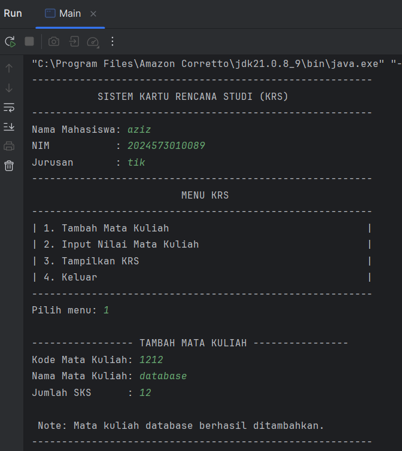
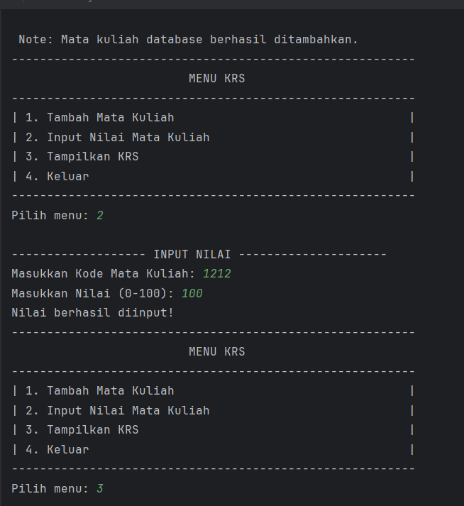
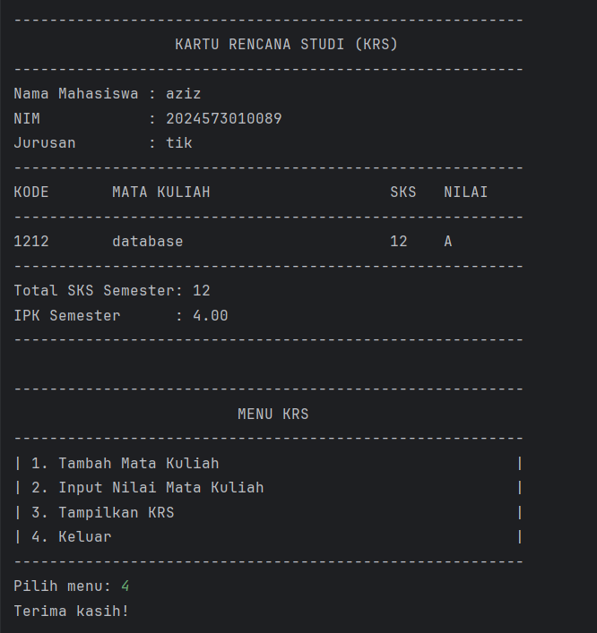

## 4. tugas  praktikum
### 4.1 tugas 
```markdown
Modifikasi kode diatas sesuai dengan instruksi berikut:

1. Tambahkan fitur untuk menghapus mata kuliah dari KRS
2. Buat validasi agar total SKS tidak melebihi batas tertentu (misalnya 24 SKS)
3. Tambahkan method untuk menampilkan mata kuliah dengan nilai terbaik dan terburuk

```

### Kode Program sesudah di modifikasi

#### kode class mahasiswa.java

```java
// Simpan sebagai Mahasiswa.java
public class Mahasiswa {
    private String nama;
    private String nim;
    private String jurusan;

    public Mahasiswa(String nama, String nim, String jurusan, double ipk) {
        this.nama = nama;
        this.nim = nim;
        this.jurusan = jurusan;
    }

    public String getNama() { return nama; }
    public String getNim() { return nim; }
    public String getJurusan() { return jurusan; }
}
```

#### kode class matakuliah.java
```java
// Simpan sebagai Matakuliah.java
public class Matakuliah {
    private String kode;
    private String nama;
    private int sks;
    private double nilai;

    public Matakuliah(String kode, String nama, int sks) {
        this.kode = kode;
        this.nama = nama;
        this.sks = sks;
        this.nilai = 0.0;
    }

    public String getKode() { return kode; }
    public String getNama() { return nama; }
    public int getSks() { return sks; }
    public double getNilai() { return nilai; }

    public void setNilai(double nilai) {
        if (nilai >= 0.0 && nilai <= 100.0) {
            this.nilai = nilai;
            System.out.println("Nilai berhasil diinput!");
        } else {
            System.out.println("Nilai harus antara 0-100");
        }
    }

    public String getNilaiHuruf() {
        if (nilai > 85) return "A";
        else if (nilai > 80) return "A-";
        else if (nilai > 75) return "B+";
        else if (nilai > 70) return "B";
        else if (nilai > 65) return "B-";
        else if (nilai > 60) return "C+";
        else if (nilai > 55) return "C";
        else if (nilai > 40) return "D";
        else return "E";
    }

    public double getBobotNilai() {
        switch (getNilaiHuruf()) {
            case "A": return 4.0;
            case "A-": return 3.7;
            case "B+": return 3.3;
            case "B": return 3.0;
            case "B-": return 2.7;
            case "C+": return 2.3;
            case "C": return 2.0;
            case "D": return 1.0;
            default: return 0.0;
        }
    }

    public void tampilkanInfo() {
        System.out.printf("   %-10s %-30s %d SKS | Nilai: %.2f (%s)\n",
                kode, nama, sks, nilai, getNilaiHuruf());
    }
}
```

#### kode class KartuRencanaStudi.java
Ini adalah file yang berisi logika modifikasi dari sebelumnya
```java
// Simpan sebagai KartuRencanaStudi.java
public class KartuRencanaStudi {
    private Mahasiswa mahasiswa;
    private Matakuliah[] daftarMatakuliah;
    private int jumlahMatkul;
    private int maxMatkul;
    // MODIFIKASI: Tambahkan konstanta untuk batas maksimal SKS
    private static final int MAX_SKS = 24;

    public KartuRencanaStudi(Mahasiswa mahasiswa, int maxMatkul) {
        this.mahasiswa = mahasiswa;
        this.maxMatkul = maxMatkul;
        this.daftarMatakuliah = new Matakuliah[maxMatkul];
        this.jumlahMatkul = 0;
    }
    
    // MODIFIKASI: Method tambahMatakuliah divalidasi dengan batas SKS
    public boolean tambahMatakuliah(Matakuliah matkul) {
        if (jumlahMatkul >= maxMatkul) {
            System.out.println("\n[GAGAL] Note: KRS sudah penuh! Maksimal " + maxMatkul + " mata kuliah.");
            return false;
        }
        
        if (hitungTotalSKS() + matkul.getSks() > MAX_SKS) {
            System.out.println("\n[GAGAL] Note: Total SKS akan melebihi batas " + MAX_SKS + " SKS.");
            return false;
        }

        daftarMatakuliah[jumlahMatkul] = matkul;
        jumlahMatkul++;
        System.out.println("\n[BERHASIL] Note: Mata kuliah " + matkul.getNama() + " berhasil ditambahkan.");
        return true;
    }

    // MODIFIKASI: Method baru untuk menghapus mata kuliah
    public boolean hapusMatakuliah(String kode) {
        int indexHapus = -1;
        for (int i = 0; i < jumlahMatkul; i++) {
            if (daftarMatakuliah[i].getKode().equalsIgnoreCase(kode)) {
                indexHapus = i;
                break;
            }
        }

        if (indexHapus == -1) {
            System.out.println("\n[GAGAL] Note: Mata kuliah dengan kode " + kode + " tidak ditemukan.");
            return false;
        }

        for (int i = indexHapus; i < jumlahMatkul - 1; i++) {
            daftarMatakuliah[i] = daftarMatakuliah[i + 1];
        }

        daftarMatakuliah[jumlahMatkul - 1] = null;
        jumlahMatkul--;
        System.out.println("\n[BERHASIL] Note: Mata kuliah dengan kode " + kode + " berhasil dihapus.");
        return true;
    }

    public int hitungTotalSKS() {
        int totalSks = 0;
        for (int i = 0; i < jumlahMatkul; i++) {
            totalSks += daftarMatakuliah[i].getSks();
        }
        return totalSks;
    }

    public double hitungIPK() {
        if (jumlahMatkul == 0) return 0.0;
        double totalBobot = 0.0;
        int totalSKS = 0;
        for (int i = 0; i < jumlahMatkul; i++) {
            totalBobot += (daftarMatakuliah[i].getBobotNilai() * daftarMatakuliah[i].getSks());
            totalSKS += daftarMatakuliah[i].getSks();
        }
        return totalSKS > 0 ? totalBobot / totalSKS : 0.0;
    }

    public void tampilkanKRS() {
        System.out.println("\n---------------------------------------------------------");
        System.out.println("                  KARTU RENCANA STUDI (KRS)              ");
        System.out.println("---------------------------------------------------------");
        System.out.println("Nama Mahasiswa : " + mahasiswa.getNama());
        System.out.println("NIM            : " + mahasiswa.getNim());
        System.out.println("Jurusan        : " + mahasiswa.getJurusan());
        System.out.println("---------------------------------------------------------");
        System.out.printf("%-10s %-30s %-5s %-5s\n", "KODE", "MATA KULIAH", "SKS", "NILAI");
        System.out.println("---------------------------------------------------------");

        if (jumlahMatkul == 0) {
            System.out.println("          Belum ada mata kuliah yang diambil.          ");
        } else {
            for (int i = 0; i < jumlahMatkul; i++) {
                Matakuliah mk = daftarMatakuliah[i];
                System.out.printf("%-10s %-30s %-5d %-5s\n", mk.getKode(), mk.getNama(), mk.getSks(), mk.getNilaiHuruf());
            }
        }

        System.out.println("---------------------------------------------------------");
        System.out.println("Total SKS Semester: " + hitungTotalSKS());
        System.out.printf("IPK Semester      : %.2f\n", hitungIPK());
        System.out.println("---------------------------------------------------------");
    }

    public Matakuliah cariMatakuliah(String kode) {
        for (int i = 0; i < jumlahMatkul; i++) {
            if (daftarMatakuliah[i].getKode().equalsIgnoreCase(kode)) {
                return daftarMatakuliah[i];
            }
        }
        return null;
    }

    // MODIFIKASI: Method baru untuk menampilkan mata kuliah terbaik
    public void tampilkanMatakuliahTerbaik() {
        if (jumlahMatkul == 0) {
            System.out.println("\nNote: Belum ada mata kuliah untuk dinilai.");
            return;
        }
        Matakuliah terbaik = null;
        for (int i = 0; i < jumlahMatkul; i++) {
            if(daftarMatakuliah[i].getNilai() > 0) {
                terbaik = daftarMatakuliah[i];
                break;
            }
        }
        if (terbaik == null) {
            System.out.println("\nNote: Belum ada mata kuliah yang diberi nilai.");
            return;
        }
        for (int i = 1; i < jumlahMatkul; i++) {
            if (daftarMatakuliah[i].getNilai() > terbaik.getNilai()) {
                terbaik = daftarMatakuliah[i];
            }
        }
        System.out.println("\n----------- MATA KULIAH NILAI TERBAIK -------------");
        terbaik.tampilkanInfo();
        System.out.println("---------------------------------------------------");
    }

    // MODIFIKASI: Method baru untuk menampilkan mata kuliah terburuk
    public void tampilkanMatakuliahTerburuk() {
        if (jumlahMatkul == 0) {
            System.out.println("\nNote: Belum ada mata kuliah untuk dinilai.");
            return;
        }
        Matakuliah terburuk = null;
        for (int i = 0; i < jumlahMatkul; i++) {
            if (daftarMatakuliah[i].getNilai() > 0) {
                terburuk = daftarMatakuliah[i];
                break;
            }
        }
        if (terburuk == null) {
            System.out.println("\nNote: Belum ada mata kuliah yang diberi nilai.");
            return;
        }
        for (int i = 1; i < jumlahMatkul; i++) {
            if (daftarMatakuliah[i].getNilai() > 0 && daftarMatakuliah[i].getNilai() < terburuk.getNilai()) {
                terburuk = daftarMatakuliah[i];
            }
        }
        System.out.println("\n----------- MATA KULIAH NILAI TERBURUK ------------");
        terburuk.tampilkanInfo();
        System.out.println("---------------------------------------------------");
    }
}
```

#### kode class main.java
File ini HANYA BERISI KELAS MAIN. Semua definisi kelas lain dihapus dari sini
```java
// Simpan sebagai Main.java
import java.util.Scanner;

public class Main {
    public static void main(String[] args) {
        Scanner input = new Scanner(System.in);

        System.out.println("---------------------------------------------------------");
        System.out.println("           SISTEM KARTU RENCANA STUDI (KRS)              ");
        System.out.println("---------------------------------------------------------");

        System.out.print("Nama Mahasiswa: ");
        String nama = input.nextLine();
        System.out.print("NIM           : ");
        String nim = input.nextLine();
        System.out.print("Jurusan       : ");
        String jurusan = input.nextLine();

        Mahasiswa mhs = new Mahasiswa(nama, nim, jurusan, 0.0);
        KartuRencanaStudi krs = new KartuRencanaStudi(mhs, 10);

        boolean running = true;
        while (running) {
            System.out.println("\n---------------------------------------------------------");
            System.out.println("                         MENU KRS                        ");
            System.out.println("---------------------------------------------------------");
            System.out.println("| 1. Tambah Mata Kuliah                                 |");
            System.out.println("| 2. Input Nilai Mata Kuliah                            |");
            System.out.println("| 3. Hapus Mata Kuliah dari KRS                         |");
            System.out.println("| 4. Tampilkan KRS                                      |");
            System.out.println("| 5. Tampilkan Mata Kuliah Nilai Terbaik                |");
            System.out.println("| 6. Tampilkan Mata Kuliah Nilai Terburuk               |");
            System.out.println("| 7. Keluar                                             |");
            System.out.println("---------------------------------------------------------");
            System.out.print("Pilih menu: ");
            int pilihan = input.nextInt();
            input.nextLine(); 

            switch (pilihan) {
                case 1:
                    System.out.println("\n----------------- TAMBAH MATA KULIAH ----------------");
                    System.out.print("Kode Mata Kuliah: ");
                    String kode = input.nextLine();
                    System.out.print("Nama Mata Kuliah: ");
                    String namaMK = input.nextLine();
                    System.out.print("Jumlah SKS      : ");
                    int sks = input.nextInt();
                    input.nextLine();

                    Matakuliah mk = new Matakuliah(kode, namaMK, sks);
                    krs.tambahMatakuliah(mk);
                    break;
                case 2:
                    System.out.println("\n------------------- INPUT NILAI ---------------------");
                    System.out.print("Masukkan Kode Mata Kuliah: ");
                    String kodeCari = input.nextLine();
                    Matakuliah mkCari = krs.cariMatakuliah(kodeCari);
                    if (mkCari != null) {
                        System.out.print("Masukkan Nilai (0-100): ");
                        double nilai = input.nextDouble();
                        input.nextLine();
                        mkCari.setNilai(nilai);
                    } else {
                        System.out.println("Mata kuliah tidak ditemukan!");
                    }
                    break;
                case 3:
                    System.out.println("\n----------------- HAPUS MATA KULIAH -----------------");
                    System.out.print("Masukkan Kode Mata Kuliah yang akan dihapus: ");
                    String kodeHapus = input.nextLine();
                    krs.hapusMatakuliah(kodeHapus);
                    break;
                case 4:
                    krs.tampilkanKRS();
                    break;
                case 5:
                    krs.tampilkanMatakuliahTerbaik();
                    break;
                case 6:
                    krs.tampilkanMatakuliahTerburuk();
                    break;
                case 7:
                    running = false;
                    System.out.println("Terima kasih!");
                    break;
                default:
                    System.out.println("Pilihan tidak valid!");
            }
        }
        input.close();
    }
}
```

#### Screenshot Hasil tugas praktikum
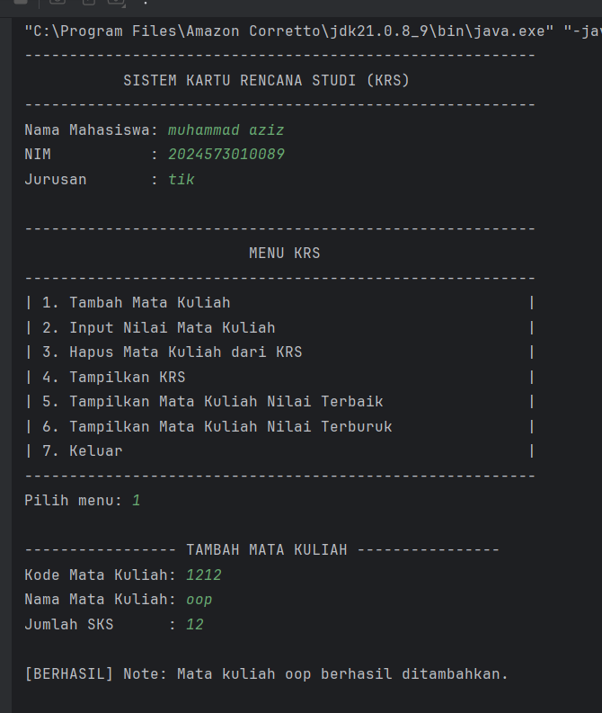
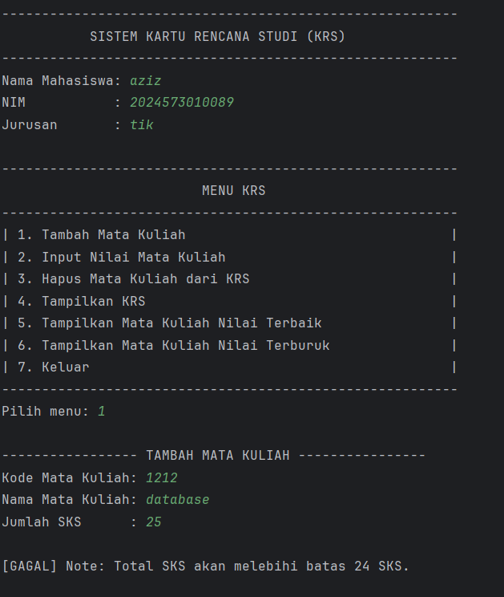
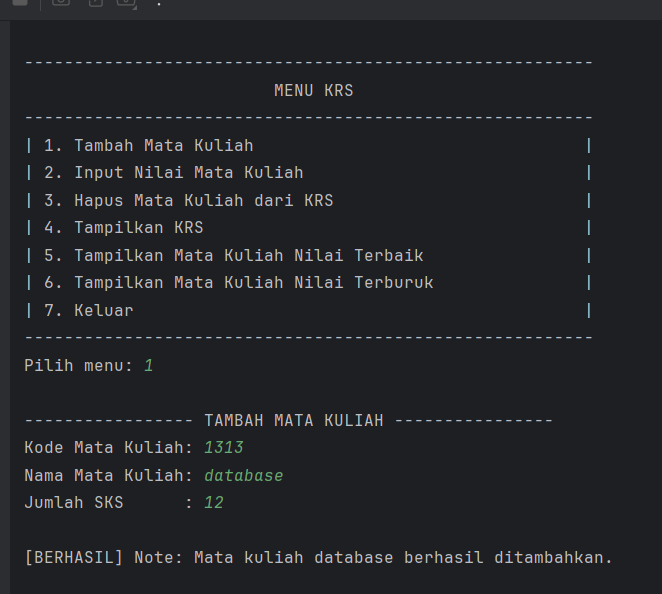

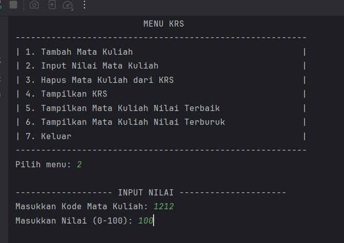
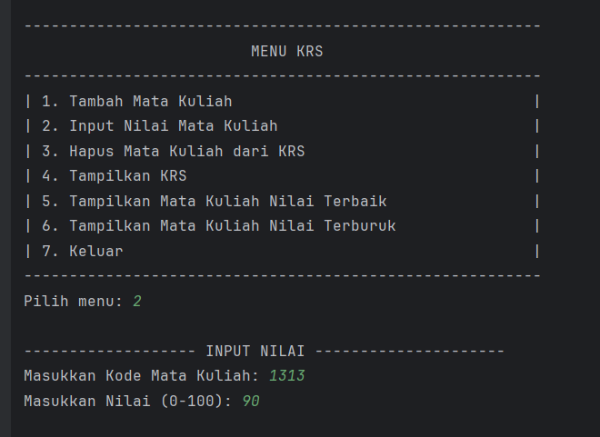
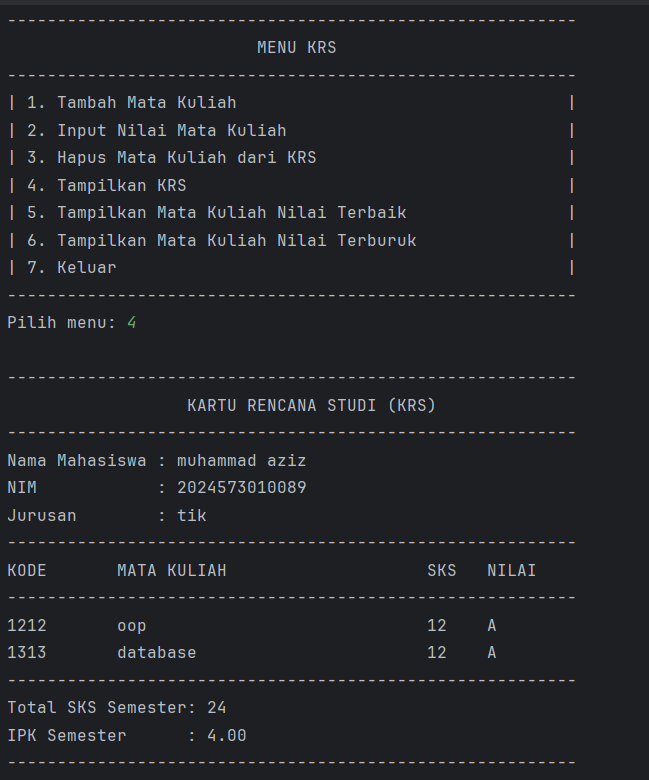
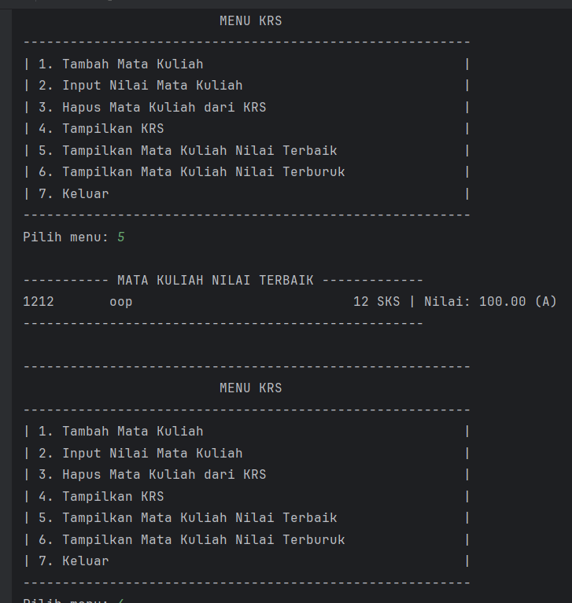
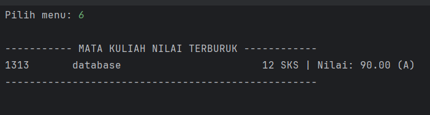
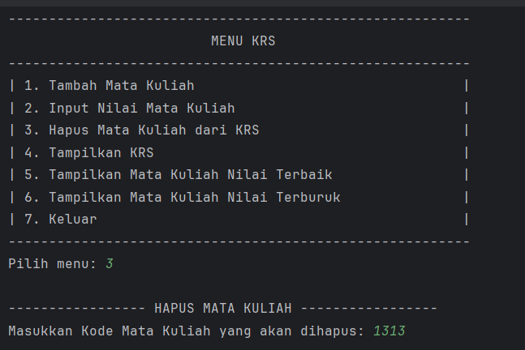
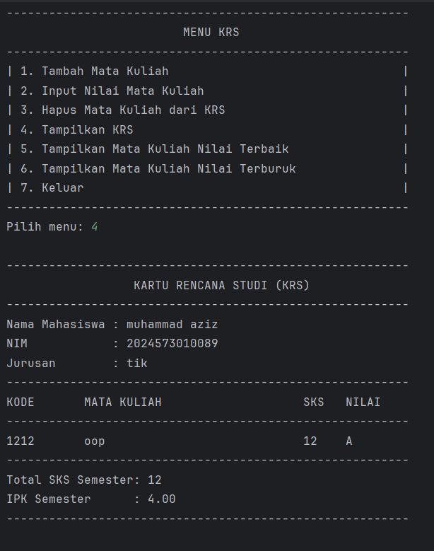
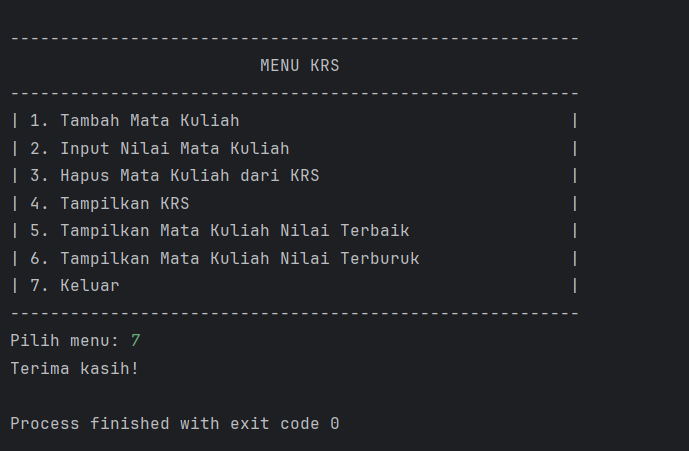


### 4.2 Analisis dan Pembahasan

#### Analisis Program Sebelum Modifikasi

Program awal yang dibangun merupakan implementasi dasar dari konsep Object-Oriented Programming (OOP) dalam Java untuk mengelola Kartu Rencana Studi (KRS) mahasiswa. Struktur program terdiri dari empat kelas utama yang saling berelasi:

1.  **`Mahasiswa`**: Berfungsi sebagai *blueprint* (cetakan) untuk objek mahasiswa. Kelas ini menggunakan prinsip **enkapsulasi** dengan mendeklarasikan atribut (`nama`, `nim`, `jurusan`) sebagai `private` dan menyediakan akses melalui metode `public` (getter). Ini memastikan bahwa data mahasiswa tidak dapat diubah secara sembarangan dari luar kelas.
2.  **`Matakuliah`**: Kelas ini merepresentasikan objek mata kuliah dengan atribut seperti `kode`, `nama`, `sks`, dan `nilai`. Kelas ini juga menerapkan enkapsulasi dan menyediakan logika bisnis internal seperti konversi nilai angka ke nilai huruf (`getNilaiHuruf`) dan bobot nilai (`getBobotNilai`), yang menunjukkan bagaimana sebuah objek dapat mengelola datanya sendiri.
3.  **`KartuRencanaStudi`**: Kelas ini bertindak sebagai "manager" atau "controller" yang mengelola hubungan antara seorang `Mahasiswa` dengan banyak `Matakuliah`. Relasi yang terbentuk adalah **agregasi**, di mana objek `KartuRencanaStudi` "memiliki" sebuah objek `Mahasiswa` dan sebuah array dari objek `Matakuliah`. Kelas ini menampung logika utama seperti penambahan mata kuliah, perhitungan total SKS, dan kalkulasi IPK.
4.  **`Main`**: Merupakan kelas utama (*entry point*) yang bertanggung jawab atas interaksi dengan pengguna (User Interface). Kelas ini membuat instance (objek) dari kelas-kelas lain dan mengatur alur program berdasarkan input pengguna melalui menu sederhana.

Secara fungsional, program awal berhasil mendemonstrasikan pembuatan *class* dan *object*, penggunaan *constructor* untuk inisialisasi, dan relasi antar kelas. Namun, program ini masih memiliki keterbatasan fungsionalitas, seperti tidak adanya fitur untuk membatalkan pengambilan mata kuliah dan tidak adanya validasi terhadap aturan akademik (contohnya, batas SKS).

#### Analisis Program Setelah Modifikasi (Tugas Praktikum)

Modifikasi yang dilakukan bertujuan untuk meningkatkan fungsionalitas program dan membuatnya lebih realistis sesuai dengan kebutuhan sistem KRS. Tiga fitur utama ditambahkan:

1.  **Validasi Batas Maksimal SKS (24 SKS)**
    -   **Implementasi**: Logika validasi ini ditambahkan di dalam method `tambahMatakuliah` pada kelas `KartuRencanaStudi`. Sebelum sebuah objek `Matakuliah` baru ditambahkan ke dalam array, program terlebih dahulu menghitung total SKS saat ini (`hitungTotalSKS()`) dan menambahkannya dengan SKS dari mata kuliah baru. Jika hasilnya melebihi `MAX_SKS` (24), proses penambahan dibatalkan dan pesan error ditampilkan.
    -   **Pembahasan**: Penambahan fitur ini menunjukkan pentingnya **validasi data** dalam sebuah sistem. Dengan menempatkan logika ini di dalam kelas `KartuRencanaStudi`, kita memastikan bahwa aturan bisnis (batas SKS) selalu terjaga, tidak peduli dari mana method `tambahMatakuliah` dipanggil. Ini memperkuat prinsip *enkapsulasi* dan menjadikan objek `KartuRencanaStudi` lebih "pintar" dan mandiri.

2.  **Fitur Menghapus Mata Kuliah dari KRS**
    -   **Implementasi**: Sebuah method baru, `hapusMatakuliah(String kode)`, dibuat di kelas `KartuRencanaStudi`. Method ini bekerja dengan cara:
        1.  Mencari indeks dari mata kuliah yang akan dihapus di dalam array `daftarMatakuliah` berdasarkan kode.
        2.  Jika ditemukan, semua elemen setelahnya akan digeser satu posisi ke kiri untuk menutupi posisi yang kosong.
        3.  Elemen terakhir di-set menjadi `null` dan `jumlahMatkul` dikurangi satu.
    -   **Pembahasan**: Fitur ini menunjukkan cara memanipulasi data dalam struktur data array. Karena array di Java memiliki ukuran yang tetap, penghapusan elemen tidak bisa dilakukan secara langsung. Teknik "menggeser elemen" adalah pendekatan standar untuk kasus ini. Fitur ini secara signifikan meningkatkan *usability* program, karena pengguna kini dapat mengoreksi kesalahan input.

3.  **Fitur Menampilkan Mata Kuliah dengan Nilai Terbaik dan Terburuk**
    -   **Implementasi**: Dua method baru, `tampilkanMatakuliahTerbaik()` dan `tampilkanMatakuliahTerburuk()`, ditambahkan ke kelas `KartuRencanaStudi`. Kedua method ini menggunakan algoritma pencarian sederhana:
        1.  Inisialisasi variabel sementara (misalnya `terbaik`) dengan mata kuliah pertama yang sudah memiliki nilai.
        2.  Lakukan iterasi (perulangan) melalui sisa mata kuliah dalam daftar.
        3.  Bandingkan nilai setiap mata kuliah dengan nilai pada variabel sementara. Jika ditemukan nilai yang lebih tinggi (untuk terbaik) atau lebih rendah (untuk terburuk), perbarui variabel sementara tersebut.
        4.  Setelah perulangan selesai, tampilkan informasi dari mata kuliah yang tersimpan di variabel sementara.
    -   **Pembahasan**: Penambahan fitur ini adalah contoh penerapan **logika algoritma dasar** di dalam sebuah method. Ini juga menunjukkan bagaimana sebuah kelas dapat memberikan wawasan atau analisis sederhana dari data yang dikelolanya. Penanganan kasus di mana belum ada nilai yang diinput menunjukkan praktik *defensive programming* yang baik, yaitu mengantisipasi kondisi-kondisi tak terduga (edge cases).

5. ### Kesimpulan
Praktikum ini berhasil mendemonstrasikan konsep-konsep fundamental OOP, mulai dari pembuatan kelas dan objek, enkapsulasi, hingga relasi antar kelas.
Melalui tugas modifikasi, program yang awalnya sederhana berhasil dikembangkan menjadi lebih fungsional dan robust. Penambahan fitur validasi SKS, penghapusan data, dan analisis nilai menunjukkan bagaimana logika bisnis dan algoritma dapat diintegrasikan ke dalam metode-metode di dalam kelas yang sesuai, sehingga menghasilkan program yang tidak hanya benar secara sintaksis, tetapi juga logis dan lebih berguna bagi pengguna.

---

6. ## Referensi
* Oracle. (2025). _The Java™ Tutorials_. Diakses pada 8 Oktober 2025, dari https://docs.oracle.com/javase/tutorial/
* Sierra, K., & Bates, B. (2022). _Head First Java, 3rd Edition_. O'Reilly Media.
* Bloch, J. (2018). _Effective Java, 3rd Edition_. Addison-Wesley Professional.
* Baeldung. (2025). _Java Tutorial_. Diakses pada 8 Oktober 2025, dari https://www.baeldung.com/java-tutorial
dition Documentation*. Diakses dari [https://docs.oracle.com/javase/](https://docs.oracle.com/javase/)