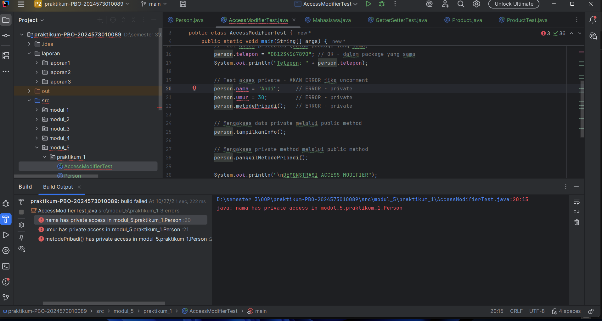
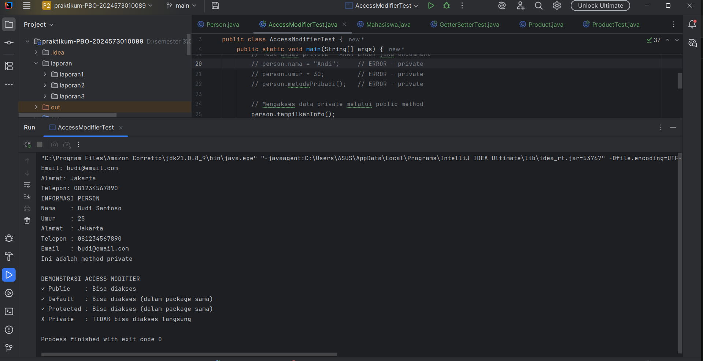
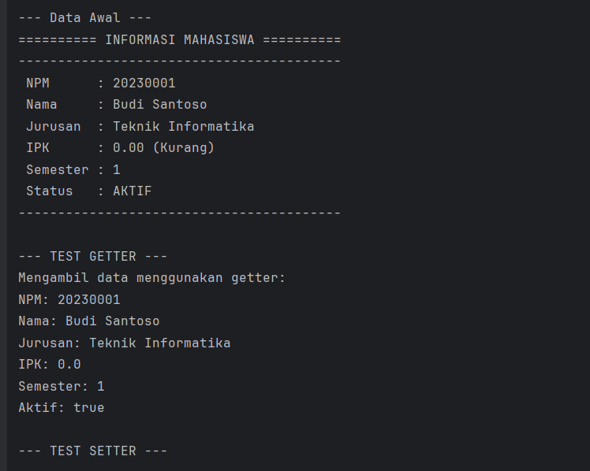
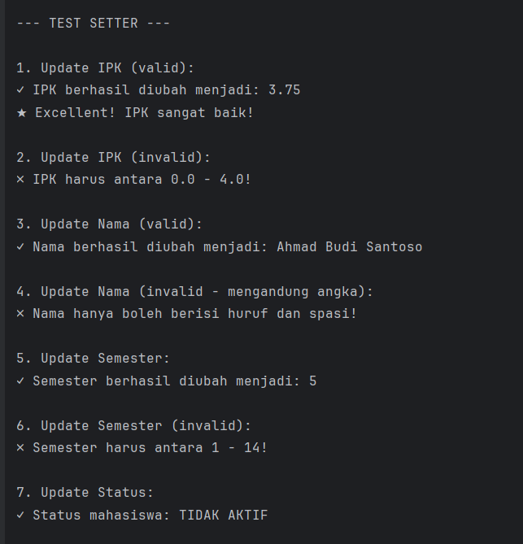
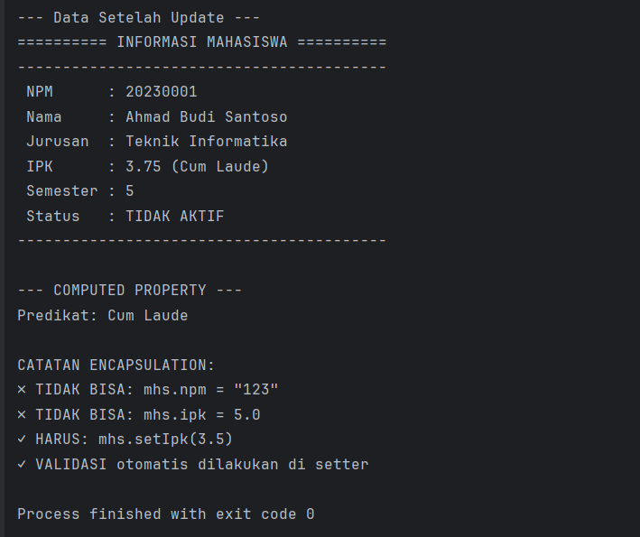
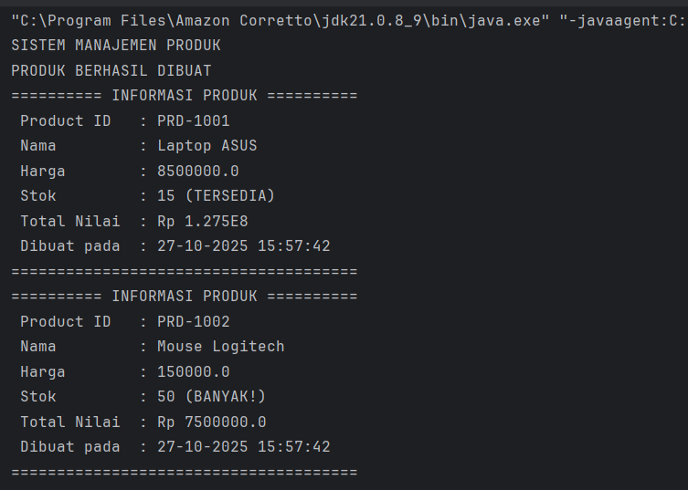
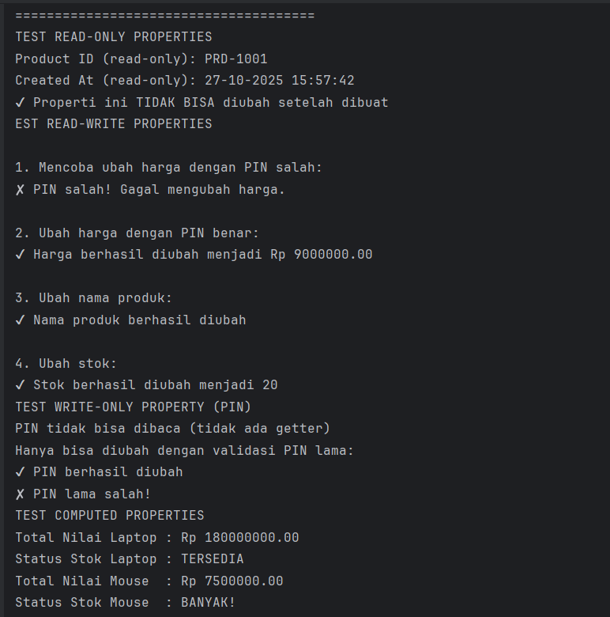
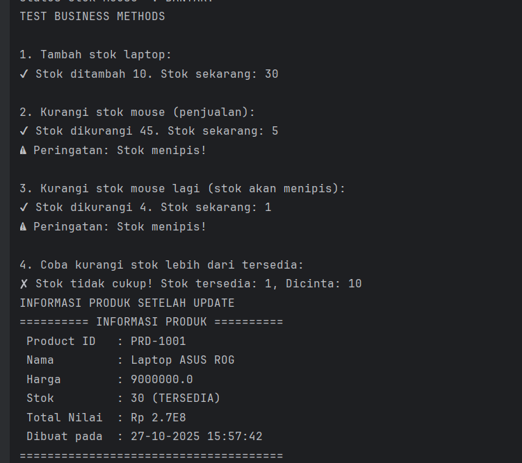
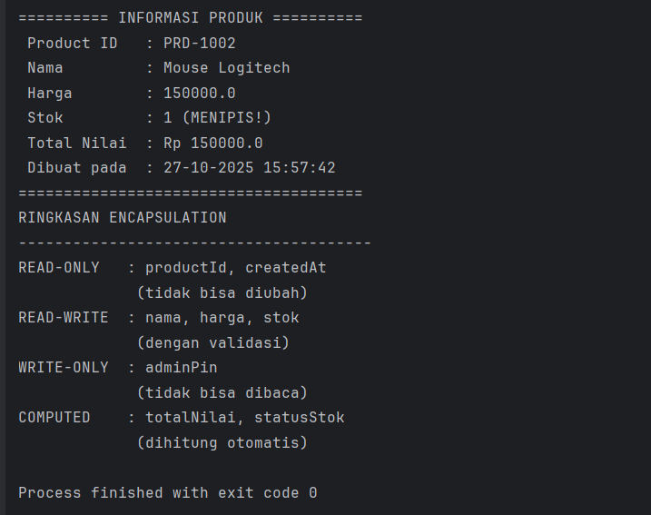

# Laporan Modul 5: Enkapsulasi

**Mata Kuliah:** Praktikum Pemrograman Berorientasi Objek  
**Nama:** Muhammad Aziz  
**NIM:** 2024573010089  
**Kelas:** TI 2E

-----

## 1\. Abstrak

Modul ini berfokus pada salah satu pilar utama Pemrograman Berorientasi Objek (OOP), yaitu **Enkapsulasi**. Laporan ini akan membahas implementasi praktis dari enkapsulasi di Java, yang mencakup penggunaan *access modifier* (public, private, protected, default), implementasi *getter* dan *setter* untuk melindungi data, serta konsep *read-only* dan *write-only properties*. Melalui tiga praktikum yang terpisah, modul ini mendemonstrasikan secara rinci bagaimana enkapsulasi digunakan untuk melindungi data dari akses tidak sah, menyediakan validasi data sebelum modifikasi, dan meningkatkan modularitas serta fleksibilitas kode.

-----

### Sebelum Memulai Praktikum

Buat sebuah package baru dengan nama `modul_5` di dalam folder `src`, kemudian, selesaikan seluruh praktikum dan latihan dari modul ini di dalam package `modul_5`.

-----

## 2\. Dasar Teori

**Encapsulation (Enkapsulasi)** adalah salah satu prinsip fundamental dalam Object-Oriented Programming (OOP) yang membungkus data (attributes) dan method yang bekerja pada data tersebut dalam satu unit (class), serta menyembunyikan detail implementasi internal dari dunia luar. Konsep utamanya sering disebut sebagai *data hiding* (penyembunyian data).

### Tujuan Encapsulation

* **Data Protection:** Melindungi data (atribut) dari akses dan modifikasi yang tidak sah dari luar class. Ini mencegah data dari kerusakan atau berada dalam kondisi yang tidak konsisten.
* **Data Validation:** Memastikan data yang masuk (melalui setter) valid sebelum disimpan ke dalam atribut. Contoh: IPK harus antara 0 dan 4.
* **Flexibility:** Implementasi internal class (bagaimana data disimpan atau diproses) dapat diubah tanpa mempengaruhi kode lain yang menggunakan class tersebut, selama *public interface* (method public) tidak berubah.
* **Maintainability:** Kode menjadi lebih mudah dipelihara dan di-debug karena logika bisnis dan data terkait terlokalisasi dalam satu class.
* **Modularity:** Membuat kode lebih modular dan terorganisir. Setiap class bertanggung jawab atas data dan perilakunya sendiri.

### Prinsip Utama dan Cara Implementasi

1.  **Deklarasikan attributes sebagai `private`**: Ini adalah langkah *data hiding*. Atribut yang `private` hanya dapat diakses dari dalam class itu sendiri.
2.  **Buat `public` getter methods**: Method ini berfungsi untuk *membaca* nilai atribut privat dari luar class. Contoh: `getNama()`.
3.  **Buat `public` setter methods**: Method ini berfungsi untuk *mengubah* nilai atribut privat. Di sinilah tempat ideal untuk meletakkan **validasi data**. Contoh: `setNama(String nama)`.
4.  **Tambahkan business logic di dalam class**: Logika yang memproses data internal harus disimpan sebagai method di dalam class itu sendiri (bisa `public` atau `private`).

### Access Modifier

Access modifier menentukan tingkat akses (visibilitas) terhadap class, attributes, dan methods. Java memiliki 4 jenis access modifier:

| Modifier | Class | Package | Subclass (Package Sama) | Subclass (Package Beda) | World (Lainnya) |
| :--- | :---: | :---: | :---: | :---: | :---: |
| **`public`** | Y | Y | Y | Y | Y |
| **`protected`** | Y | Y | Y | Y | T |
| **`default` (tanpa modifier)** | Y | Y | Y | T | T |
| **`private`** | Y | T | T | T | T |

### Getter dan Setter

Getter dan Setter adalah method publik yang digunakan untuk mengakses dan mengubah nilai `private` attributes.

* **Naming Convention (Aturan Penamaan):**

    * **Getter:** `get` + `NamaAttribute` (contoh: `getNama()`)
    * **Setter:** `set` + `NamaAttribute` (contoh: `setNama(String nama)`)
    * **Boolean Getter:** `is` + `NamaAttribute` (contoh: `isActive()`)

* **Keuntungan Menggunakan Getter/Setter:**

    * **Kontrol akses:** Anda dapat mengontrol penuh bagaimana data dibaca dan ditulis.
    * **Validasi data:** Setter dapat berisi logika untuk memvalidasi data sebelum disimpan.
    * **Read-only atau write-only attributes:**
        * **Read-only:** Hanya menyediakan method `get()`, tidak ada `set()`.
        * **Write-only:** Hanya menyediakan method `set()`, tidak ada `get()`.
    * **Computed attributes:** Getter dapat mengembalikan nilai yang dihitung "on-the-fly" alih-alih hanya mengembalikan nilai atribut.

-----

## 3\. Praktikum

### 3.1 Praktikum 1: Memahami Access Modifier

#### Tujuan:

Memahami perbedaan fungsional dan penggunaan berbagai *access modifier* (`public`, `protected`, `default`, `private`) dalam konteks akses antar-kelas dalam satu package.

#### Langkah Praktikum

1.  Buat sebuah package baru di dalam `modul_5` dengan nama `praktikum_1`.
2.  Di dalam `praktikum_1`, buat class baru bernama `Person.java`.
3.  Deklarasikan empat atribut dengan *access modifier* yang berbeda di dalam class `Person`:
    * `public String name;`
    * `protected int age;`
    * `String address;` (Ini adalah *default* atau *package-private*)
    * `private String ssn;` (Social Security Number)
4.  Buat sebuah *constructor* publik yang menerima empat parameter untuk menginisialisasi semua atribut tersebut.
5.  Buat sebuah method `public void displayInfo()` di dalam `Person` yang mencetak keempat atribut. Ini untuk menunjukkan bahwa class dapat mengakses semua membernya sendiri, termasuk yang `private`.
6.  Di dalam package `praktikum_1` yang sama, buat class baru bernama `AccessModifierTest.java`.
7.  Buat method `public static void main(String[] args)` di dalam `AccessModifierTest`.
8.  Di dalam `main`, buat sebuah *instance* (objek) dari `Person`: `Person person = new Person(...)`.
9.  Coba akses dan cetak setiap atribut dari objek `person` secara langsung:
    * `System.out.println(person.name);`
    * `System.out.println(person.age);`
    * `System.out.println(person.address);`
    * `System.out.println(person.ssn);`
10. Amati *compile error* yang terjadi. Baris yang mengakses `person.ssn` akan gagal karena `ssn` memiliki akses `private` di `Person`.
11. Beri komentar (`//`) pada baris yang error tersebut.
12. Panggil method `person.displayInfo()` untuk menunjukkan bahwa data `private` dapat diakses melalui method `public` dari class itu sendiri.
13. Jalankan program dan amati outputnya.

#### Kode class Person.java

```java
package modul_5.praktikum_1;

public class Person {
    // Private - hanya bisa diakses dalam class ini
    private String nama;
    private int umur;

    // Default (package-private) - bisa diakses dalam package yang sama
    String alamat;

    // Protected - bisa diakses dalam package dan subclass
    protected String telepon;

    // Public - bisa diakses dari mana saja
    public String email;

    // Constructor
    public Person(String nama, int umur) {
        this.nama = nama;
        this.umur = umur;
    }

    // Public method untuk menampilkan info
    public void tampilkanInfo() {
        System.out.println("INFORMASI PERSON");
        System.out.println("Nama    : " + nama);     // OK - dalam class yang sama
        System.out.println("Umur    : " + umur);     // OK - dalam class yang sama
        System.out.println("Alamat  : " + alamat);   // OK - dalam class yang sama
        System.out.println("Telepon : " + telepon);  // OK - dalam class yang sama
        System.out.println("Email   : " + email);    // OK - dalam class yang sama
    }

    // Private method - hanya bisa dipanggil dalam class ini
    private void metodePribadi() {
        System.out.println("Ini adalah method private");
    }

    // Protected method
    protected void metodeProtected() {
        System.out.println("Ini adalah method protected");
    }

    // Method untuk mengakses private method
    public void panggilMetodePribadi() {
        metodePribadi(); // OK - dalam class yang sama
    }
}

```

#### Kode class AccessModifierTest.java

```java
package modul_5.praktikum_1;

public class AccessModifierTest {
    public static void main(String[] args) {
        Person person = new Person("Budi Santoso", 25);

        // Test akses public
        person.email = "budi@email.com"; // OK - public
        System.out.println("Email: " + person.email);

        // Test akses default (dalam package yang sama)
        person.alamat = "Jakarta"; // OK - dalam package yang sama
        System.out.println("Alamat: " + person.alamat);

        // Test akses protected (dalam package yang sama)
        person.telepon = "081234567890"; // OK - dalam package yang sama
        System.out.println("Telepon: " + person.telepon);

        // Test akses private - AKAN ERROR jika uncomment
        // person.nama = "Andi";     // ERROR - private
        // person.umur = 30;         // ERROR - private
        // person.metodePribadi();   // ERROR - private

        // Mengakses data private melalui public method
        person.tampilkanInfo();

        // Mengakses private method melalui public method
        person.panggilMetodePribadi();

        System.out.println("\nDEMONSTRASI ACCESS MODIFIER");
        System.out.println("✓ Public    : Bisa diakses");
        System.out.println("✓ Default   : Bisa diakses (dalam package sama)");
        System.out.println("✓ Protected : Bisa diakses (dalam package sama)");
        System.out.println("X Private   : TIDAK bisa diakses langsung");
    }
}

```

#### Screenshot Hasil


jika di uncomment

jika di comment


-----
## 4\. Analisis dan Pembahasan

### 4.1 Analisis Praktikum 1 (Access Modifier)

Praktikum ini secara langsung mendemonstrasikan empat level visibilitas di Java. Pengujian dilakukan dari class `AccessModifierTest` terhadap atribut di class `Person`, dimana kedua class berada dalam package yang sama (`praktikum_1`).

* **`public String name`**: Atribut ini berhasil diakses. Ini sesuai teori bahwa `public` memiliki visibilitas terluas dan dapat diakses dari mana saja.
* **`protected int age`**: Atribut ini berhasil diakses. Ini karena `protected` dapat diakses oleh class lain dalam *package yang sama*.
* **`String address` (default/package-private)**: Atribut ini juga berhasil diakses. Visibilitas *default* sama dengan *protected* dalam konteks satu package, yaitu dapat diakses oleh class lain di package yang sama.
* **`private String ssn`**: Atribut ini **gagal** diakses dan menyebabkan *compile error*. Ini adalah inti dari *data hiding*. Atribut `private` hanya dapat diakses oleh kode di dalam class `Person` itu sendiri.
* **`person.displayInfo()`**: Method ini berhasil dipanggil (karena `public`) dan berhasil mencetak `ssn`. Ini membuktikan bahwa pembatasan `private` berlaku untuk akses *dari luar* class, bukan *di dalam* class itu sendiri.
----- 


### 3.2 Praktikum 2: Getter dan Setter

#### Tujuan:

Memahami cara membuat dan menggunakan *getter* dan *setter* untuk menerapkan enkapsulasi, melindungi data, dan melakukan validasi data.

#### Langkah Praktikum

1.  Buat sebuah package baru di dalam `modul_5` dengan nama `praktikum_2`.
2.  Di dalam `praktikum_2`, buat class baru bernama `Mahasiswa.java`.
3.  Deklarasikan semua atribut sebagai `private`:
    * `private String nama;`
    * `private String nim;`
    * `private String jurusan;`
    * `private double ipk;`
    * `private boolean statusAktif;`
4.  Buat *constructor* publik yang menerima `nama`, `nim`, dan `jurusan`. Di dalam constructor, inisialisasi `ipk` ke `0.0` dan `statusAktif` ke `true` sebagai nilai default.
5.  Buat *getter* method `public` untuk **semua** atribut:
    * `public String getNama()`
    * `public String getNim()`
    * `public String getJurusan()`
    * `public double getIpk()`
    * `public boolean isStatusAktif()` (Gunakan prefix `is` untuk boolean)
6.  Buat *setter* method `public` **hanya** untuk `nama`, `jurusan`, dan `ipk`:
    * `public void setNama(String nama)`
    * `public void setJurusan(String jurusan)`
    * `public void setIpk(double ipk)`
7.  Di dalam method `setIpk(double ipk)`, tambahkan **logika validasi**: periksa apakah `ipk` yang diinput berada di antara `0.0` dan `4.0`. Jika valid, ubah nilainya. Jika tidak valid, cetak pesan error dan jangan ubah nilai `ipk`.
8.  Perhatikan bahwa `nim` dan `statusAktif` tidak memiliki *setter*. Ini menjadikan `nim` *read-only* (hanya bisa di-set sekali via constructor) dan `statusAktif` juga *read-only*.
9.  Di dalam package `praktikum_2`, buat class baru bernama `GetterSetterTest.java` dengan method `main`.
10. Di dalam `main`, buat objek `Mahasiswa`.
11. Cetak semua data mahasiswa menggunakan method *getter* untuk melihat data awal.
12. Coba ubah data IPK menggunakan `mhs1.setIpk(3.75)` (input valid).
13. Coba ubah data IPK menggunakan `mhs1.setIpk(5.0)` (input tidak valid).
14. Coba ubah data jurusan menggunakan `mhs1.setJurusan("Sistem Informasi")`.
15. Coba ubah data NIM (misal: `mhs1.setNim("123")`). Ini akan gagal (compile error) karena method `setNim()` tidak ada.
16. Cetak kembali semua data mahasiswa menggunakan *getter* untuk melihat data akhir setelah perubahan.

#### Kode class Mahasiswa.java

```java
package modul_5.praktikum_2;

public class Mahasiswa {
    // Private attributes
    private String npm;
    private String nama;
    private String jurusan;
    private double ipk;
    private int semester;
    private boolean aktif;

    // Constructor
    public Mahasiswa(String npm, String nama, String jurusan) {
        this.npm = npm;
        this.nama = nama;
        this.jurusan = jurusan;
        this.ipk = 0.0;
        this.semester = 1;
        this.aktif = true;
    }

    // GETTER METHODS
    public String getNpm() {
        return npm;
    }

    public String getNama() {
        return nama;
    }

    public String getJurusan() {
        return jurusan;
    }

    public double getIpk() {
        return ipk;
    }

    public int getSemester() {
        return semester;
    }

    // Boolean getter menggunakan 'is' prefix
    public boolean isAktif() {
        return aktif;
    }

    // SETTER METHODS DENGAN VALIDASI
    // NPM: Read-only (tidak ada setter)
    // Alasan: NPM tidak boleh diubah setelah dibuat
    public void setNama(String nama) {
        // Validasi: Nama tidak boleh kosong
        if (nama == null || nama.trim().isEmpty()) {
            System.out.println("✗ Nama tidak boleh kosong!");
            return;
        }

        // Validasi: Nama hanya huruf dan spasi
        if (!nama.matches("[a-zA-Z ]+")) {
            System.out.println("✗ Nama hanya boleh berisi huruf dan spasi!");
            return;
        }

        this.nama = nama;
        System.out.println("✓ Nama berhasil diubah menjadi: " + nama);
    }

    public void setJurusan(String jurusan) {
        if (jurusan == null || jurusan.trim().isEmpty()) {
            System.out.println("✗ Jurusan tidak boleh kosong!");
            return;
        }

        this.jurusan = jurusan;
        System.out.println("✓ Jurusan berhasil diubah menjadi: " + jurusan);
    }

    public void setIpk(double ipk) {
        // Validasi: IPK antara 0.0 - 4.0
        if (ipk < 0.0 || ipk > 4.0) {
            System.out.println("✗ IPK harus antara 0.0 - 4.0!");
            return;
        }

        this.ipk = ipk;
        System.out.printf("✓ IPK berhasil diubah menjadi: %.2f%n", ipk);

        // Cek status akademik berdasarkan IPK
        cekStatusAkademik();
    }

    public void setSemester(int semester) {
        // Validasi: Semester antara 1 - 14
        if (semester < 1 || semester > 14) {
            System.out.println("✗ Semester harus antara 1 - 14!");
            return;
        }

        this.semester = semester;
        System.out.println("✓ Semester berhasil diubah menjadi: " + semester);
    }

    public void setAktif(boolean aktif) {
        this.aktif = aktif;
        String status = aktif ? "AKTIF" : "TIDAK AKTIF";
        System.out.println("✓ Status mahasiswa: " + status);
    }

    // HELPER METHODS (PRIVATE)
    private void cekStatusAkademik() {
        if (ipk < 2.0) {
            System.out.println("⚠ Peringatan: IPK di bawah standar!");
        } else if (ipk > 3.5) {
            System.out.println("★ Excellent! IPK sangat baik!");
        }
    }

    // PUBLIC METHODS
    public String getPredikat() {
        if (ipk > 3.5) return "Cum Laude";
        else if (ipk > 3.0) return "Sangat Baik";
        else if (ipk > 2.5) return "Baik";
        else if (ipk > 2.0) return "Cukup";
        else return "Kurang";
    }

    public void tampilkanInfo() {
        System.out.println("========== INFORMASI MAHASISWA ==========");
        System.out.println("-----------------------------------------");
        System.out.println(" NPM      : " + npm);
        System.out.println(" Nama     : " + nama);
        System.out.println(" Jurusan  : " + jurusan);
        System.out.printf(" IPK      : %.2f (%s)%n", ipk, getPredikat());
        System.out.println(" Semester : " + semester);
        System.out.println(" Status   : " + (aktif ? "AKTIF" : "TIDAK AKTIF"));
        System.out.println("-----------------------------------------");
    }
}

```

#### Kode class GetterSetterTest.java

```java
package modul_5.praktikum_2;

public class GetterSetterTest {
    public static void main(String[] args) {
        System.out.println("TEST GETTER DAN SETTER\n");

        // Membuat object mahasiswa
        Mahasiswa mhs = new Mahasiswa("20230001", "Budi Santoso", "Teknik Informatika");

        System.out.println("--- Data Awal ---");
        mhs.tampilkanInfo();

        // Test GETTER
        System.out.println("\n--- TEST GETTER ---");
        System.out.println("Mengambil data menggunakan getter:");
        System.out.println("NPM: " + mhs.getNpm());
        System.out.println("Nama: " + mhs.getNama());
        System.out.println("Jurusan: " + mhs.getJurusan());
        System.out.println("IPK: " + mhs.getIpk());
        System.out.println("Semester: " + mhs.getSemester());
        System.out.println("Aktif: " + mhs.isAktif());

        // Test SETTER dengan validasi
        System.out.println("\n--- TEST SETTER ---");

        // Test 1: Update IPK valid
        System.out.println("\n1. Update IPK (valid):");
        mhs.setIpk(3.75);

        // Test 2: Update IPK invalid
        System.out.println("\n2. Update IPK (invalid):");
        mhs.setIpk(5.0); // Akan ditolak

        // Test 3: Update nama valid
        System.out.println("\n3. Update Nama (valid):");
        mhs.setNama("Ahmad Budi Santoso");

        // Test 4: Update nama invalid
        System.out.println("\n4. Update Nama (invalid - mengandung angka):");
        mhs.setNama("Budi1123"); // Akan ditolak

        // Test 5: Update semester
        System.out.println("\n5. Update Semester:");
        mhs.setSemester(5);

        // Test 6: Update semester invalid
        System.out.println("\n6. Update Semester (invalid):");
        mhs.setSemester(20); // Akan ditolak

        // Test 7: Update status
        System.out.println("\n7. Update Status:");
        mhs.setAktif(false);

        // Tampilkan data akhir
        System.out.println("\n--- Data Setelah Update ---");
        mhs.tampilkanInfo();

        // Demonstrasi computed property
        System.out.println("\n--- COMPUTED PROPERTY ---");
        System.out.println("Predikat: " + mhs.getPredikat());

        // Tidak bisa akses langsung (akan error)
        System.out.println("\nCATATAN ENCAPSULATION:");
        System.out.println("✗ TIDAK BISA: mhs.npm = \"123\"");
        System.out.println("✗ TIDAK BISA: mhs.ipk = 5.0");
        System.out.println("✓ HARUS: mhs.setIpk(3.5)");
        System.out.println("✓ VALIDASI otomatis dilakukan di setter");
    }
}


```

#### Screenshot Hasil






-----
## 4\. Analisis dan Pembahasan

### 4.2 Analisis Praktikum 2 (Getter dan Setter)

Praktikum ini adalah implementasi standar enkapsulasi. Semua atribut di-set ke `private`, dan akses dikontrol melalui method *accessor* (getter) dan *mutator* (setter).

* **Proteksi Data:** Dengan menyembunyikan atribut (misal `ipk`), kita memaksa kode luar (dari `GetterSetterTest`) untuk menggunakan `setIpk()`.
* **Validasi Data:** Method `setIpk(double ipk)` bertindak sebagai "penjaga gerbang". Ketika `mhs1.setIpk(5.5)` dipanggil, logika `if` di dalam setter mencegah data yang tidak valid masuk ke atribut `ipk`. Nilai `ipk` tetap `3.75` (dari pemanggilan valid sebelumnya), bukan `0.0` atau `5.5`. Ini menjaga integritas dan konsistensi data objek.
* **Read-Only Property:** Atribut `nim` secara efektif menjadi *read-only*. Ia bisa di-set satu kali melalui *constructor* saat objek dibuat, tetapi setelah itu tidak bisa diubah lagi karena tidak ada method `setNim()`. Upaya untuk memanggil `setNim()` gagal di tahap kompilasi. Ini sangat penting untuk data yang seharusnya *immutable* (tidak bisa berubah) seperti NIM atau ID.

-----

### 3.3 Praktikum 3: Read-Only dan Write-Only Properties

#### Tujuan:

Memahami konsep *read-only* dan *write-only properties* serta *computed properties* sebagai bagian dari implementasi enkapsulasi yang lebih kompleks.

#### Langkah Praktikum

1.  Buat sebuah package baru di dalam `modul_5` dengan nama `praktikum_3`.
2.  Di dalam `praktikum_3`, buat class baru bernama `Product.java`.
3.  Deklarasikan atribut `private`: `id`, `name`, `price`, `pin`, `stock`.
4.  Buat *constructor* untuk menginisialisasi semua atribut (termasuk `pin` awal).
5.  Implementasikan properti berikut:
    * **Read-Only (`id`):** Buat `public String getId()`, tapi **jangan** buat `setId()`.
    * **Read-Write (`name`, `price`):** Buat `getName()`, `setName()`, `getPrice()`, `setPrice()`.
    * **Write-Only (`pin`):** Buat `public void setPin(String pin)`, tapi **jangan** buat `getPin()`. Ini berguna untuk data sensitif yang bisa diubah tapi tidak boleh dibaca.
    * **Validasi Keamanan:** Modifikasi `setPrice()` agar membutuhkan parameter kedua: `public void setPrice(double price, String inputPin)`. Method ini harus memanggil method *helper* `private boolean validatePin(String inputPin)` sebelum mengubah harga.
    * **Computed Property:** Buat method `public double getTotalValue()` yang mengembalikan hasil perhitungan `this.price * this.stock`. Ini adalah properti yang nilainya "dihitung" saat dipanggil, bukan disimpan.
6.  Di dalam package `praktikum_3`, buat class baru bernama `ProductTest.java` dengan method `main`.
7.  Di dalam `main`, buat objek `Product` dengan PIN awal (misal: "123456").
8.  **Uji Read-Only:** Coba baca `product.getId()` (sukses). Coba ubah `product.setId("P002")` (gagal, compile error).
9.  **Uji Write-Only:** Coba ubah `product.setPin("654321")` (sukses). Coba baca `product.getPin()` (gagal, compile error).
10. **Uji Validasi PIN:** Coba ubah harga `product.setPrice(20000, "123456")` (menggunakan PIN lama yang salah, harusnya gagal).
11. Cetak harga, pastikan tidak berubah.
12. Coba ubah harga `product.setPrice(20000, "654321")` (menggunakan PIN baru yang benar, harusnya sukses).
13. Cetak harga, pastikan sudah berubah.
14. **Uji Computed Property:** Cetak hasil dari `product.getTotalValue()`.

#### Kode class Product.java

```java
package modul_5.praktikum_3;

import java.time.LocalDateTime;
import java.time.format.DateTimeFormatter;

public class Product {
    // Read-only (hanya getter)
    private final String productId;
    private final LocalDateTime createdAt;

    // Read-write (getter dan setter)
    private String name;
    private double harga;
    private int stok;

    // Write-only (hanya setter) - untuk password/PIN
    private String adminPin;

    // Computed property (tidak ada attribute, hanya getter)
    // Total nilai = harga x stok

    // Counter untuk ID otomatis
    private static int counter = 1000;

    // CONSTRUCTOR
    public Product(String nama, double harga, int stok, String adminPin) {
        this.productId = generateProductID();
        this.createdAt = LocalDateTime.now();
        this.name = nama;
        this.harga = harga;
        this.stok = stok;
        this.adminPin = adminPin;
    }

    // PRIVATE HELPER METHODS
    private String generateProductID() {
        counter++;
        return "PRD-" + counter;
    }

    public String getProductId() {
        return productId;
    }


    private boolean validatelPin(String inputPin) {
        return this.adminPin.equals(inputPin);
    }

    // READ-ONLY PROPERTIES (hanya getter)
    public String getProductID() {
        return productId;
    }

    public String getCreatedAt() {
        DateTimeFormatter formatter = DateTimeFormatter.ofPattern("dd-MM-yyyy HH:mm:ss");
        return createdAt.format(formatter);
    }

    // READ-WRITE PROPERTIES (getter dan setter)
    public String getNama() {
        return name;
    }

    public void setNama(String nama, String pin) {
        if (!validatelPin(pin)) {
            System.out.println("✘ PIN salah! Gagal mengubah nama.");
            return;
        }

        if (nama == null || nama.trim().isEmpty()) {
            System.out.println("✘ Nama produk tidak boleh kosong!");
            return;
        }

        this.name = nama;
        System.out.println("✔ Nama produk berhasil diubah");
    }

    public double getHarga() {
        return harga;
    }

    public void setHarga(double harga, String pin) {
        if (!validatelPin(pin)) {
            System.out.println("✘ PIN salah! Gagal mengubah harga.");
            return;
        }

        if (harga < 0) {
            System.out.println("✘ Harga tidak boleh negatif!");
            return;
        }

        this.harga = harga;
        System.out.printf("✔ Harga berhasil diubah menjadi Rp %.2f%n", harga);
    }

    public int getStok() {
        return stok;
    }

    public void setStok(int stok, String pin) {
        if (!validatelPin(pin)) {
            System.out.println("✘ PIN salah! Gagal mengubah stok.");
            return;
        }

        if (stok < 0) {
            System.out.println("✘ Stok tidak boleh negatif!");
            return;
        }

        this.stok = stok;
        System.out.printf("✔ Stok berhasil diubah menjadi %d%n", stok);
    }

    // WRITE-ONLY PROPERTY (hanya setter)
    // Tidak ada getAdminPin() - untuk keamanan!
    public void changeAdminPin(String oldPin, String newPin) {
        if (!validatelPin(oldPin)) {
            System.out.println("✘ PIN lama salah!");
            return;
        }

        if (newPin.length() < 4) {
            System.out.println("✘ PIN baru minimal 4 karakter!");
            return;
        }

        this.adminPin = newPin;
        System.out.println("✔ PIN berhasil diubah");
    }

    // COMPUTED PROPERTIES (calculated on-the-fly)
    public double getTotalNilai() {
        return harga * stok;
    }

    public String getStatusStok() {
        if (stok == 0) return "HABIS!";
        else if (stok < 10) return "MENIPIS!";
        else if (stok < 50) return "TERSEDIA";
        else return "BANYAK!";
    }

    // PUBLIC METHODS
    public boolean tambahStok(int jumlah, String pin) {
        if (!validatelPin(pin)) {
            System.out.println("✘ PIN salah!");
            return false;
        }

        if (jumlah <= 0) {
            System.out.println("✘ Jumlah harus lebih dari 0!");
            return false;
        }

        stok += jumlah;
        System.out.printf("✔ Stok ditambah %d. Stok sekarang: %d%n", jumlah, stok);
        return true;
    }

    public boolean kurangiStok(int jumlah) {
        if (jumlah <= 0) {
            System.out.println("✘ Jumlah harus lebih dari 0!");
            return false;
        }

        if (jumlah > stok) {
            System.out.printf("✘ Stok tidak cukup! Stok tersedia: %d, Dicinta: %d%n", stok, jumlah);
            return false;
        }

        stok -= jumlah;
        System.out.printf("✔ Stok dikurangi %d. Stok sekarang: %d%n", jumlah, stok);

        // Warning jika stok menipis
        if (stok < 10) {
            System.out.println("⚠ Peringatan: Stok menipis!");
        }

        return true;
    }

    public void tampilkanInfo() {
        System.out.println("========== INFORMASI PRODUK ==========");
        System.out.println(" Product ID   : " + productId);
        System.out.println(" Nama         : " + name);
        System.out.println(" Harga        : " + harga);
        System.out.println(" Stok         : " + stok + " (" + getStatusStok() + ")");
        System.out.println(" Total Nilai  : Rp " + getTotalNilai());
        System.out.println(" Dibuat pada  : " + getCreatedAt());
        System.out.println("======================================");
    }
}


```

#### Kode class ProductTest.java

```java
package modul_5.praktikum_3;

import java.util.Scanner;

public class ProductTest {
    public static void main(String[] args) {
        Scanner input = new Scanner(System.in);

        System.out.println("SISTEM MANAJEMEN PRODUK");

        // Membuat produk dengan PIN
        Product laptop = new Product("Laptop ASUS", 8500000, 15, "1234");
        Product mouse = new Product("Mouse Logitech", 150000, 50, "1234");

        System.out.println("PRODUK BERHASIL DIBUAT");
        laptop.tampilkanInfo();
        mouse.tampilkanInfo();

        // TEST READ-ONLY PROPERTIES
        System.out.println("TEST READ-ONLY PROPERTIES");
        System.out.println("Product ID (read-only): " + laptop.getProductId());
        System.out.println("Created At (read-only): " + laptop.getCreatedAt());
        System.out.println("✔ Properti ini TIDAK BISA diubah setelah dibuat");

        // TEST READ-WRITE PROPERTIES
        System.out.println("EST READ-WRITE PROPERTIES");

        // Test 1: Ubah harga tanpa PIN (akan gagal)
        System.out.println("\n1. Mencoba ubah harga dengan PIN salah:");
        laptop.setHarga(9000000, "0000");

        // Test 2: Ubah harga dengan PIN benar
        System.out.println("\n2. Ubah harga dengan PIN benar:");
        laptop.setHarga(9000000, "1234");

        // Test 3: Ubah nama
        System.out.println("\n3. Ubah nama produk:");
        laptop.setNama("Laptop ASUS ROG", "1234");

        // Test 4: Ubah stok
        System.out.println("\n4. Ubah stok:");
        laptop.setStok(20, "1234");

        // TEST WRITE-ONLY PROPERTY
        System.out.println("TEST WRITE-ONLY PROPERTY (PIN)");
        System.out.println("PIN tidak bisa dibaca (tidak ada getter)");
        System.out.println("Hanya bisa diubah dengan validasi PIN lama:");
        laptop.changeAdminPin("1234", "5678");
        laptop.changeAdminPin("0000", "9999"); // Akan gagal

        // TEST COMPUTED PROPERTIES
        System.out.println("TEST COMPUTED PROPERTIES");
        System.out.printf("Total Nilai Laptop : Rp %.2f%n", laptop.getTotalNilai());
        System.out.println("Status Stok Laptop : " + laptop.getStatusStok());
        System.out.printf("Total Nilai Mouse  : Rp %.2f%n", mouse.getTotalNilai());
        System.out.println("Status Stok Mouse  : " + mouse.getStatusStok());

        // TEST BUSINESS METHODS
        System.out.println("TEST BUSINESS METHODS");

        System.out.println("\n1. Tambah stok laptop:");
        laptop.tambahStok(10, "5678"); // PIN sudah diubah

        System.out.println("\n2. Kurangi stok mouse (penjualan):");
        mouse.kurangiStok(45);

        System.out.println("\n3. Kurangi stok mouse lagi (stok akan menipis):");
        mouse.kurangiStok(4);

        System.out.println("\n4. Coba kurangi stok lebih dari tersedia:");
        mouse.kurangiStok(10);

        // TAMPILKAN INFO AKHIR
        System.out.println("INFORMASI PRODUK SETELAH UPDATE");
        laptop.tampilkanInfo();
        mouse.tampilkanInfo();

        // RINGKASAN ENCAPSULATION
        System.out.println("RINGKASAN ENCAPSULATION");
        System.out.println("---------------------------------------");
        System.out.println("READ-ONLY   : productId, createdAt     ");
        System.out.println("             (tidak bisa diubah)       ");
        System.out.println("READ-WRITE  : nama, harga, stok        ");
        System.out.println("             (dengan validasi)         ");
        System.out.println("WRITE-ONLY  : adminPin                 ");
        System.out.println("             (tidak bisa dibaca)       ");
        System.out.println("COMPUTED    : totalNilai, statusStok   ");
        System.out.println("             (dihitung otomatis)       ");
    }
}


```

#### Screenshot Hasil








-----

## 4\. Analisis dan Pembahasan

### 4.3 Analisis Praktikum 3 (Read-Only, Write-Only, Computed)

Praktikum ini menunjukkan variasi yang lebih canggih dari enkapsulasi:

* **Read-Only (`id`):** Sama seperti `nim` di praktikum 2, `id` (yang di-set `final`) hanya memiliki *getter*. Ini menjamin `id` produk tidak akan pernah berubah setelah objek dibuat.
* **Write-Only (`pin`):** Ini adalah konsep yang menarik. Atribut `pin` hanya memiliki *setter*. `ProductTest` dapat *mengubah* PIN, tetapi tidak dapat *membaca* PIN saat ini (`getPin()` tidak ada). Ini adalah teknik keamanan yang baik untuk data sensitif seperti password atau PIN, mencegahnya terekspos secara tidak sengaja (misalnya, tercetak di log).
* **Validasi Keamanan (`setPrice`):** Ini adalah level selanjutnya dari validasi. Perubahan data (`price`) tidak hanya divalidasi nilainya (harus \> 0), tetapi juga memerlukan *otorisasi* (`inputPin`). Kegagalan `setPrice(..., "123456")` membuktikan bahwa logika validasi internal (`validatePin`) berhasil melindungi data.
* **Computed Property (`getTotalValue`):** Method ini menunjukkan fleksibilitas enkapsulasi. `ProductTest` bisa mendapatkan "Total Nilai Stok" seolah-olah itu adalah sebuah atribut, padahal nilai tersebut tidak pernah disimpan. Nilai itu dihitung *on-the-fly* menggunakan atribut privat `price` dan `stock`. Jika `price` atau `stock` berubah, `getTotalValue()` akan secara otomatis mengembalikan nilai baru yang sudah diperbarui.

-----

## 5\. Kesimpulan

Modul 5 ini telah berhasil mendemonstrasikan konsep fundamental dan implementasi praktis dari Enkapsulasi dalam OOP. Enkapsulasi bukan hanya tentang menyembunyikan data (data hiding) dengan `private`, tetapi juga tentang **mengontrol** akses ke data tersebut dan membungkus logika bisnis yang relevan bersama datanya.

Melalui tiga praktikum, telah dibuktikan bahwa:

1.  **Access Modifier** (`public`, `protected`, `default`, `private`) adalah fondasi teknis untuk menentukan visibilitas atribut dan method.
2.  **Getter dan Setter** adalah mekanisme standar untuk mengekspos data privat secara terkontrol. Setter sangat krusial untuk implementasi **validasi data** (seperti pada `setIpk`) dan memastikan data objek selalu dalam kondisi yang konsisten.
3.  Dengan mengontrol ketersediaan getter dan setter, kita dapat membuat properti yang spesifik, seperti **read-only** (contoh: `nim`, `id`) untuk data yang tidak boleh diubah, dan **write-only** (contoh: `pin`) untuk data sensitif.
4.  Enkapsulasi memungkinkan class untuk menyediakan **computed properties** (contoh: `getTotalValue`) dan logika bisnis yang aman (contoh: `setPrice` dengan validasi PIN), menyembunyikan kompleksitas implementasi dari pengguna class.

Secara keseluruhan, penerapan enkapsulasi yang benar menghasilkan kode yang lebih aman, modular, fleksibel, dan mudah dipelihara.

-----

## 6\. Referensi

* Oracle. (2025). *The Java™ Tutorials*. Diakses pada 27 Oktober 2025, dari [https://docs.oracle.com/javase/tutorial/](https://docs.oracle.com/javase/tutorial/)
* Sierra, K., & Bates, B. (2022). *Head First Java, 3rd Edition*. O'Reilly Media.
* Bloch, J. (2018). *Effective Java, 3rd Edition*. Addison-Wesley Professional.