# Laporan Modul 6: Inheritance

**Mata Kuliah:** Praktikum Pemrograman Berorientasi Objek  
**Nama:** Muhammad Aziz  
**NIM:** 2024573010089  
**Kelas:** TI 2E

-----

## 1\. Abstrak

Modul ini berfokus pada salah satu pilar utama Pemrograman Berorientasi Objek (OOP), yaitu **Inheritance (Pewarisan)**. Laporan ini akan membahas implementasi praktis dari inheritance di Java, yang mencakup penggunaan kata kunci `extends`, perbedaan jenis-jenis inheritance (Single, Multilevel, Hierarchical), konsep *Method Overriding*, dan penggunaan kata kunci `super`. Melalui empat praktikum yang terpisah, modul ini mendemonstrasikan secara rinci bagaimana inheritance digunakan untuk mencapai *code reusability*, menerapkan *polymorphism*, dan membangun hierarki kelas yang logis, yang diakhiri dengan studi kasus implementasi pada sistem manajemen perpustakaan sederhana.

-----

### Sebelum Memulai Praktikum

Buat sebuah package baru dengan nama `modul_6` di dalam folder `src`, kemudian, selesaikan seluruh praktikum dan latihan dari modul ini di dalam package `modul_6`.

-----

## 2\. Dasar Teori

**Inheritance (Pewarisan)** adalah salah satu prinsip fundamental dalam Object-Oriented Programming (OOP) yang memungkinkan sebuah class (subclass/child class) mewarisi sifat dan perilaku dari class lain (superclass/parent class). Dengan inheritance, kita dapat menghindari duplikasi kode dan meningkatkan reusability.

### Tujuan Inheritance

* **Code Reusability** - Menggunakan kembali kode yang sudah ada tanpa menulis ulang.
* **Method Overriding** - Memungkinkan subclass mengimplementasikan ulang method dari parent class.
* **Polymorphism** - Memungkinkan objek subclass diperlakukan sebagai objek superclass.
* **Extensibility** - Memperluas fungsionalitas class yang sudah ada.
* **Hierarchical Classification** - Membuat hubungan hierarki antar class.

### Cara Implementasi

Gunakan kata kunci `extends` untuk mewarisi dari sebuah class.
Subclass dapat mengakses anggota (fields dan methods) yang bersifat `protected` dan `public` dari superclass.
Subclass dapat mengoverride method dari superclass.
Gunakan kata kunci `super` untuk mengakses anggota superclass.

### Jenis-jenis Inheritance

1.  **Single Inheritance**
    Single inheritance terjadi ketika sebuah class turunan hanya mewarisi dari satu class induk. Ini adalah bentuk pewarisan yang paling sederhana.

    ```java
    //Super class
    class Vehicle {
        Vehicle() {
            System.out.println("This is a Vehicle");
        }
    }

    // Subclass
    class Car extends Vehicle {
        Car() {
            System.out.println("This Vehicle is Car");
        }
    }

    public class Test {
        public static void main(String[] args) {
            // Creating object of subclass invokes base class constructor
            Car obj = new Car();
        }
    }
    ```

2.  **Multiple Inheritance (via Interface)**
    Multiple inheritance memungkinkan sebuah class turunan untuk mewarisi dari lebih dari satu class induk. Di Java, ini dicapai menggunakan `interface`.

    ```java
    interface LandVehicle {
        default void landInfo() {
            System.out.println("This is a LandVehicle");
        }
    }

    interface WaterVehicle {
        default void waterInfo() {
            System.out.println("This is a WaterVehicle");
        }
    }

    // Subclass implementing both interfaces
    class AmphibiousVehicle implements LandVehicle, WaterVehicle {
        AmphibiousVehicle() {
            System.out.println("This is an AmphibiousVehicle");
        }
    }

    public class Test {
        public static void main(String[] args) {
            AmphibiousVehicle obj = new AmphibiousVehicle();
            obj.waterInfo();
            obj.landInfo();
        }
    }
    ```

3.  **Hierarchical Inheritance**
    Hierarchical inheritance terjadi saat beberapa class turunan mewarisi dari satu class induk yang sama.

    ```java
    class Vehicle {
        Vehicle() {
            System.out.println("This is a Vehicle");
        }
    }

    class Car extends Vehicle {
        Car() {
            System.out.println("This Vehicle is Car");
        }
    }

    class Bus extends Vehicle {
        Bus() {
            System.out.println("This Vehicle is Bus");
        }
    }

    public class Test {
        public static void main(String[] args) {
            Car obj1 = new Car(); 
            Bus obj2 = new Bus(); 
        }
    }
    ```

4.  **Multilevel Inheritance**
    Dalam multilevel inheritance, sebuah class turunan mewarisi dari class turunan lain, menciptakan "rantai" pewarisan.

    ```java
    class Vehicle {
        Vehicle() {
            System.out.println("This is a Vehicle");
        }
    }

    class FourWheeler extends Vehicle {
        FourWheeler() {
            System.out.println("4 Wheeler Vehicles");
        }
    }

    class Car extends FourWheeler {
        Car() {
            System.out.println("This 4 Wheeler Vehicle is a Car");
        }
    }

    public class Geeks {
        public static void main(String[] args) {
            Car obj = new Car(); // Triggers all constructors in order
        }
    }
    ```

5.  **Hybrid Inheritance**
    Hybrid inheritance adalah kombinasi dari dua atau lebih jenis inheritance (misalnya, Hierarchical dan Multilevel). Kondisi ini sering terjadi dalam sistem yang lebih kompleks.

-----

## 3\. Praktikum

### 3.1 Praktikum 1: Memahami Single Inheritance

#### Tujuan:

Memahami konsep dan implementasi single inheritance.

#### Langkah Praktikum

1.  Buat sebuah package baru di dalam package `modul_6` dengan nama `praktikum_1`.
2.  Buat class `Person` sebagai superclass.
3.  Buat class `Student` sebagai subclass yang mewarisi `Person`.
4.  Buat class `InheritanceTest` untuk testing.
5.  Jalankan program dan amati hasilnya.
6.  Perhatikan bagaimana subclass mewarisi dan memperluas fungsionalitas superclass.

#### Kode class Person.java

```java
package modul_6.praktikum_1;

public class Person {
    // Deklarasi variabel instance dengan akses protected
    protected String name;
    protected int age;

    // Konstruktor untuk menginisialisasi objek Person
    public Person(String name, int age) {
        this.name = name;
        this.age = age;
    }

    // Metode untuk menampilkan informasi nama dan usia
    public void displayInfo() {
        System.out.println("Name: " + name);
        System.out.println("Age: " + age);
    }

    // Metode untuk menampilkan pesan sapaan
    public void greet() {
        System.out.println("Hello, I am a person.");
    }
}

```

#### Kode class Student.java

```java
package modul_6.praktikum_1;

public class Student extends OverloadingTest {
    // Variabel privat untuk menyimpan ID mahasiswa
    private String studentId;

    // Konstruktor untuk menginisialisasi objek Student
    public Student(String name, int age, String studentId) {
        super(name, age); // Memanggil konstruktor dari superclass (Person)
        this.studentId = studentId;
    }

    // Metode untuk menunjukkan bahwa mahasiswa sedang belajar
    public void study() {
        System.out.println(name + " is studying.");
    }

    // Override metode greet dari kelas Person
    @Override
    public void greet() {
        System.out.println("Hello, I am a student named " + name);
    }
}

```

#### Kode class InheritanceTest.java

```java
package modul_6.praktikum_1;

public class InheritanceTest {
    public static void main(String[] args) {
        // Membuat objek Student
        Student student = new Student("Alice", 20, "S12345");

        // Memanggil method dari superclass (Person)
        student.displayInfo();

        // Memanggil method dari subclass (Student)
        student.study();

        // Memanggil method yang di-override dari Student
        student.greet();

        // Polymorphism: objek Student diperlakukan sebagai Person
        OverloadingTest person = new Student("Bob", 22, "S67890");
        person.greet(); // Tetap memanggil versi yang di-override di Student
    }
}

```

#### Screenshot Hasil

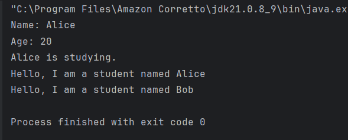

-----

### Analisis dan Pembahasan

#### Analisis Praktikum 1 (Single Inheritance)

Praktikum ini mendemonstrasikan **Single Inheritance** secara jelas. Class `Student` mewarisi (`extends`) class `Person`.

* **Pewarisan Properti dan Metode:** Class `Student` secara otomatis memiliki akses ke properti `protected` (`name`, `age`) dan metode `public` (`displayInfo`, `greet`) dari class `Person`. Ini dibuktikan di `InheritanceTest` ketika objek `student` berhasil memanggil `student.displayInfo()`, padahal metode tersebut hanya didefinisikan di `Person`.
* **Penggunaan `super(name, age)`:** Panggilan `super(name, age)` di dalam *constructor* `Student` adalah krusial. Ini adalah cara subclass untuk memanggil *constructor* dari superclass-nya (`Person`). Tujuannya adalah untuk menginisialisasi bagian-bagian dari objek `Student` yang merupakan warisan dari `Person` (yaitu, `name` dan `age`). Tanpa panggilan ini, kode tidak akan terkompilasi karena Java tidak tahu bagaimana cara menginisialisasi atribut `name` dan `age`.
* **Method Overriding:** Metode `greet()` di-override di `Student`. Ketika `student.greet()` dipanggil, versi `Student`-lah yang dieksekusi, bukan versi `Person`.
* **Polymorphism:** Baris `Person person = new Student(...)` menunjukkan polymorphism. Meskipun variabel `person` bertipe `Person`, ia menunjuk ke objek `Student`. Karena itu, ketika `person.greet()` dipanggil, Java menggunakan *dynamic method dispatch* untuk menjalankan metode `greet()` yang ada di class `Student` (objek sebenarnya), bukan yang ada di class `Person` (tipe referensinya).

---

### 3.2 Praktikum 2: Method Overriding dan Kata Kunci `super`

#### Teori Dasar

Method overriding memungkinkan subclass memberikan implementasi spesifik untuk method yang sudah didefinisikan di superclass. Kata kunci `super` digunakan untuk mengakses anggota superclass.

**Aturan Method Overriding:**

* Method harus memiliki nama dan parameter yang sama.
* Return type harus sama atau subtype (covariant return type).
* Access modifier tidak boleh lebih restriktif.
* Tidak bisa override method yang `final` atau `static`.

**Penggunaan `super`:**

* `super()` - Memanggil constructor superclass.
* `super.methodName()` - Memanggil method superclass.
* `super.variableName` - Mengakses variable superclass.

#### Tujuan:

Memahami cara melakukan method overriding dan penggunaan kata kunci `super`.

#### Langkah Praktikum

1.  Buat sebuah package baru di dalam package `modul_6` dengan nama `praktikum_2`.
2.  Buat class `Vehicle` sebagai superclass.
3.  Buat class `Car` sebagai subclass yang mewarisi `Vehicle`.
4.  Buat class `OverrideTest` untuk testing.
5.  Jalankan program dan amati.

#### Kode class Vehicle.java

```java
package modul_6.praktikum_2;

public class Vehicle {
    // Variabel protected dapat diakses oleh subclass
    protected String brand;
    protected int speed;

    // Konstruktor untuk menginisialisasi objek Vehicle
    public Vehicle(String brand, int speed) {
        this.brand = brand;
        this.speed = speed;
    }

    // Metode untuk menampilkan pesan saat kendaraan mulai berjalan
    public void start() {
        System.out.println("Vehicle is starting...");
    }

    // Metode untuk menampilkan informasi kendaraan
    public void displayInfo() {
        System.out.println("Brand: " + brand);
        System.out.println("Speed: " + speed + " km/h");
    }
}
```

#### Kode class Car.java

```java
package modul_6.praktikum_2;

public class Car extends Vehicle {
    // Variabel privat untuk menyimpan jumlah pintu
    private int numberOfDoors;

    // Konstruktor untuk menginisialisasi objek Car
    public Car(String brand, int speed, int numberOfDoors) {
        super(brand, speed); // Memanggil konstruktor dari superclass (Vehicle)
        this.numberOfDoors = numberOfDoors;
    }

    // Override metode start dari Vehicle
    @Override
    public void start() {
        super.start(); // Memanggil versi start dari superclass
        System.out.println("Car engine is running smoothly");
    }

    // Override metode displayInfo dari Vehicle
    @Override
    public void displayInfo() {
        super.displayInfo(); // Memanggil versi displayInfo dari superclass
        System.out.println("Number of doors: " + numberOfDoors);
    }

    // Metode khusus untuk Car
    public void honk() {
        System.out.println("Beep beep!");
    }
}

```

#### Kode class OverrideTest.java

```java
package modul_6.praktikum_2;

public class OverrideTest {
    public static void main(String[] args) {
        // Membuat objek Car dan memanggil metode-metodenya
        Shape car = new Shape("Toyota", 180, 4);

        // Memanggil method yang di-override dari Vehicle
        car.start();
        car.displayInfo();

        // Memanggil method khusus milik Car
        car.honk();

        // Demonstrasi polymorphism: objek Car disimpan sebagai Vehicle
        Vehicle vehicle = new Shape("Honda", 200, 2);

        // Tetap memanggil versi method yang di-override di Car
        vehicle.start();
        vehicle.displayInfo();
    }
}
```

#### Screenshot Hasil

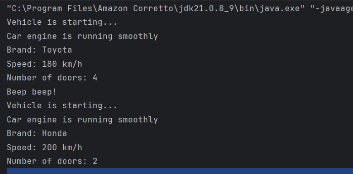

-----

### Analisis dan Pembahasan

#### Analisis Praktikum 2 (Method Overriding dan `super`)

Praktikum ini berfokus pada **Method Overriding** dan penggunaan kata kunci `super` untuk mengakses anggota superclass.

* **Perbedaan Output `start()`:**
    * Objek `Vehicle` (jika dibuat) saat memanggil `start()` hanya akan mencetak: "Vehicle is starting...".
    * Objek `Car` (`car`) saat memanggil `start()` mencetak: "Vehicle is starting..." DAN "Car engine is running smoothly".
    * Ini terjadi karena metode `start()` di `Car` **meng-override** metode `Vehicle`. Di dalamnya, ia memanggil `super.start()` (menjalankan kode dari `Vehicle`) lalu menambahkan fungsionalitasnya sendiri.
* **Penggunaan `super.displayInfo()`:** Di dalam `Car.displayInfo()`, panggilan `super.displayInfo()` digunakan untuk **code reusability**. Daripada menulis ulang kode untuk mencetak `brand` dan `speed`, `Car` "meminta" `Vehicle` untuk melakukannya terlebih dahulu, lalu `Car` tinggal menambahkan info spesifiknya (`numberOfDoors`).
* **Penggunaan `super()` di Constructor:** Sama seperti praktikum 1, `super(brand, speed)` di constructor `Car` adalah wajib untuk menginisialisasi atribut `brand` dan `speed` yang dimiliki oleh superclass `Vehicle`.
* **Polymorphism:** Seperti di Praktikum 1, `Vehicle vehicle = new Car(...)` menunjukkan bahwa saat `vehicle.start()` dan `vehicle.displayInfo()` dipanggil, versi yang dieksekusi adalah versi yang telah di-override di class `Car`, karena objek sebenarnya adalah `Car`.

---

### 3.3 Praktikum 3: Multilevel dan Hierarchical Inheritance

#### Tujuan:

Memahami konsep multilevel dan hierarchical inheritance.

#### Langkah Praktikum

1.  Buat sebuah package baru di dalam package `modul_6` dengan nama `praktikum_3`.
2.  Buat class `Animal` sebagai superclass.
3.  Buat class `Mammal` yang mewarisi `Animal` (multilevel).
4.  Buat class `Dog` yang mewarisi `Mammal` (multilevel).
5.  Buat class `Cat` yang mewarisi `Mammal` (hierarchical, karena Dog dan Cat sama-sama mewarisi Mammal).
6.  Buat class `InheritanceTypeTest` untuk testing.

#### Kode class Animal.java

```java
package modul_6.praktikum_3;

public class Animal {
    // Variabel protected dapat diakses oleh subclass
    protected String name;

    // Konstruktor untuk menginisialisasi objek Animal
    public Animal(String name) {
        this.name = name;
    }

    // Metode untuk menunjukkan bahwa hewan sedang makan
    public void eat() {
        System.out.println(name + " is eating.");
    }

    // Metode untuk menunjukkan bahwa hewan sedang tidur
    public void sleep() {
        System.out.println(name + " is sleeping.");
    }
}
```

#### Kode class Mammal.java

```java
package modul_6.praktikum_3;

public class Mammal extends Animal {
    // Variabel protected untuk warna bulu
    protected String furColor;

    // Konstruktor untuk menginisialisasi nama dan warna bulu
    public Mammal(String name, String furColor) {
        super(name); // Memanggil konstruktor dari superclass (Animal)
        this.furColor = furColor;
    }

    // Metode khusus untuk Mammal
    public void giveBirth() {
        System.out.println(name + " is giving birth to live young.");
    }
}
```

#### Kode class Dog.java

```java
package modul_6.praktikum_3;

public class Dog extends Mammal {
    // Variabel privat untuk menyimpan ras anjing
    private String breed;

    // Konstruktor untuk menginisialisasi nama, warna bulu, dan ras
    public Dog(String name, String furColor, String breed) {
        super(name, furColor); // Memanggil konstruktor dari superclass (Mammal)
        this.breed = breed;
    }

    // Metode khusus untuk Dog
    public void bark() {
        System.out.println(name + " is barking: Woof woof!");
    }

    // Override metode eat dari Animal
    @Override
    public void eat() {
        System.out.println(name + " the dog is eating dog food.");
    }
}

```

#### Kode class Cat.java

```java
package modul_6.praktikum_3;

public class Cat extends Mammal {
    // Variabel privat untuk menunjukkan apakah kucing adalah kucing rumahan
    private boolean isIndoor;

    // Konstruktor untuk menginisialisasi nama, warna bulu, dan status indoor
    public Cat(String name, String furColor, boolean isIndoor) {
        super(name, furColor); // Memanggil konstruktor dari superclass (Mammal)
        this.isIndoor = isIndoor;
    }

    // Metode khusus untuk Cat
    public void meow() {
        System.out.println(name + " is meowing: Meow Meow!");
    }

    // Override metode eat dari Animal
    @Override
    public void eat() {
        System.out.println(name + " the cat is eating cat food.");
    }
}
```

#### Kode class InheritanceTypeTest.java

```java
package modul_6.praktikum_3;

public class InheritanceTypeTest {
    public static void main(String[] args) {
        // Multilevel inheritance test
        Dog dog = new Dog("Buddy", "Brown", "Golden Retriever");
        dog.giveBirth(); // Dari Animal
        dog.eat();       // Dari Mammal (di-override oleh Dog)
        dog.bark();      // Dari Dog

        System.out.println();

        // Hierarchical inheritance test
        Cat cat = new Cat("Whiskers", "White", true);
        cat.giveBirth(); // Dari Animal
        cat.eat();       // Dari Mammal (di-override oleh Cat)
        cat.meow();      // Dari Cat

        System.out.println();

        // Polymorphism dengan hierarchical inheritance
        Animal[] animals = {
                new Dog("Max", "Black", "Labrador"),
                new Cat("Luna", "Gray", false)
        };

        for (Animal animal : animals) {
            animal.eat(); // Memanggil versi method sesuai tipe objek sebenarnya
        }
    }
}

```

#### Screenshot Hasil

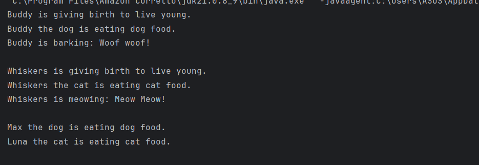

-----

### Analisis dan Pembahasan

### Analisis Praktikum 3 (Multilevel dan Hierarchical)

Praktikum ini mendemonstrasikan dua tipe hierarki pewarisan yang lebih kompleks.

* **Rantai Pewarisan (Multilevel Inheritance):** Rantai pewarisan untuk `Dog` adalah **`Dog` -> `Mammal` -> `Animal`**. Ini disebut **Multilevel Inheritance** karena `Dog` mewarisi dari `Mammal`, dan `Mammal` mewarisi dari `Animal`.
* **Bukti Akses Multilevel:** Objek `dog` membuktikan pewarisan ini dengan berhasil mengakses metode dari ketiga level:
    1.  `dog.giveBirth()`: Metode ini diwarisi dari `Mammal` (level 1 di atasnya).
    2.  `dog.eat()`: Metode ini diwarisi dari `Animal` (level 2 di atasnya) dan di-override di `Dog`.
    3.  `dog.bark()`: Metode ini didefinisikan di `Dog` itu sendiri.
        (Objek `dog` juga bisa memanggil `dog.sleep()` yang murni diwarisi dari `Animal`).
* **Hierarchical Inheritance:** Struktur ini disebut **Hierarchical Inheritance** ketika kita melihat `Mammal` sebagai *parent* dan `Dog` serta `Cat` sebagai *children*. `Dog` dan `Cat` berada di level yang sama dan sama-sama mewarisi dari `Mammal`, menciptakan struktur seperti pohon keluarga.
* **Polymorphism dalam Array:** Array `Animal[] animals` adalah demonstrasi polymorphism yang kuat. Array tersebut dapat menampung objek `Dog` dan `Cat` karena keduanya (secara tidak langsung) adalah `Animal`. Saat iterasi `animal.eat()` dijalankan, JVM secara dinamis menentukan objek mana yang sedang diproses dan memanggil metode `eat()` yang sesuai (versi `Dog` untuk `dog`, versi `Cat` untuk `cat`).

---

### 3.4 Praktikum 4: Sistem Manajemen Perpustakaan Sederhana

#### Tujuan:

Menerapkan konsep inheritance dalam project real-world sederhana untuk mengelola sistem perpustakaan.

#### Deskripsi Project:

Kita akan membuat sistem manajemen perpustakaan sederhana yang memiliki berbagai jenis item (buku, majalah, DVD) dengan karakteristik yang berbeda namun memiliki beberapa kesamaan (seperti `itemId`, `title`, `isAvailable`, `borrowItem()`, `returnItem()`).

#### Langkah Praktikum

1.  Buat sebuah package baru di dalam package `modul_6` dengan nama `praktikum_4`.
2.  Buat class `LibraryItem` sebagai superclass (bisa `abstract`).
3.  Buat class `Book` yang mewarisi `LibraryItem`.
4.  Buat class `Magazine` yang mewarisi `LibraryItem`.
5.  Buat class `DVD` yang mewarisi `LibraryItem`.
6.  Buat class `LibraryManagementSystem` sebagai main class (mirip dengan yang ada di Modul 5, tetapi kini menggunakan inheritance).

#### Kode class LibraryItem.java

```java
package modul_6.praktikum_4;

public abstract class LibraryItem {
    protected String itemId;
    protected String title;
    protected int year;
    protected boolean isAvailable;

    public LibraryItem(String itemId, String title, int year) {
        this.itemId = itemId;
        this.title = title;
        this.year = year;
        this.isAvailable = true;
    }

    // Getter methods
    public String getItemId() { return itemId; }
    public String getTitle() { return title; }
    public int getYear() { return year; }
    public boolean isAvailable() { return isAvailable; }

    // Setter methods
    public void setAvailable(boolean available) {
        isAvailable = available;
    }

    // Abstract method yang harus diimplementasikan subclass
    public abstract void displayInfo();

    // Concrete method yang bisa digunakan semua subclass
    public void borrowItem() {
        if (isAvailable) {
            isAvailable = false;
            System.out.println(title + " berhasil dipinjam");
        } else {
            System.out.println(title + " sedang tidak tersedia");
        }
    }

    public void returnItem() {
        isAvailable = true;
        System.out.println(title + " berhasil dikembalikan");
    }
}

```

#### Kode class Book.java

```java
package modul_6.praktikum_4;

public class Book extends LibraryItem {
    private String author;
    private String isbn;
    private int numberOfPages;

    public Book(String itemId, String title, int year, String author, String isbn, int numberOfPages) {
        super(itemId, title, year);
        this.author = author;
        this.isbn = isbn;
        this.numberOfPages = numberOfPages;
    }

    @Override
    public void displayInfo() {
        System.out.println("BUKU");
        System.out.println("-------------------------");
        System.out.println("ID: " + itemId);
        System.out.println("Judul: " + title);
        System.out.println("Penulis: " + author);
        System.out.println("Tahun: " + year);
        System.out.println("ISBN: " + isbn);
        System.out.println("Jumlah Halaman: " + numberOfPages);
        System.out.println("Status: " + (isAvailable ? "Tersedia" : "Dipinjam"));
        System.out.println("-------------------------");
    }

    // Method khusus Book
    public void readSample() {
        System.out.println("Membaca sample dari buku: " + title);
    }
}

```

#### Kode class Magazine.java

```java
package modul_6.praktikum_4;

public class Magazine extends LibraryItem {
    private String publisher;
    private int issueNumber;
    private String category;

    public Magazine(String itemId, String title, int year, String publisher, int issueNumber, String category) {
        super(itemId, title, year);
        this.publisher = publisher;
        this.issueNumber = issueNumber;
        this.category = category;
    }

    @Override
    public void displayInfo() {
        System.out.println("------------- MAJALAH -------------");
        System.out.println("ID: " + itemId);
        System.out.println("Judul: " + title);
        System.out.println("Penerbit: " + publisher);
        System.out.println("Tahun: " + year);
        System.out.println("Edisi: " + issueNumber);
        System.out.println("Kategori: " + category);
        System.out.println("Status: " + (isAvailable ? "Tersedia" : "Dipinjam"));
        System.out.println("-----------------------------------");
    }

    // Method khusus Magazine
    public void browseArticles() {
        System.out.println("Menelusuri artikel dalam majalah: " + title);
    }
}
```

#### Kode class DVD.java

```java
package modul_6.praktikum_4;

public class DVD extends LibraryItem {
    private String director;
    private int duration; // dalam menit
    private String genre;

    public DVD(String itemId, String title, int year, String director, int duration, String genre) {
        super(itemId, title, year);
        this.director = director;
        this.duration = duration;
        this.genre = genre;
    }

    @Override
    public void displayInfo() {
        System.out.println("------------- DVD -------------");
        System.out.println("ID: " + itemId);
        System.out.println("Judul: " + title);
        System.out.println("Sutradara: " + director);
        System.out.println("Tahun: " + year);
        System.out.println("Durasi: " + duration + " menit");
        System.out.println("Genre: " + genre);
        System.out.println("Status: " + (isAvailable ? "Tersedia" : "Dipinjam"));
        System.out.println("-----------------------------");
    }

    // Method khusus DVD
    public void playTrailer() {
        System.out.println("Memutar trailer DVD: " + title);
    }
}
```

#### Kode class LibraryManagementSystem.java

```java
package modul_6.praktikum_4;

import java.util.Scanner;
import java.util.ArrayList;
import java.util.InputMismatchException;

public class LibraryManagementSystem {

    public static void main(String[] args) {
        Scanner scanner = new Scanner(System.in);
        ArrayList<LibraryItem> libraryItems = new ArrayList<>();
        initializeLibrary(libraryItems);

        while (true) {
            displayMenu();
            int choice = -1;
            try {
                choice = scanner.nextInt();
            } catch (InputMismatchException e) {
                System.out.println("Input tidak valid. Harap masukkan angka.");
                scanner.next(); // Bersihkan input yang salah
                continue;
            }
            scanner.nextLine(); // Konsumsi newline

            switch (choice) {
                case 1:
                    displayAllItems(libraryItems);
                    break;
                case 2:
                    borrowItem(scanner, libraryItems);
                    break;
                case 3:
                    returnItem(scanner, libraryItems);
                    break;
                case 4:
                    callSpecialMethod(scanner, libraryItems);
                    break;
                case 5:
                    addNewItem(scanner, libraryItems);
                    break;
                case 6:
                    System.out.println("Terima kasih telah menggunakan sistem perpustakaan. Sampai jumpa!");
                    scanner.close();
                    return;
                default:
                    System.out.println("Pilihan tidak valid. Silakan coba lagi.");
            }
            System.out.println(); // Beri spasi untuk keterbacaan
        }
    }

    private static void displayMenu() {
        System.out.println("===== SISTEM MANAJEMEN PERPUSTAKAAN =====");
        System.out.println("1. Tampilkan semua item");
        System.out.println("2. Pinjam item");
        System.out.println("3. Kembalikan item");
        System.out.println("4. Panggil method khusus (sample/trailer/browse)");
        System.out.println("5. Tambah item baru");
        System.out.println("6. Keluar");
        System.out.print("Masukkan pilihan Anda (1-6): ");
    }

    private static void initializeLibrary(ArrayList<LibraryItem> items) {
        items.add(new Book("B001", "Harry Potter and the Philosopher's Stone", 1997, "J.K. Rowling", "978-0747532699", 223));
        items.add(new Book("B002", "The Lord of the Rings", 1954, "J.R.R. Tolkien", "978-0618640157", 1178));
        items.add(new Magazine("M001", "National Geographic", 2023, "National Geographic Society", 10, "Sains & Alam"));
        items.add(new DVD("D001", "Inception", 2010, "Christopher Nolan", 148, "Sci-Fi"));
        items.add(new DVD("D002", "The Shawshank Redemption", 1994, "Frank Darabont", 142, "Drama"));
    }

    private static void displayAllItems(ArrayList<LibraryItem> items) {
        System.out.println("\n===== DAFTAR SEMUA ITEM DI PERPUSTAKAAN =====");
        if (items.isEmpty()) {
            System.out.println("Perpustakaan kosong.");
            return;
        }
        for (LibraryItem item : items) {
            item.displayInfo();
            System.out.println(); // Spasi antar item
        }
    }

    private static LibraryItem findItemById(String id, ArrayList<LibraryItem> items) {
        for (LibraryItem item : items) {
            if (item.getItemId().equalsIgnoreCase(id)) {
                return item;
            }
        }
        return null;
    }

    private static void borrowItem(Scanner scanner, ArrayList<LibraryItem> items) {
        System.out.print("Masukkan ID item yang ingin dipinjam: ");
        String id = scanner.nextLine();
        LibraryItem item = findItemById(id, items);

        if (item != null) {
            item.borrowItem();
        } else {
            System.out.println("Item dengan ID " + id + " tidak ditemukan.");
        }
    }

    private static void returnItem(Scanner scanner, ArrayList<LibraryItem> items) {
        System.out.print("Masukkan ID item yang ingin dikembalikan: ");
        String id = scanner.nextLine();
        LibraryItem item = findItemById(id, items);

        if (item != null) {
            item.returnItem();
        } else {
            System.out.println("Item dengan ID " + id + " tidak ditemukan.");
        }
    }

    private static void callSpecialMethod(Scanner scanner, ArrayList<LibraryItem> items) {
        System.out.print("Masukkan ID item untuk method khusus: ");
        String id = scanner.nextLine();
        LibraryItem item = findItemById(id, items);

        if (item != null) {
            if (item instanceof Book) {
                ((Book) item).readSample();
            } else if (item instanceof Magazine) {
                ((Magazine) item).browseArticles();
            } else if (item instanceof DVD) {
                ((DVD) item).playTrailer();
            } else {
                System.out.println("Item ini tidak memiliki method khusus.");
            }
        } else {
            System.out.println("Item dengan ID " + id + " tidak ditemukan.");
        }
    }

    private static void addNewItem(Scanner scanner, ArrayList<LibraryItem> items) {
        System.out.println("\nPilih tipe item yang ingin ditambahkan:");
        System.out.println("1. Buku");
        System.out.println("2. Majalah");
        System.out.println("3. DVD");
        System.out.print("Pilihan (1-3): ");
        int typeChoice = -1;

        try {
            typeChoice = scanner.nextInt();
        } catch (InputMismatchException e) {
            System.out.println("Input tidak valid.");
            scanner.next(); // clear
            return;
        }
        scanner.nextLine(); // consume newline

        System.out.print("Masukkan ID (misal B003, M002, D003): ");
        String id = scanner.nextLine();
        if (findItemById(id, items) != null) {
            System.out.println("Error: Item dengan ID " + id + " sudah ada.");
            return;
        }

        System.out.print("Masukkan Judul: ");
        String title = scanner.nextLine();
        System.out.print("Masukkan Tahun Terbit: ");
        int year = scanner.nextInt();
        scanner.nextLine(); // consume newline

        try {
            switch (typeChoice) {
                case 1: // Buku
                    System.out.print("Masukkan Penulis: ");
                    String author = scanner.nextLine();
                    System.out.print("Masukkan ISBN: ");
                    String isbn = scanner.nextLine();
                    System.out.print("Masukkan Jumlah Halaman: ");
                    int pages = scanner.nextInt();
                    scanner.nextLine();
                    items.add(new Book(id, title, year, author, isbn, pages));
                    System.out.println("Buku baru berhasil ditambahkan.");
                    break;
                case 2: // Majalah
                    System.out.print("Masukkan Penerbit: ");
                    String publisher = scanner.nextLine();
                    System.out.print("Masukkan Nomor Edisi: ");
                    int issue = scanner.nextInt();
                    scanner.nextLine();
                    System.out.print("Masukkan Kategori: ");
                    String category = scanner.nextLine();
                    items.add(new Magazine(id, title, year, publisher, issue, category));
                    System.out.println("Majalah baru berhasil ditambahkan.");
                    break;
                case 3: // DVD
                    System.out.print("Masukkan Sutradara: ");
                    String director = scanner.nextLine();
                    System.out.print("Masukkan Durasi (menit): ");
                    int duration = scanner.nextInt();
                    scanner.nextLine();
                    System.out.print("Masukkan Genre: ");
                    String genre = scanner.nextLine();
                    items.add(new DVD(id, title, year, director, duration, genre));
                    System.out.println("DVD baru berhasil ditambahkan.");
                    break;
                default:
                    System.out.println("Pilihan tipe tidak valid.");
            }
        } catch (InputMismatchException e) {
            System.out.println("Error: Input tidak valid. Pastikan angka dimasukkan dengan benar.");
            scanner.nextLine(); // Clear buffer
        }
    }
}
```

#### Screenshot Hasil

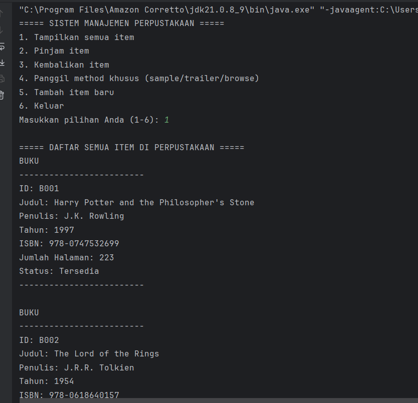
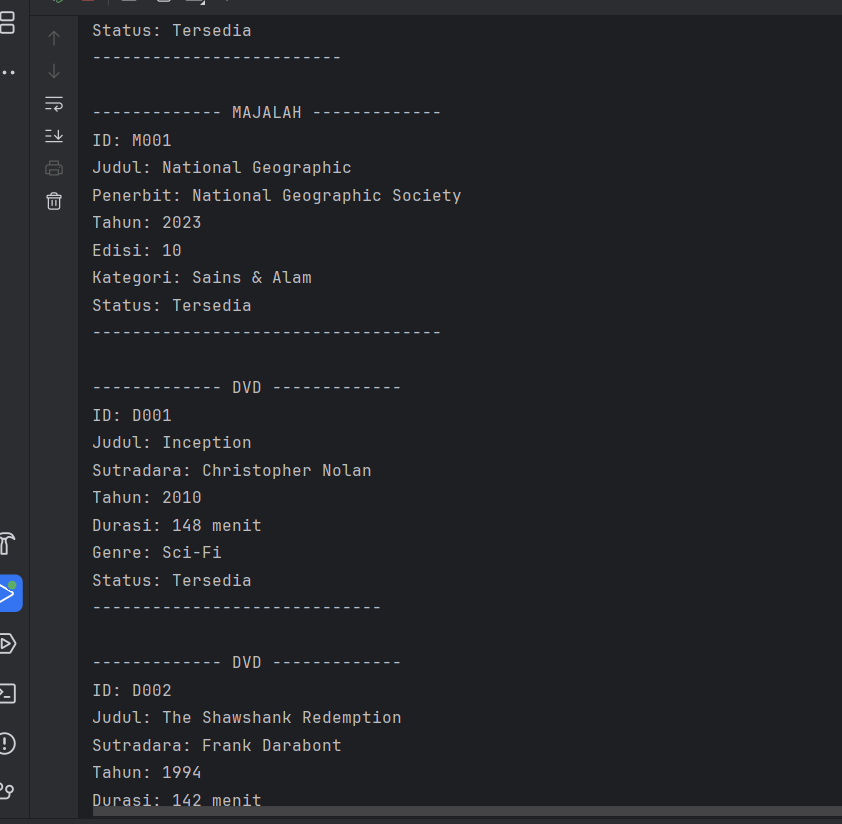
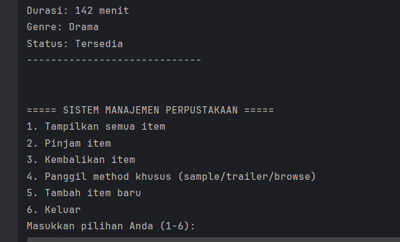
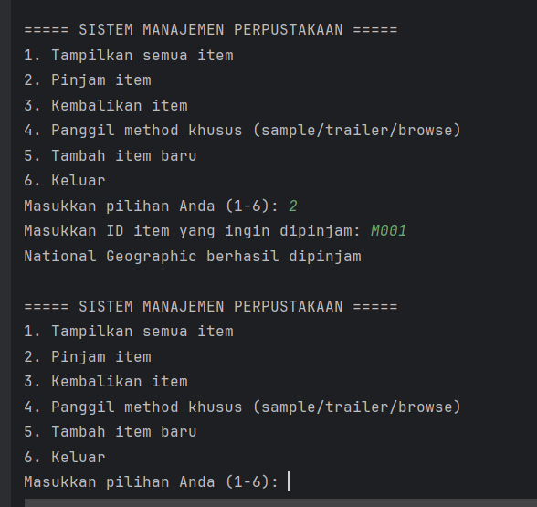
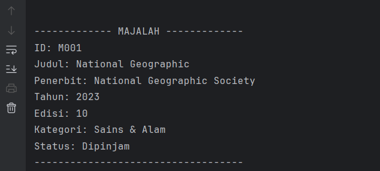
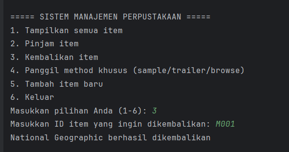
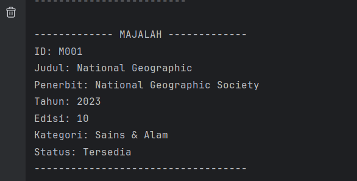
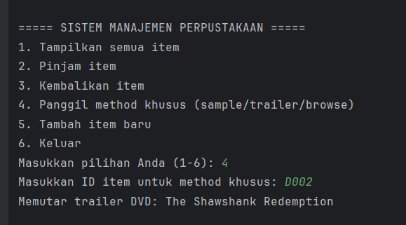
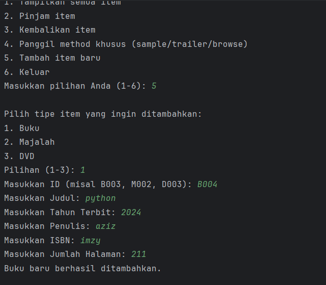
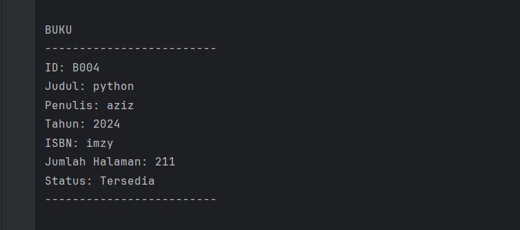


-----


### Analisis dan Pembahasan

#### Analisis Praktikum 4 (Studi Kasus Perpustakaan)

Praktikum ini menggabungkan semua konsep (inheritance, abstract class, polymorphism) dalam sebuah studi kasus.

* **Keuntungan Utama Inheritance:** **Code Reusability (Dapat Digunakan Ulang)**. Semua properti umum (`itemId`, `title`, `year`, `isAvailable`) dan fungsionalitas umum (`borrowItem()`, `returnItem()`) didefinisikan **hanya satu kali** di `LibraryItem`. Class `Book`, `Magazine`, dan `DVD` secara otomatis mendapatkan semua fungsionalitas ini tanpa perlu menulis ulang kodenya, mengurangi redundansi dan mempermudah pemeliharaan.
* **Polymorphism di `displayAllItems()`:** Ini adalah inti dari kekuatan polymorphism. `ArrayList<LibraryItem>` dapat menyimpan berbagai jenis objek (Book, Magazine, DVD). Saat `displayAllItems()` melakukan iterasi dan memanggil `item.displayInfo()`, Java secara otomatis menjalankan versi `displayInfo()` yang benar berdasarkan **tipe objek sebenarnya** (dynamic dispatch). Jika `item` adalah `Book`, `Book.displayInfo()` dipanggil. Jika `item` adalah `DVD`, `DVD.displayInfo()` dipanggil. Loop tersebut tidak perlu tahu tipe spesifiknya, ia hanya perlu tahu bahwa setiap `LibraryItem` *pasti* memiliki metode `displayInfo()`.
* **Keuntungan `abstract class LibraryItem`:** Ini mencegah developer membuat objek "generik" `new LibraryItem(...)`, yang tidak masuk akal dalam konteks ini (item harus berupa *sesuatu*, entah itu buku, majalah, atau DVD). Ini memaksa penggunaan subclass yang lebih spesifik.
* **Keuntungan `abstract void displayInfo()`:** Ini bertindak sebagai **kontrak (perjanjian)**. Dengan mendeklarasikannya sebagai `abstract`, `LibraryItem` *memaksa* setiap subclass (`Book`, `Magazine`, `DVD`) untuk menyediakan implementasi `displayInfo()`-nya sendiri. Ini menjamin bahwa setiap objek yang mewarisi `LibraryItem` pasti tahu cara menampilkan informasinya, yang membuat loop polymorphic di `displayAllItems()` aman dan fungsional.


-----

## 5\. Kesimpulan

Modul 6 ini telah berhasil mendemonstrasikan konsep fundamental dan implementasi praktis dari **Inheritance** dalam OOP. Inheritance terbukti sebagai mekanisme yang kuat untuk *code reusability* dan membangun hierarki class yang logis dan mudah dikelola.

Melalui empat praktikum, telah dibuktikan bahwa:

1.  **Single Inheritance** (menggunakan `extends`) adalah cara dasar bagi subclass untuk mewarisi properti dan method dari satu superclass, seperti yang ditunjukkan pada `Student` dan `Person`.
2.  **Method Overriding** memberikan kemampuan bagi subclass untuk menyediakan implementasi spesifik dari method superclass (seperti `start()` pada class `Car`), yang merupakan inti dari polymorphism.
3.  **Kata Kunci `super`** sangat krusial untuk berinteraksi dengan superclass, baik untuk memanggil *constructor* superclass (`super()`) maupun untuk memanggil method atau mengakses atribut yang di-override (`super.methodName()`).
4.  **Hierarki Kelas** yang kompleks dapat dibangun menggunakan **Multilevel Inheritance** (rantai pewarisan seperti `Dog` -\> `Mammal` -\> `Animal`) dan **Hierarchical Inheritance** (satu parent, banyak child seperti `Mammal` -\> `Dog` dan `Mammal` -\> `Cat`).
5.  Penerapan inheritance pada studi kasus (Sistem Perpustakaan) sangat menyederhanakan kode. Dengan menggunakan **Polymorphism**, kita dapat mengelola berbagai jenis item (`Book`, `Magazine`, `DVD`) dalam satu `ArrayList<LibraryItem>` dan memanggil method `displayInfo()` mereka secara seragam.

Secara keseluruhan, pemahaman inheritance sangat penting untuk menulis kode OOP yang efisien, modular, dan *extensible* (mudah diperluas).

-----

## 6\. Referensi

* Oracle. (2025). *The Java™ Tutorials*. Diakses pada 27 Oktober 2025, dari [https://docs.oracle.com/javase/tutorial/](https://docs.oracle.com/javase/tutorial/)
* Sierra, K., & Bates, B. (2022). *Head First Java, 3rd Edition*. O'Reilly Media.
* Bloch, J. (2018). *Effective Java, 3rd Edition*. Addison-Wesley Professional.