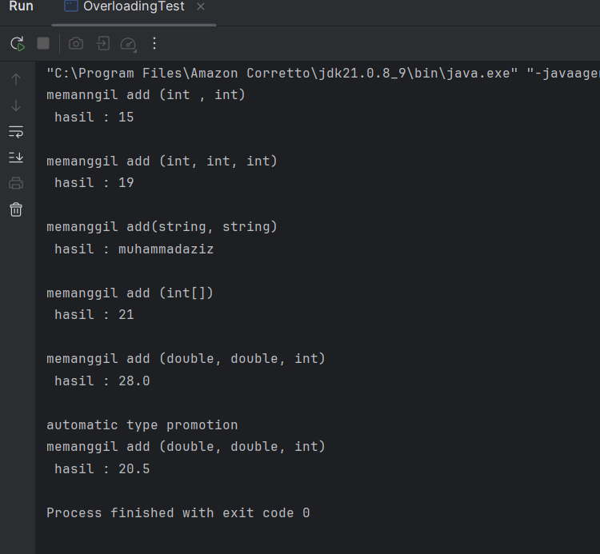
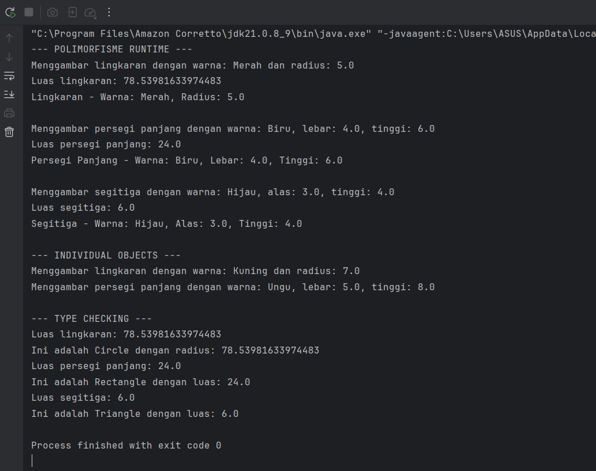

# Laporan Modul 7: Polymorphism

**Mata Kuliah:** Praktikum Pemrograman Berorientasi Objek  
**Nama:** Muhammad Aziz  
**NIM:** 2024573010089  
**Kelas:** TI 2E

## 1. Abstrak

Modul ini berfokus pada pilar fundamental Pemrograman Berorientasi Objek (OOP) lainnya, yaitu **Polymorphism** (Banyak Bentuk). Laporan ini akan membahas implementasi praktis dari polymorphism di Java, mencakup perbedaan antara **Compile-time Polymorphism (Method Overloading)** dan **Runtime Polymorphism (Method Overriding)**. Melalui dua praktikum terpisah, modul ini mendemonstrasikan bagaimana overloading digunakan untuk fungsionalitas method dengan nama sama namun parameter berbeda, dan bagaimana overriding digunakan untuk menyediakan implementasi spesifik pada subclass dalam sebuah hierarki inheritance untuk mencapai perilaku dinamis.

## Sebelum Memulai Praktikum

Buat sebuah package baru dengan nama `modul_7` di dalam folder `src`, kemudian, selesaikan seluruh praktikum dan latihan dari modul ini di dalam package `modul_7`.

## 2. Dasar Teori

Dalam konteks pemrograman OOP (Object Oriented Programming), istilah polymorphism sering digunakan karena berkaitan erat dengan salah satu pilar seperti class, object, method, atau inheritance. Polymorphism adalah **banyak bentuk** atau bermacam-macam. Dalam istilah pemrograman, polymorphism adalah sebuah konsep di mana sebuah interface tunggal digunakan pada entitas yang berbeda-beda.

Polymorphism adalah konsep pemrograman yang berorientasi pada objek yang mengacu pada kemampuan variabel, fungsi atau objek untuk mengambil beberapa bentuk. Dalam bahasa pemrograman yang menunjukkan polimorfisme, objek kelas miliki hierarki yang sama yang diwariskan dari kelas induk yang sama, mungkin memiliki fungsi dengan nama yang sama, tetapi dengan perilaku berbeda.

### Tujuan Polymorphism

* **Flexibility** - Memungkinkan kode yang lebih fleksibel dan mudah diperluas.
* **Code Reusability** - Mengurangi duplikasi kode dengan menggunakan interface yang sama.
* **Maintainability** - Memudahkan maintenance dan pengembangan fitur baru.
* **Dynamic Behavior** - Perilaku objek ditentukan pada runtime.
* **Interface Consistency** - Konsistensi dalam penggunaan interface.

### Cara Implementasi (untuk Runtime Polymorphism)

* Gunakan inheritance hierarchy.
* Override method di subclass.
* Gunakan reference superclass untuk memegang objek subclass.
* Method yang dipanggil ditentukan pada runtime berdasarkan tipe aktual objek.

### Jenis-jenis Polimorfisme

**1. Compile-time Polymorphism (Method Overloading)**

Method overloading (disebut juga compile-time polymorphism) terjadi ketika sebuah class memiliki dua atau lebih method dengan **nama yang sama**, tetapi dengan **parameter yang berbeda** (berbeda jumlah, tipe, atau urutan). Compiler menentukan method mana yang akan dipanggil pada saat kompilasi berdasarkan argumen yang diberikan.

**2. Runtime Polymorphism (Method Overriding)**

Method overriding terjadi ketika subclass (class anak) menyediakan implementasi spesifik untuk method yang sudah didefinisikan di superclass (class induk). Method overriding digunakan untuk mengubah atau memperluas perilaku method yang diwarisi dari superclass. Method yang di-override harus memiliki nama, parameter, dan return type yang sama dengan method di superclass.

**Aturan Method Overriding:**

* Method harus memiliki nama dan parameter yang sama dengan method di superclass.
* Return type harus sama atau subtype dari return type di superclass.
* Access modifier tidak boleh lebih restriktif daripada method di superclass.
* Method tidak bisa di-override jika di superclass dideklarasikan sebagai `final`.

## 3. Praktikum

### 3.1 Praktikum 1: Memahami Method Overloading (Compile-time Polymorphism)

**Tujuan:**

* Memahami konsep dan implementasi method overloading.

**Langkah Praktikum:**

1.  Buat sebuah package baru di dalam package `modul_7` dengan nama `praktikum_1`.
2.  Buat class `Calculator` dengan method overloading.
3.  Buat class `OverloadingTest` untuk testing.
4.  Jalankan program dan amati hasilnya.
5.  Perhatikan bagaimana compiler memilih method yang tepat berdasarkan parameter.

**Kode class `Calculator.java`**

```java
package modul_7.praktikum_1;

public class Calculator {
    // methode untuk menjumlahkan dua integer
    public  int add(int a, int b) {
        System.out.println("memanngil add (int , int)");
        return a + b;
    }

    // overload method untuk menjummlahkan tiga integer
    public  int add (int a, int b, int c){
        System.out.println("memanggil add (int, int, int)");
        return  a + b + c;
    }

    // menjumlah kan dua variabel yang tipe datanya double
    public double add(double a, double b){
        System.out.println("memanggil add (double, double, int)");
        return  a + b;
    }

    // function untuk menjumlahkan dua array yang tipe datanya array
    public int add(int[] numbers){
        System.out.println("memanggil add (int[])");
        int sum = 0;
        for (int num : numbers){
            sum += num;
        }
        return  sum;
    }

    public String add (String a, String b){
        System.out.println("memanggil add(string, string)");
        return  a + b;
    }
}
````

**Kode class `OverloadingTest.java`**

```java
package modul_7.praktikum_1;

public class OverloadingTest {

    public static  void main (String [] args){
        Calculator calc = new Calculator();

        System.out.println(" hasil : " + calc.add(5, 10));
        System.out.println();

        System.out.println(" hasil : " + calc.add(10, 5, 4));
        System.out.println();

        System.out.println(" hasil : " + calc.add("muhammad", "aziz"));
        System.out.println();

        int[] numbers = {1, 1, 2, 8, 9};
        System.out.println(" hasil : " + calc.add(numbers));
        System.out.println();

        System.out.println(" hasil : " + calc.add(15.5, 12.5));
        System.out.println();


        System.out.println("automatic type promotion");
        System.out.println(" hasil : " + calc.add(5, 15.5));

    }

}
```

**Screenshot Hasil:**




---

### Analisis dan Pembahasan (Praktikum 1)

Pada Praktikum 1, kita mengamati implementasi **Compile-time Polymorphism**, yang lebih dikenal sebagai **Method Overloading**. Keberhasilan pemanggilan method `add` yang berbeda-beda, seperti `calc.add(5, 10)` dan `calc.add(15.5, 12.5)`, dimungkinkan karena *compiler* Java dapat membedakan method-method tersebut berdasarkan **signature**-nya.

Sebuah *method signature* di Java didefinisikan oleh nama method dan **parameter list**-nya (jumlah, tipe, dan urutan parameter). Di dalam class `Calculator`, meskipun ada lima method dengan nama `add`, masing-masing memiliki *signature* yang unik:
* `add(int, int)`
* `add(int, int, int)`
* `add(double, double)`
* `add(int[])`
* `add(String, String)`

Ketika *compiler* (pada *compile-time*) menemukan sebuah pemanggilan method, ia akan mencari *signature* yang paling sesuai.
* `calc.add(5, 10)` cocok dengan `add(int, int)`.
* `calc.add(15.5, 12.5)` cocok dengan `add(double, double)`.
* `calc.add(numbers)` cocok dengan `add(int[])`.

Hal ini disebut *compile-time* polymorphism karena keputusan tentang method mana yang akan dieksekusi sudah final dibuat oleh *compiler* sebelum program dijalankan.

Sebuah kasus menarik adalah pada pemanggilan `calc.add(5, 15.5)` yang terdapat di `OverloadingTest`. Meskipun tidak ada method dengan *signature* `add(int, double)`, *compiler* melakukan **automatic type promotion** (promosi tipe otomatis). Tipe `int` (nilai `5`) dipromosikan menjadi `double` (nilai `5.0`) agar sesuai dengan *signature* `add(double, double)`. Inilah mengapa pemanggilan tersebut valid dan akan mengeksekusi method `add(double, double)`.

---


### 3.2 Praktikum 2: Memahami Method Overriding (Runtime Polymorphism)

**Tujuan:**

* Memahami konsep runtime polymorphism melalui method overriding.

**Langkah Praktikum:**

1.  Buat sebuah package baru di dalam package `modul_7` dengan nama `praktikum_2`.
2.  Buat class `Shape` sebagai superclass (bisa abstract).
3.  Buat class `Circle` yang mewarisi `Shape`.
4.  Buat class `Rectangle` yang mewarisi `Shape`.
5.  Buat class `Triangle` yang mewarisi `Shape`.
6.  Buat class `PolymorphismTest` untuk testing.
7.  Jalankan program dan amati perilaku polimorfik dari objek-objek berbeda dan penggunaan `instanceof`.

**Kode class `Shape.java`**

```java
package modul_7.praktikum_2;

public class Shape {
    protected String color;

    public Shape(String color) {
        this.color = color;
    }

    public void draw() {
        System.out.println("Menggambar shape dengan warna: " + color);
    }

    public double calculateArea() {
        System.out.println("Menghitung luas shape umum");
        return 0.0;
    }

    public void displayInfo() {
        System.out.println("Shape - Warna: " + color);
    }
}
```

**Kode class `Circle.java`**

```java
package modul_7.praktikum_2;

public class Circle extends Shape {
    private double radius;

    public Circle(String color, double radius) {
        super(color);
        this.radius = radius;
    }

    @Override
    public void draw() {
        System.out.println("Menggambar lingkaran dengan warna: " + color + " dan radius: " + radius);
    }

    @Override
    public double calculateArea() {
        double area = Math.PI * radius * radius;
        System.out.println("Luas lingkaran: " + area);
        return area;
    }

    @Override
    public void displayInfo() {
        System.out.println("Lingkaran - Warna: " + color + ", Radius: " + radius);
    }
}

```

**Kode class `Rectangle.java`**

```java
package modul_7.praktikum_2;

public class Rectangle extends Shape {
    private double width;
    private double height;

    public Rectangle(String color, double width, double height) {
        super(color);
        this.width = width;
        this.height = height;
    }

    @Override
    public void draw() {
        System.out.println("Menggambar persegi panjang dengan warna: " + color +
                ", lebar: " + width + ", tinggi: " + height);
    }

    @Override
    public double calculateArea() {
        double area = width * height;
        System.out.println("Luas persegi panjang: " + area);
        return area;
    }

    @Override
    public void displayInfo() {
        System.out.println("Persegi Panjang - Warna: " + color +
                ", Lebar: " + width + ", Tinggi: " + height);
    }
}

```

**Kode class `Triangle.java`**

```java
package modul_7.praktikum_2;

public class Triangle extends Shape {
    private double base;
    private double height;

    public Triangle(String color, double base, double height) {
        super(color);
        this.base = base;
        this.height = height;
    }

    @Override
    public void draw() {
        System.out.println("Menggambar segitiga dengan warna: " + color +
                ", alas: " + base + ", tinggi: " + height);
    }

    @Override
    public double calculateArea() {
        double area = 0.5 * base * height;
        System.out.println("Luas segitiga: " + area);
        return area;
    }

    @Override
    public void displayInfo() {
        System.out.println("Segitiga - Warna: " + color +
                ", Alas: " + base + ", Tinggi: " + height);
    }
}
```

**Kode class `PolymorphismTest.java`**

```java
package modul_7.praktikum_2;

public class PolymorphismTest {
    public static void main(String[] args) {
        // Demonstrasi runtime polymorphism
        Shape[] shapes = new Shape[3];
        shapes[0] = new Circle("Merah", 5.0);
        shapes[1] = new Rectangle("Biru", 4.0, 6.0);
        shapes[2] = new Triangle("Hijau", 3.0, 4.0);

        System.out.println("--- POLIMORFISME RUNTIME ---");
        for (Shape shape : shapes) {
            shape.draw();               // Akan memanggil method sesuai objek sebenarnya
            shape.calculateArea();      // Akan memanggil method sesuai objek sebenarnya
            shape.displayInfo();        // Akan memanggil method sesuai objek sebenarnya
            System.out.println();
        }

        // Demonstrasi dengan individual objects
        System.out.println("--- INDIVIDUAL OBJECTS ---");
        Shape shape1 = new Circle("Kuning", 7.0);
        Shape shape2 = new Rectangle("Ungu", 5.0, 8.0);

        shape1.draw();                  // Memanggil Circle's draw()
        shape2.draw();                  // Memanggil Rectangle's draw()

        // Type casting dan instanceof
        System.out.println("\n--- TYPE CHECKING ---");
        for (Shape shape : shapes) {
            if (shape instanceof Circle) {
                Circle circle = (Circle) shape;
                System.out.println("Ini adalah Circle dengan radius: " + circle.calculateArea());
            } else if (shape instanceof Rectangle) {
                Rectangle rectangle = (Rectangle) shape;
                System.out.println("Ini adalah Rectangle dengan luas: " + rectangle.calculateArea());
            } else if (shape instanceof Triangle) {
                Triangle triangle = (Triangle) shape;
                System.out.println("Ini adalah Triangle dengan luas: " + triangle.calculateArea());
            }
        }
    }
}
```

**Screenshot Hasil:**





### Analisis dan Pembahasan (Praktikum 2)

Praktikum 2 mendemonstrasikan **Runtime Polymorphism**, yang diimplementasikan melalui **Method Overriding** dan *inheritance*.

Konsep inti yang bekerja di sini adalah **Dynamic Method Dispatch**. Dalam class `PolymorphismTest`, kita membuat sebuah array `Shape[] shapes`. Ini berarti tipe referensi untuk semua elemen di dalam array adalah `Shape` (tipe *compile-time*). Namun, objek *aktual* yang kita masukkan ke dalam array adalah instance dari *subclass* (`new Circle()`, `new Rectangle()`, `new Triangle()`).

Ketika kita melakukan iterasi (loop) pada array dan memanggil `shape.draw()`, terjadi hal berikut:
1.  **Compiler Check (Compile-time):** *Compiler* hanya memeriksa apakah method `draw()` ada di dalam class `Shape` (tipe referensi). Karena `Shape` memilikinya, kode berhasil dikompilasi.
2.  **JVM Execution (Runtime):** Saat program berjalan, Java Virtual Machine (JVM) tidak melihat tipe referensi (`Shape`), melainkan melihat **tipe objek aktual** di memori.
    * Ketika `shape` merujuk ke objek `Circle`, JVM akan mengeksekusi method `draw()` yang ada di class `Circle`.
    * Ketika `shape` merujuk ke objek `Rectangle`, JVM akan mengeksekusi method `draw()` yang ada di class `Rectangle`.
    * ...dan seterusnya untuk `Triangle`.

Inilah yang disebut *dynamic dispatch*: keputusan tentang implementasi method mana yang akan dijalankan "ditunda" hingga *runtime*, berdasarkan tipe objek yang sebenarnya. Ini memungkinkan kita untuk menulis kode yang sangat fleksibel (loop `for` yang sama) yang dapat menangani berbagai jenis objek (`Circle`, `Rectangle`, dll) secara seragam.

**Penggunaan `instanceof`:**
Operator `instanceof` digunakan untuk **memeriksa tipe aktual** dari sebuah objek pada saat *runtime*. Ini menjadi penting ketika kita perlu mengakses fungsionalitas yang spesifik milik *subclass* yang tidak ada di *superclass*.

Sebagai contoh, jika class `Circle` memiliki method unik `getRadius()` (yang tidak ada di `Shape`), kita tidak bisa memanggil `shape.getRadius()` secara langsung, karena *compiler* hanya tahu tentang tipe `Shape`.

Untuk memanggilnya dengan aman, kita harus:
1.  **Memeriksa Tipe:** `if (shape instanceof Circle)`
2.  **Melakukan Type Casting:** `Circle circle = (Circle) shape;`
3.  **Memanggil Method:** `double r = circle.getRadius();` (jika method itu ada)

Dalam praktikum ini, `instanceof` digunakan untuk mengonfirmasi tipe objek sebelum melakukan *casting* (seperti `Circle circle = (Circle) shape;`). Penggunaan utamanya adalah untuk menghindari `ClassCastException`, yang akan terjadi jika kita mencoba men-*cast* objek ke tipe yang salah (misalnya, men-*cast* objek `Rectangle` menjadi `Circle`).

## 5\. Kesimpulan


Berdasarkan praktikum yang telah dilaksanakan, dapat ditarik beberapa kesimpulan mengenai konsep Polymorphism dalam Pemrograman Berorientasi Objek (OOP):

1.  **Polymorphism Terbukti:** Modul ini berhasil mendemonstrasikan dua jenis utama polymorphism di Java. Keduanya memungkinkan sebuah *interface* (nama method) untuk digunakan pada berbagai bentuk (implementasi atau tipe data yang berbeda).

2.  **Compile-time (Overloading):** Praktikum 1 (class `Calculator`) membuktikan **Compile-time Polymorphism** atau **Method Overloading**. Terbukti bahwa *compiler* Java dapat membedakan method dengan nama yang sama (`add`) selama *method signature* (jumlah, tipe, atau urutan parameter) berbeda. Keputusan method mana yang akan dieksekusi ditentukan sepenuhnya pada saat **kompilasi**.

3.  **Runtime (Overriding):** Praktikum 2 (class `Shape` dan turunannya) membuktikan **Runtime Polymorphism** atau **Method Overriding**. Melalui mekanisme *inheritance*, *subclass* (`Circle`, `Rectangle`, `Triangle`) menyediakan implementasi spesifik untuk method yang ada di *superclass* (`draw`, `calculateArea`).

4.  **Dynamic Method Dispatch:** Poin kunci dari Praktikum 2 adalah demonstrasi **Dynamic Method Dispatch**. Ketika sebuah method dipanggil melalui referensi *superclass* (misalnya, `Shape shape = new Circle(); shape.draw();`), Java Virtual Machine (JVM) akan menentukan implementasi method mana yang akan dijalankan pada saat **runtime**, berdasarkan **tipe objek aktual** (yaitu `Circle`), bukan tipe referensi (`Shape`).

5.  **Fleksibilitas Kode:** Penggunaan polymorphism, khususnya *overriding*, terbukti menghasilkan kode yang jauh lebih fleksibel dan mudah dikelola. Hal ini terlihat pada `PolymorphismTest`, di mana satu *loop* `for` dapat memproses berbagai jenis objek `Shape` secara seragam, namun setiap objek tetap menjalankan perilakunya yang unik.

## 6\. Referensi

* Oracle. (2025). The Java™ Tutorials. Diakses pada 27 Oktober 2025, dari https://docs.oracle.com/javase/tutorial/
* Sierra, K., & Bates, B. (2022). Head First Java, 3rd Edition. O'Reilly Media.
* Bloch, J. (2018). Effective Java, 3rd Edition. Addison-Wesley Professional.

