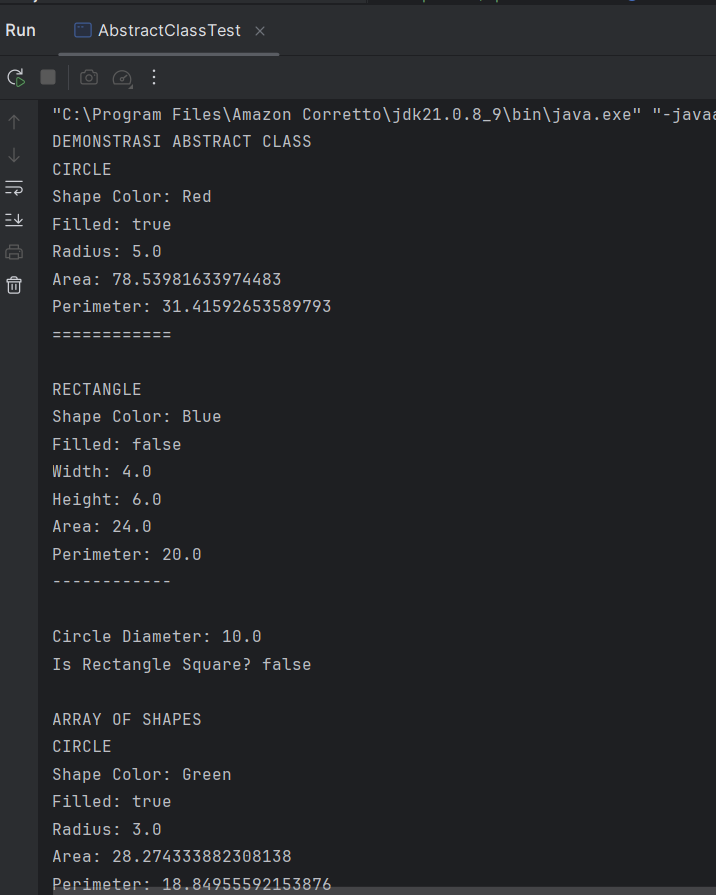
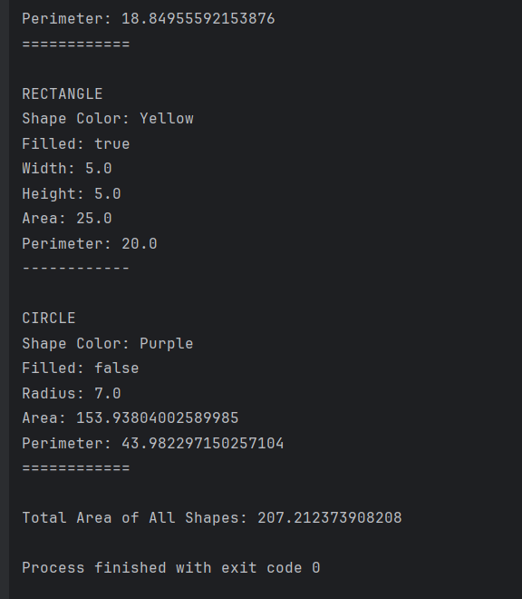
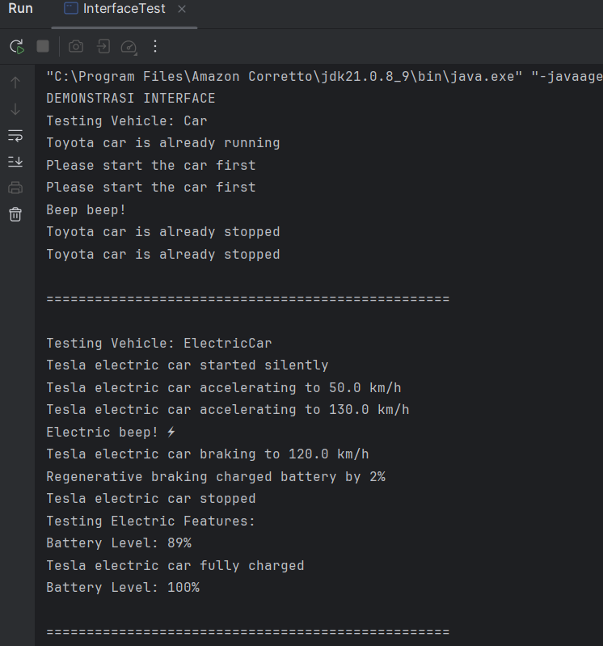
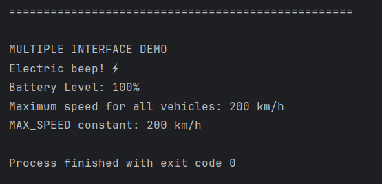
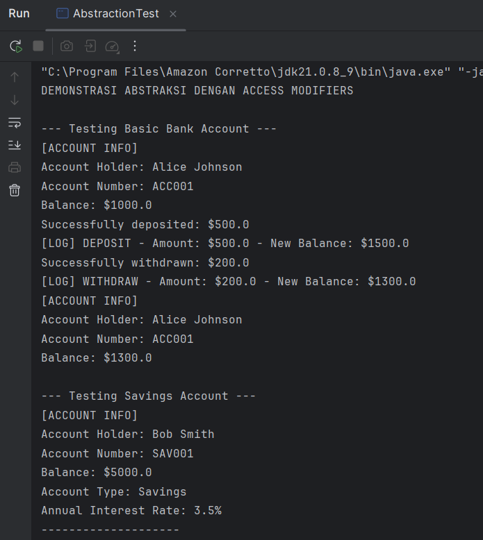
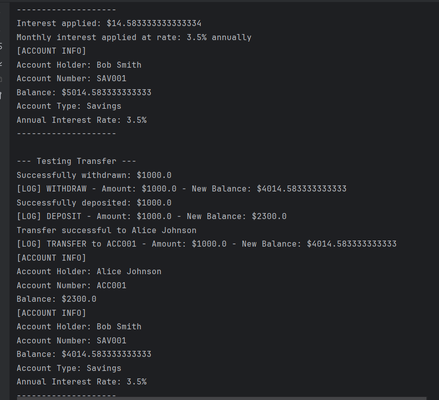
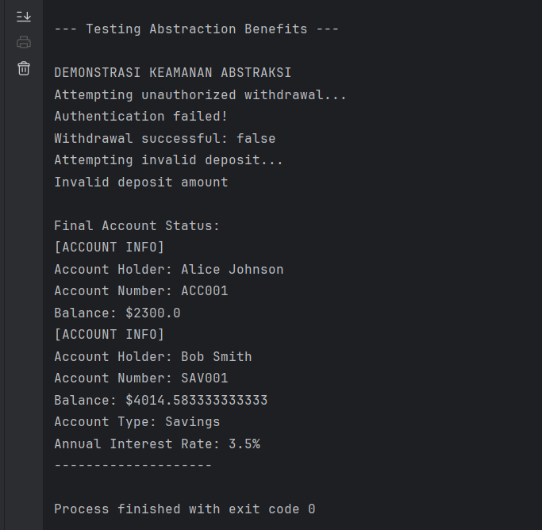

# Laporan Modul 8: Abstraction
**Mata Kuliah:** Praktikum Pemrograman Berorientasi Objek  
**Nama:** Muhammad Aziz  
**NIM:** 2024573010089  
**Kelas:** TI 2E

---

## 1. Abstrak
Modul ini berfokus pada pilar fundamental Pemrograman Berorientasi Objek (OOP), yaitu Abstraction (Abstraksi). Laporan ini akan membahas tiga mekanisme utama untuk mencapai abstraksi di Java: Abstract Classes, Interfaces, dan Access Modifiers. Melalui tiga praktikum terpisah, modul ini mendemonstrasikan bagaimana abstract class digunakan sebagai kerangka kerja paksa untuk subclass, bagaimana interface digunakan untuk mendefinisikan kontrak dan mencapai multiple inheritance tipe, dan bagaimana access modifier (seperti private dan protected) digunakan untuk menyembunyikan detail implementasi (encapsulation) dan menyediakan antarmuka publik yang aman.

### Sebelum Memulai Praktikum
Buat sebuah package baru dengan nama `modul_8` di dalam folder `src`, kemudian, selesaikan seluruh praktikum dan latihan dari modul ini di dalam package `modul_8`.

---

## 2. Dasar Teori
Abstraksi adalah konsep dalam object-oriented programming (OOP) yang bertujuan untuk menyederhanakan kompleksitas sistem dengan menyembunyikan detail-detail teknis yang tidak perlu.

Inti dari abstraksi adalah tentang fokus pada 'apa' yang dilakukan suatu objek atau komponen, bukan 'bagaimana' hal itu dilakukan. Dalam praktiknya, abstraksi membantu programmer mendefinisikan interface, menunjukkan operasi yang dapat dilakukan oleh suatu objek, tanpa harus menyertakan detail tentang logika internal atau implementasi di balik operasi tersebut.

Misalnya, ketika menggunakan remote TV, kita hanya perlu tahu cara mengoperasikannya tanpa harus memahami mekanisme internalnya. Dalam OOP, objek menyediakan abstraksi yang menyembunyikan detail implementasi internal. Seperti remote TV, user only perlu tahu metode apa dari objek yang tersedia untuk dipanggil dan parameter input apa yang diperlukan untuk memicu operasi tertentu.

### Fungsi Abstraksi
* **Menyederhanakan kompleksitas:** abstraksi membantu dalam menyederhanakan sistem yang kompleks. Dengan menyembunyikan detail internal dan menampilkan only fungsionalitas yang diperlukan, abstraksi membantu programmer untuk tidak terbebani oleh kompleksitas yang tidak relevan.
* **Meningkatkan modularitas:** abstraksi mendukung pembuatan modul yang dapat digunakan kembali. Dengan mendefinisikan interface yang jelas, modul dapat dikembangkan secara independen dan digunakan dalam berbagai konteks tanpa perlu mengetahui detail internalnya.
* **Memudahkan maintenance:** kode yang mengimplementasikan abstraksi lebih mudah dipelihara dan diperbarui. Perubahan pada implementasi internal suatu modul tidak memengaruhi modul lain yang menggunakan interface abstrak tersebut.
* **Meningkatkan keamanan:** dengan menyembunyikan detail internal, abstraksi akan meningkatkan keamanan software. Hal ini mencegah akses tidak sah ke data internal atau manipulasi fungsi internal.
* **Memfasilitasi kolaborasi:** dalam proyek besar dengan banyak developer, abstraksi memungkinkan tim untuk bekerja secara paralel pada komponen yang berbeda. Setiap tim fokus pada tugasnya sendiri tanpa perlu memahami keseluruhan sistem.
* **Mendukung polimorfisme dan penggunaan ulang kode:** abstraksi mendukung penggunaan polimorfisme, di mana objek dari class berbeda dapat diakses melalui interface yang sama. Ini meningkatkan fleksibilitas dan penggunaan ulang kode.
* **Mendukung pemisahan antara interface dan implementasi:** abstraksi bisa memisahkan apa yang dilakukan suatu objek (interface) dan bagaimana hal itu dilakukan (implementasi). Ini memudahkan pemahaman dan pengembangan software.

### Jenis-jenis Abstraksi
* **Abstraksi data (data abstraction)**
    Data abstraction terjadi ketika data objek tidak terlihat oleh dunia luar. Akses ke data objek (jika diperlukan) disediakan melalui beberapa metode. Abstraksi data memastikan detail internal objek tetap tersembunyi, sementara fungsionalitas yang diperlukan dapat diakses.
* **Abstraksi proses (process abstraction)**
    Process abstraction terjadi ketika implementasi internal dari berbagai fungsi yang terlibat dalam operasi user disembunyikan. Artinya, detail tentang bagaimana fungsi tertentu diimplementasikan tidak terlihat oleh user, hanya hasil akhirnya yang penting.

### Cara Implementasi
* **Abstract Classes** - Class yang tidak dapat diinstansiasi langsung dan mengandung abstract methods
* **Interfaces** - Kontrak yang mendefinisikan method yang harus diimplementasikan
* **Access Modifiers** - Menggunakan private/protected untuk menyembunyikan detail implementasi

---

## 3. Praktikum
### 3.1 Praktikum 1: Memahami Abstract Class dan Abstract Method
**Tujuan:**
* Memahami konsep dan implementasi abstract class dan abstract method.

**Langkah Praktikum:**
1.  Buat sebuah package baru di dalam package `modul_8` dengan nama `praktikum_1`.
2.  Buat abstract class `Shape`.
3.  Buat class `Circle` yang mewarisi `Shape`.
4.  Buat class `Rectangle` yang mewarisi `Shape`.
5.  Buat class `AbstractClassTest` untuk testing.
6.  Jalankan program dan amati hasilnya.
7.  Coba buat instance abstract class langsung dan lihat error yang terjadi.

**Kode class Shape.java**
```java
package modul_8.praktikum_1;

public abstract class Shape {
    protected String color;
    protected boolean filled;

    // Constructor
    public Shape(String color, boolean filled) {
        this.color = color;
        this.filled = filled;
    }

    // Abstract methods - harus diimplementasikan subclass
    public abstract double calculateArea();
    public abstract double calculatePerimeter();

    // Concrete methods - sudah memiliki implementasi
    public String getColor() {
        return color;
    }

    public void setColor(String color) {
        this.color = color;
    }

    public boolean isFilled() {
        return filled;
    }

    public void setFilled(boolean filled) {
        this.filled = filled;
    }

    // Concrete method yang bisa dioverride
    public void displayInfo() {
        System.out.println("Shape Color: " + color);
        System.out.println("Filled: " + filled);
    }
}
````

**Kode class Circle.java**

```java
package modul_8.praktikum_1;

public class Circle extends Shape {
    private double radius;

    public Circle(String color, boolean filled, double radius) {
        super(color, filled);
        this.radius = radius;
    }

    // Implementasi abstract methods
    @Override
    public double calculateArea() {
        return Math.PI * radius * radius;
    }

    @Override
    public double calculatePerimeter() {
        return 2 * Math.PI * radius;
    }

    // Override concrete method
    @Override
    public void displayInfo() {
        System.out.println("CIRCLE");
        super.displayInfo();
        System.out.println("Radius: " + radius);
        System.out.println("Area: " + calculateArea());
        System.out.println("Perimeter: " + calculatePerimeter());
        System.out.println("============");
    }

    // Method khusus Circle
    public double getDiameter() {
        return 2 * radius;
    }
}
```

**Kode class Rectangle.java**

```java
package modul_8.praktikum_1;

public class Rectangle extends Shape {
    private double width;
    private double height;

    public Rectangle(String color, boolean filled, double width, double height) {
        super(color, filled);
        this.width = width;
        this.height = height;
    }

    // Implementasi abstract methods
    @Override
    public double calculateArea() {
        return width * height;
    }

    @Override
    public double calculatePerimeter() {
        return 2 * (width + height);
    }

    // Override concrete method
    @Override
    public void displayInfo() {
        System.out.println("RECTANGLE");
        super.displayInfo();
        System.out.println("Width: " + width);
        System.out.println("Height: " + height);
        System.out.println("Area: " + calculateArea());
        System.out.println("Perimeter: " + calculatePerimeter());
        System.out.println("------------");
    }

    // Method khusus Rectangle
    public boolean isSquare() {
        return width == height;
    }
}
```

**Kode class AbstractClassTest.java**

```java
package modul_8.praktikum_1;

public class AbstractClassTest {
    public static void main(String[] args) {
        // Tidak bisa membuat instance abstract class langsung
        // Shape shape = new Shape("Red", true); // ERROR!

        // Membuat objects dari concrete subclasses
        Circle circle = new Circle("Red", true, 5.0);
        Rectangle rectangle = new Rectangle("Blue", false, 4.0, 6.0);

        System.out.println("DEMONSTRASI ABSTRACT CLASS");

        // Menggunakan abstract class reference
        Shape shape1 = circle;
        Shape shape2 = rectangle;

        // Polymorphic calls
        shape1.displayInfo();
        System.out.println();
        shape2.displayInfo();
        System.out.println();

        // Mengakses method khusus subclass melalui casting
        System.out.println("Circle Diameter: " + circle.getDiameter());
        System.out.println("Is Rectangle Square? " + rectangle.isSquare());

        // Array of Shapes - demonstrating polymorphism
        System.out.println("\nARRAY OF SHAPES");
        Shape[] shapes = new Shape[3];
        shapes[0] = new Circle("Green", true, 3.0);
        shapes[1] = new Rectangle("Yellow", true, 5.0, 5.0);
        shapes[2] = new Circle("Purple", false, 7.0);

        double totalArea = 0;
        for (Shape shape : shapes) {
            shape.displayInfo();
            totalArea += shape.calculateArea(); // Abstract method call
            System.out.println();
        }

        System.out.println("Total Area of All Shapes: " + totalArea);
    }
}
```




**Analisis dan Pembahasan (Praktikum 1)** Pada Praktikum 1, kita mengimplementasikan abstraksi menggunakan abstract class. Class `Shape` dideklarasikan sebagai `abstract`, yang memiliki dua konsekuensi utama:

1.  **Tidak Dapat Diinstansiasi:** Seperti yang ditunjukkan oleh komentar `// ERROR!` di `AbstractClassTest.java`, kita tidak dapat membuat objek langsung dari `Shape` (misalnya, `new Shape(...)`). Ini memaksa programmer untuk menggunakan subclass konkret.
2.  **Kontrak Method Abstrak:** `Shape` memiliki `abstract method` yaitu `calculateArea()` dan `calculatePerimeter()`. Method ini tidak memiliki *body* (isi implementasi). Ini adalah sebuah "kontrak" yang memaksa setiap subclass non-abstrak (seperti `Circle` dan `Rectangle`) untuk menyediakan implementasi mereka sendiri untuk method-method tersebut, ditandai dengan `@Override`.

Di `AbstractClassTest`, kita melihat kekuatan polimorfisme yang dikombinasikan dengan abstraksi. Kita dapat membuat `Shape[] shapes` (sebuah array dengan tipe referensi abstract `Shape`), tetapi mengisinya dengan objek konkret (`Circle` dan `Rectangle`).

Saat kita melakukan iterasi loop dan memanggil `shape.calculateArea()`, JVM secara dinamis menentukan implementasi method mana yang akan dipanggil (apakah milik `Circle` atau `Rectangle`) pada saat runtime. Ini menyederhanakan kode secara signifikan, karena kita dapat memproses semua *shape* secara seragam tanpa perlu tahu tipe spesifiknya.


-----

### 3.2 Praktikum 2: Memahami Interface

**Tujuan:**

* Memahami konsep dan implementasi interface.

**Langkah Praktikum:**

1.  Buat sebuah package baru di dalam package `modul_8` dengan nama `praktikum_2`.
2.  Buat interface `Vehicle`.
3.  Buat interface `Electric`.
4.  Buat class `Car` yang mengimplementasi `Vehicle`.
5.  Buat class `ElectricCar` yang mengimplementasi kedua interface.
6.  Buat class `InterfaceTest` untuk testing.
7.  Jalankan program dan amati hasilnya.

**Kode class Vehicle.java**

```java
package modul_8.praktikum_2;

public interface Vehicle {
    // Constant fields (public static final by default)
    int MAX_SPEED = 200;

    // Abstract methods (public abstract by default)
    void start();
    void stop();
    void accelerate(double speed);
    void brake();

    // Default method (Java 8+)
    default void honk() {
        System.out.println("Beep beep!");
    }

    // Static method (Java 8+)
    static void displayMaxSpeed() {
        System.out.println("Maximum speed for all vehicles: " + MAX_SPEED + " km/h");
    }
}
```

**Kode class Electric.java**

```java
package modul_8.praktikum_2;

public interface Electric {
    void charge();
    int getBatteryLevel();
    void setBatteryLevel(int level);

    default void displayBatteryInfo() {
        System.out.println("Battery Level: " + getBatteryLevel() + "%");
    }
}
```

**Kode class Car.java**

```java
package modul_8.praktikum_2;

public class Car implements Vehicle {
    private String brand;
    private double currentSpeed;
    private boolean isRunning;

    public Car(String brand) {
        this.brand = brand;
        this.currentSpeed = 0;
        this.isRunning = false;
    }

    @Override
    public void start() {
        if (!isRunning) { // Perbaikan logika: harusnya !isRunning
            isRunning = true;
            System.out.println(brand + " car started");
        } else {
            System.out.println(brand + " car is already running");
        }
    }

    @Override
    public void stop() {
        if (isRunning) {
            isRunning = false;
            currentSpeed = 0;
            System.out.println(brand + " car stopped");
        } else {
            System.out.println(brand + " car is already stopped");
        }
    }

    @Override
    public void accelerate(double speed) {
        if (isRunning) {
            currentSpeed += speed;
            if (currentSpeed > MAX_SPEED) {
                currentSpeed = MAX_SPEED;
            }
            System.out.println(brand + " car accelerating to " + currentSpeed + " km/h");
        } else {
            System.out.println("Please start the car first");
        }
    }

    @Override
    public void brake() {
        if (currentSpeed > 0) {
            currentSpeed -= 10;
            if (currentSpeed < 0) currentSpeed = 0;
            System.out.println(brand + " car braking to " + currentSpeed + " km/h");
        } else {
            System.out.println(brand + " car is already stopped");
        }
    }

    // Getter methods
    public String getBrand() { return brand; }
    public double getCurrentSpeed() { return currentSpeed; }
    public boolean isRunning() { return isRunning; }
}
```

**Kode class ElectricCar.java**

```java
package modul_8.praktikum_2;

public class ElectricCar implements Vehicle, Electric {
    private String brand;
    private double currentSpeed;
    private boolean isRunning;
    private int batteryLevel;

    public ElectricCar(String brand) {
        this.brand = brand;
        this.currentSpeed = 0;
        this.isRunning = false;
        this.batteryLevel = 100; // Fully charged
    }

    // Implement Vehicle interface methods
    @Override
    public void start() {
        if (!isRunning && batteryLevel > 0) {
            isRunning = true;
            System.out.println(brand + " electric car started silently");
        } else if (batteryLevel <= 0) {
            System.out.println("Cannot start. Battery is empty. Please charge first.");
        } else {
            System.out.println(brand + " electric car is already running");
        }
    }

    @Override
    public void stop() {
        if (isRunning) {
            isRunning = false;
            currentSpeed = 0;
            System.out.println(brand + " electric car stopped");
        } else {
            System.out.println(brand + " electric car is already stopped");
        }
    }

    @Override
    public void accelerate(double speed) {
        if (isRunning && batteryLevel > 0) {
            currentSpeed += speed;
            batteryLevel -= (int)(speed / 10); // Battery consumption
            if (batteryLevel < 0) batteryLevel = 0;
            if (currentSpeed > MAX_SPEED) currentSpeed = MAX_SPEED;
            System.out.println(brand + " electric car accelerating to " + currentSpeed + " km/h");
        } else if (batteryLevel <= 0) {
            System.out.println("Cannot accelerate. Battery is empty.");
        } else {
            System.out.println("Please start the car first");
        }
    }

    @Override
    public void brake() {
        if (currentSpeed > 0) {
            currentSpeed -= 10;
            if (currentSpeed < 0) currentSpeed = 0;
            System.out.println(brand + " electric car braking to " + currentSpeed + " km/h");
            
            // Regenerative braking - charge battery slightly
            if (batteryLevel < 100) {
                batteryLevel += 2; // Regenerative braking charged battery by 2%
                if (batteryLevel > 100) batteryLevel = 100;
                System.out.println("Regenerative braking charged battery by 2%");
            }
        } else {
            System.out.println(brand + " electric car is already stopped");
        }
    }

    // Override default method
    @Override
    public void honk() {
        System.out.println("Electric beep! ⚡");
    }

    // Implement Electric interface methods
    @Override
    public void charge() {
        batteryLevel = 100;
        System.out.println(brand + " electric car fully charged");
    }

    @Override
    public int getBatteryLevel() {
        return batteryLevel;
    }

    @Override
    public void setBatteryLevel(int level) {
        if (level >= 0 && level <= 100) {
            batteryLevel = level;
        } else {
            System.out.println("Battery level must be between 0 and 100");
        }
    }

    // Getter methods
    public String getBrand() { return brand; }
    public double getCurrentSpeed() { return currentSpeed; }
    public boolean isRunning() { return isRunning; }
}
```

**Kode class InterfaceTest.java**

```java
package modul_8.praktikum_2;

public class InterfaceTest {
    public static void main(String[] args) {
        System.out.println("DEMONSTRASI INTERFACE");

        // Test regular car
        Car car = new Car("Toyota");
        testVehicle(car);

        System.out.println("\n" + "=".repeat(50) + "\n");

        // Test electric car
        ElectricCar electricCar = new ElectricCar("Tesla");
        testVehicle(electricCar);
        testElectric(electricCar);

        System.out.println("\n" + "=".repeat(50) + "\n");

        // Demonstrasi multiple interface implementation
        System.out.println("MULTIPLE INTERFACE DEMO");
        electricCar.honk(); // Overridden default method
        electricCar.displayBatteryInfo(); // Default method from Electric interface

        // Static method call
        Vehicle.displayMaxSpeed();

        // Interface constants
        System.out.println("MAX_SPEED constant: " + Vehicle.MAX_SPEED + " km/h");
    }

    public static void testVehicle(Vehicle vehicle) {
        System.out.println("Testing Vehicle: " + vehicle.getClass().getSimpleName());
        vehicle.start();
        vehicle.accelerate(50);
        vehicle.accelerate(80);
        vehicle.honk(); // Default method
        vehicle.brake();
        vehicle.stop();
    }

    public static void testElectric(Electric electric) {
        System.out.println("Testing Electric Features:");
        electric.displayBatteryInfo();
        electric.charge();
        electric.displayBatteryInfo();
    }
}
```




**Analisis dan Pembahasan (Praktikum 2)** Praktikum 2 mendemonstrasikan interface, yang merupakan bentuk abstraksi murni. Berbeda dengan abstract class, interface (sebelum Java 8) hanya mendefinisikan *apa* yang harus dilakukan (kontrak method), bukan *bagaimana* (implementasi).

Poin kunci dari praktikum ini adalah **Multiple Inheritance (Pewarisan Ganda)**. Di Java, sebuah class hanya bisa `extends` satu superclass, tetapi bisa `implements` banyak interface. Class `ElectricCar` adalah contoh sempurna: `public class ElectricCar implements Vehicle, Electric`. Ini berarti objek `ElectricCar` adalah sebuah `Vehicle` (memiliki method `start()`, `stop()`, dll.) DAN adalah sebuah `Electric` (memiliki method `charge()`, `getBatteryLevel()`, dll.).

Ini ditunjukkan di `InterfaceTest.java`. Objek `electricCar` yang sama dapat dilewatkan ke method `testVehicle(Vehicle vehicle)` dan juga ke method `testElectric(Electric electric)`. Ini menunjukkan fleksibilitas luar biasa:

* `testVehicle` hanya peduli tentang "sifat-sifat kendaraan" dari objek tersebut.
* `testElectric` hanya peduli tentang "sifat-sifat elektrik" dari objek tersebut.

Praktikum ini juga menunjukkan fitur Java 8+:

* **Default Method:** `Vehicle` memiliki `default void honk()`. `Car` menggunakan implementasi default ini, tetapi `ElectricCar` memilih untuk meng-`@Override` method tersebut untuk memberikan suara yang berbeda.
* **Static Method:** `Vehicle.displayMaxSpeed()` adalah method yang "dimiliki" oleh interface itu sendiri, bukan oleh objek yang mengimplementasikannya.
* **Constant Fields:** `Vehicle.MAX_SPEED` secara otomatis bersifat `public static final`.


-----

### 3.3 Praktikum 3: Abstraksi dengan Access Modifiers

**Tujuan:**

* Memahami bagaimana access modifiers membantu dalam mencapai abstraksi.

**Langkah Praktikum:**

1.  Buat sebuah package baru di dalam package `modul_8` dengan nama `praktikum_3`.
2.  Buat class `BankAccount` yang mengimplementasi abstraksi.
3.  Buat class `SavingsAccount` yang mewarisi `BankAccount`.
4.  Buat class `AbstractionTest` untuk testing.
5.  Jalankan program dan amati hasilnya.

**Kode class BankAccount.java**

```java
package modul_8.praktikum_3;

public class BankAccount {
    // Private fields - hidden from outside world
    private String accountNumber;
    private String accountHolder;
    private double balance;
    private String password;

    public BankAccount(String accountNumber, String accountHolder, double initialBalance, String password) {
        this.accountNumber = accountNumber;
        this.accountHolder = accountHolder;
        this.balance = initialBalance;
        this.password = password;
    }

    // Public methods - interface to the outside world
    public double getBalance() {
        return balance;
    }

    public String getAccountNumber() {
        return accountNumber;
    }

    public String getAccountHolder() {
        return accountHolder;
    }

    public void deposit(double amount) {
        if (amount > 0) {
            balance += amount;
            System.out.println("Successfully deposited: $" + amount);
            logTransaction("DEPOSIT", amount);
        } else {
            System.out.println("Invalid deposit amount");
        }
    }

    public boolean withdraw(double amount, String inputPassword) {
        if (authenticate(inputPassword)) {
            if (amount > 0 && amount <= balance) {
                balance -= amount;
                System.out.println("Successfully withdrawn: $" + amount);
                logTransaction("WITHDRAW", amount);
                return true;
            } else {
                System.out.println("Invalid withdrawal amount or insufficient funds");
                return false;
            }
        } else {
            System.out.println("Authentication failed!");
            return false;
        }
    }

    public boolean transfer(BankAccount recipient, double amount, String inputPassword) {
        if (authenticate(inputPassword)) {
            // Re-uses withdrawal logic, note: withdraw calls authenticate again
            // A better design might be a private withdraw method without auth check
            if (this.withdraw(amount, inputPassword)) { 
                recipient.deposit(amount);
                System.out.println("Transfer successful to " + recipient.getAccountHolder());
                logTransaction("TRANSFER to " + recipient.getAccountNumber(), amount);
                return true;
            }
            // withdraw() already prints failure message
            return false;
        } else {
             System.out.println("Authentication failed for transfer!");
             return false;
        }
    }

    // Private method - hidden implementation detail
    private boolean authenticate(String inputPassword) {
        return this.password.equals(inputPassword);
    }

    // Private method - hidden implementation detail
    private void logTransaction(String type, double amount) {
        System.out.println("[LOG] " + type + " - Amount: $" + amount + " - New Balance: $" + balance);
    }

    // Protected method - accessible within package and subclasses
    protected void applyInterest(double rate) {
        double interest = balance * (rate / 100);
        balance += interest;
        System.out.println("Interest applied: $" + interest);
    }

    // Public method to display non-sensitive info
    public void displayAccountInfo() {
        System.out.println("[ACCOUNT INFO]");
        System.out.println("Account Holder: " + accountHolder);
        System.out.println("Account Number: " + accountNumber);
        System.out.println("Balance: $" + balance);
    }
}
```

**Kode class SavingsAccount.java**

```java
package modul_8.praktikum_3;

public class SavingsAccount extends BankAccount {
    private double interestRate;

    public SavingsAccount(String accountNumber, String accountHolder,
                          double initialBalance, String password, double interestRate) {
        super(accountNumber, accountHolder, initialBalance, password);
        this.interestRate = interestRate;
    }

    // Public method to apply interest
    public void applyMonthlyInterest() { 
        // Calling protected method from parent
        applyInterest(interestRate / 12);
        System.out.println("Monthly interest applied at rate: " + interestRate + "% annually");
    }

    @Override
    public void displayAccountInfo() {
        super.displayAccountInfo();
        System.out.println("Account Type: Savings");
        System.out.println("Annual Interest Rate: " + interestRate + "%");
        System.out.println("--------------------");
    }
}
```

**Kode class AbstractionTest.java**

```java
package modul_8.praktikum_3;

public class AbstractionTest {
    public static void main(String[] args) {
        System.out.println("DEMONSTRASI ABSTRAKSI DENGAN ACCESS MODIFIERS");

        // Create accounts
        BankAccount account1 = new BankAccount("ACC001", "Alice Johnson", 1000.0, "pass123");
        SavingsAccount account2 = new SavingsAccount("SAV001", "Bob Smith", 5000.0, "save456", 3.5);

        // Test public interface
        System.out.println("\n--- Testing Basic Bank Account ---");
        account1.displayAccountInfo();
        account1.deposit(500.0);
        account1.withdraw(200.0, "pass123");
        account1.displayAccountInfo();

        System.out.println("\n--- Testing Savings Account ---");
        account2.displayAccountInfo();
        account2.applyMonthlyInterest();
        account2.displayAccountInfo();

        System.out.println("\n--- Testing Transfer ---");
        account2.transfer(account1, 1000.0, "save456");
        account1.displayAccountInfo();
        account2.displayAccountInfo();

        System.out.println("\n--- Testing Abstraction Benefits ---");

        // Cannot access private members directly
        // System.out.println(account1.balance); // ERROR - private field
        // System.out.println(account1.password); // ERROR - private field

        // Cannot call private methods
        // account1.authenticate("pass123"); // ERROR - private method
        // account1.logTransaction("TEST", 100); // ERROR - private method

        // Protected method is accessible through public interface in subclass
        // account1.applyInterest(5.0); // ERROR - protected method not accessible outside hierarchy

        System.out.println("\nDEMONSTRASI KEAMANAN ABSTRAKSI");
        // Attempt unauthorized access
        System.out.println("Attempting unauthorized withdrawal...");
        boolean success = account1.withdraw(1000.0, "wrongpassword");
        System.out.println("Withdrawal successful: " + success);

        System.out.println("Attempting invalid deposit...");
        account1.deposit(-100.0); // Invalid amount

        System.out.println("\nFinal Account Status:");
        account1.displayAccountInfo();
        account2.displayAccountInfo();
    }
}
```





**Analisis dan Pembahasan (Praktikum 3)** Praktikum 3 mendemonstrasikan Abstraksi Data (juga terkait erat dengan Encapsulation) melalui *access modifiers*.

* **`private`**: Ini adalah level yang paling ketat. Di `BankAccount`, field `balance` dan `password`, serta method `authenticate()` dan `logTransaction()`, semuanya `private`. Ini berarti:

    * Mereka tidak bisa diakses dari luar class `BankAccount`.
    * `AbstractionTest` tidak bisa menulis `account1.balance = 99999;` (ERROR).
    * `SavingsAccount` (subclass) juga tidak bisa mengakses `this.balance` secara langsung.
      Ini adalah inti dari abstraksi: detail implementasi disembunyikan. Dunia luar tidak perlu tahu bagaimana saldo disimpan atau bagaimana otentikasi bekerja; mereka hanya perlu menggunakan method `public` yang disediakan.

* **`public`**: Ini adalah *interface* (antarmuka) kita ke dunia luar. Method seperti `deposit()`, `withdraw()`, dan `getBalance()` adalah `public`. Ini adalah "tombol-tombol" yang aman untuk ditekan.
  Method `public` ini berisi logika validasi yang penting. Method `deposit(-100.0)` gagal karena validasi `if (amount > 0)`. Method `withdraw(..., "wrongpassword")` gagal karena memanggil `authenticate()` yang `private`.
  Dengan demikian, abstraksi (menyembunyikan `balance`) meningkatkan keamanan (mencegah data korup atau akses tidak sah).

* **`protected`**: Ini adalah modifier khusus untuk inheritance. Method `applyInterest()` di `BankAccount` adalah `protected`. Ini berarti:

    * Method ini tidak bisa dipanggil dari `AbstractionTest` (luar hierarchy).
    * Method ini *bisa* dipanggil dari subclass, yaitu `SavingsAccount`.
      Dalam `SavingsAccount.applyMonthlyInterest()`, kita melihat pemanggilan `applyInterest(interestRate / 12);` yang valid. Ini adalah cara bagi superclass untuk menyediakan fungsionalitas khusus kepada subclass-nya, tanpa mengekspos fungsionalitas itu ke seluruh dunia.

-----

## 5\. Kesimpulan

Modul 8 ini telah mendemonstrasikan tiga cara fundamental untuk mencapai abstraksi dalam Java, yang semuanya bertujuan menyederhanakan kompleksitas dan meningkatkan keamanan serta modularitas kode.

1.  **Praktikum 1 (Abstract Class):** Menunjukkan bagaimana abstract class bertindak sebagai kerangka kerja (template) yang tidak lengkap. Ini memaksa subclass untuk menyediakan implementasi spesifik (misalnya, `calculateArea()`) sambil tetap menyediakan fungsionalitas bersama (misalnya, `displayInfo()`), yang sangat berguna untuk polymorphism.
2.  **Praktikum 2 (Interface):** Menunjukkan bagaimana interface bertindak sebagai kontrak murni. Ini adalah pilar utama untuk polymorphism dan memungkinkan fungsionalitas "plug-and-play" (seperti `testVehicle` dan `testElectric`) serta mengizinkan class untuk "mewarisi" perilaku dari berbagai sumber (`ElectricCar` mengimplementasi `Vehicle` dan `Electric`).
3.  **Praktikum 3 (Access Modifiers):** Menunjukkan bagaimana `private`, `protected`, dan `public` bekerja sama untuk menyembunyikan detail implementasi (encapsulation). Dengan membatasi akses ke data (`balance`) dan mengekspos method publik yang aman (`deposit()`, `withdraw()`), kita melindungi integritas data dan menyederhanakan penggunaan class bagi programmer lain.

Secara keseluruhan, abstraksi adalah tentang mengelola kompleksitas dengan hanya mengekspos "apa" yang perlu diketahui (antarmuka publik) dan menyembunyikan "bagaimana" hal itu dilakukan (implementasi internal).

-----

## 6\. Referensi

* Oracle. (2025). *The Java™ Tutorials*. Diakses pada 13 November 2025, dari https://docs.oracle.com/javase/tutorial/
* Sierra, K., & Bates, B. (2022). *Head First Java, 3rd Edition*. O'Reilly Media.
* Bloch, J. (2018). *Effective Java, 3rd Edition*. Addison-Wesley Professional.


```